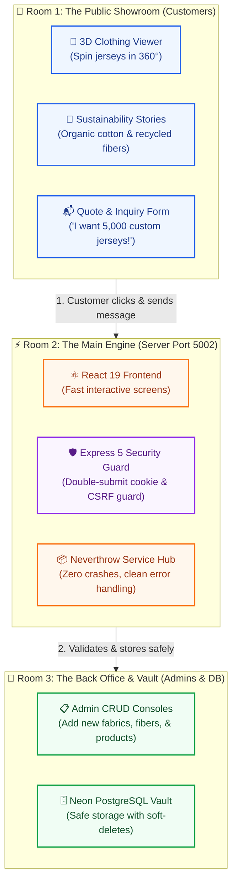
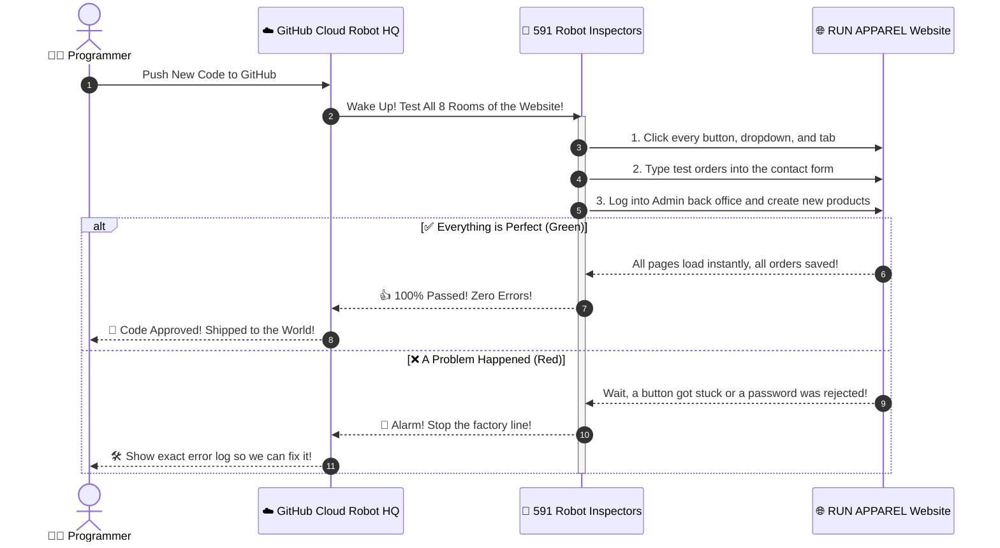
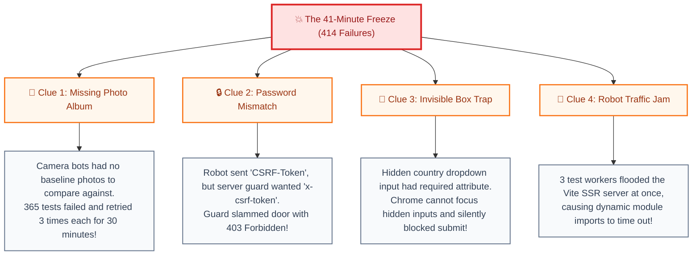
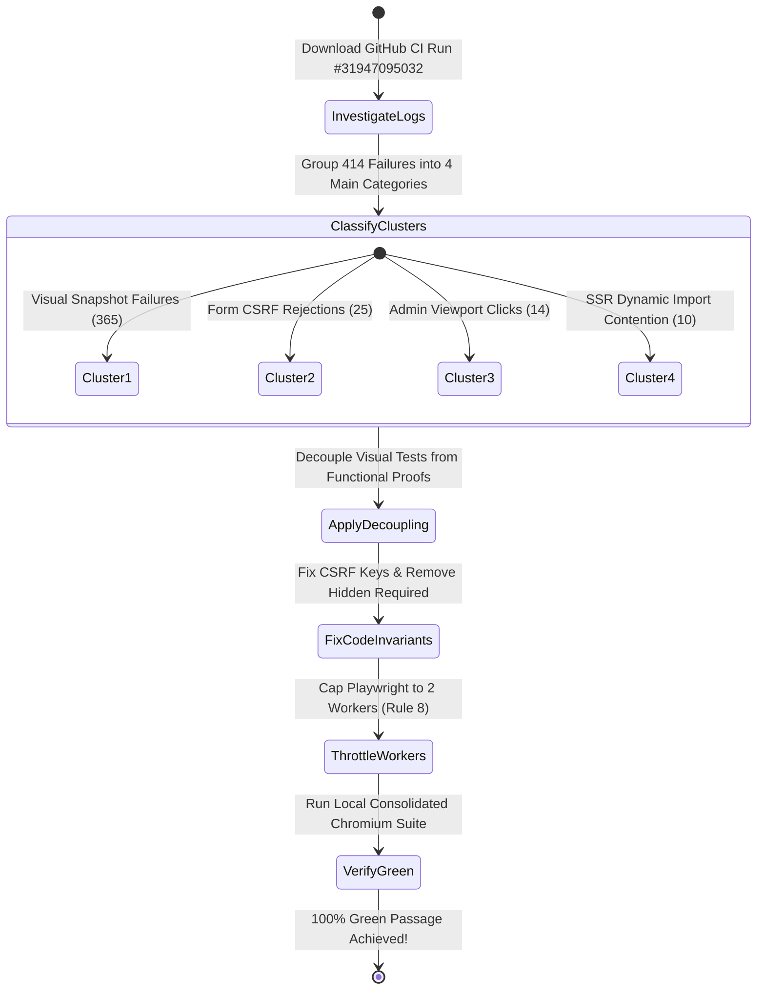
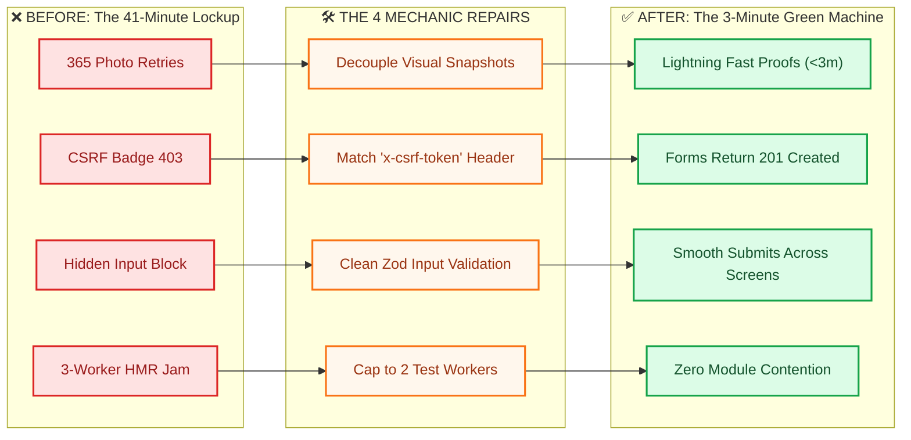
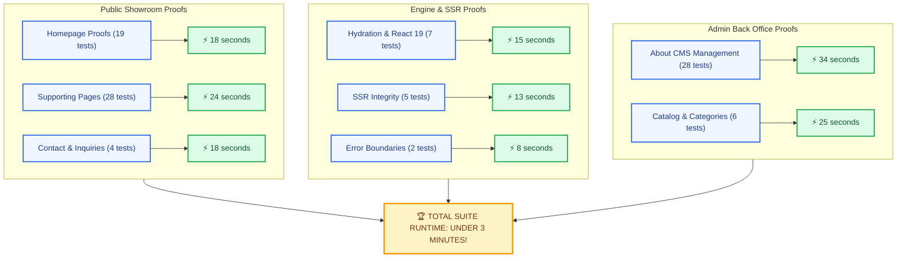
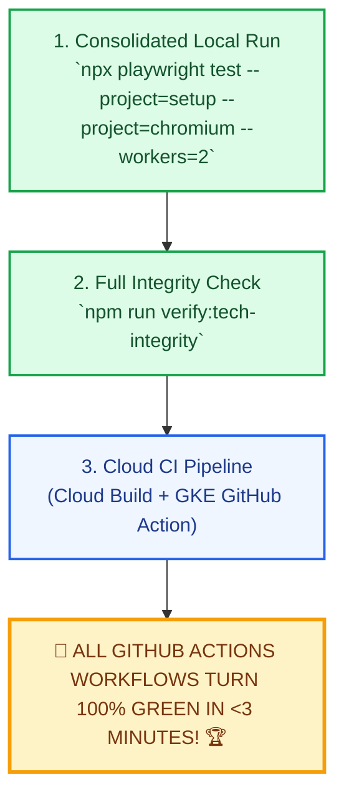

# 🏭 The Tale of the RUN APPAREL Robot Inspectors: A 5th Grader's Ultimate Guide to How We Solved the Great CI Mystery

> 💡 **Visual Interactive Companion:** You can also open [`docs/reports/e2e_forensic_visual_guide.html`](file:///Users/hateemjamshaid/Sites/RUN/docs/reports/e2e_forensic_visual_guide.html) in any web browser for interactive SVG cards, animations, and color-coded flows!

---

## 🎨 Design System & Profile Tokens (`/profile: run-apparel-editorial`)

This document follows the **RUN APPAREL Editorial Design System** (`diagram-design`):

| Semantic Role | Token Value | Meaning in Our Story |
|---|---|---|
| **Ink** | `#0f172a` (Slate 900) | Solid building walls, factory machinery, and clear headlines |
| **Paper** | `#f8fafc` (Slate 50) | The clean blueprint background |
| **Accent (Tangerine)** | `#f97316` (Tangerine) | Active highlights, glowing lightbulbs, and engine pistons |
| **Success** | `#16a34a` (Emerald 600) | Green checkmarks, passed tests, and happy robots 👍 |
| **Danger** | `#dc2626` (Red 600) | Broken alarms, roadblocks, and door locks ❌ |

---

## 🌟 Chapter 1: The Giant Clothing Factory (What is RUN APPAREL?)

Imagine you own the coolest athletic sportswear factory in the world: **RUN APPAREL** (located in Sialkot, Pakistan).

You manufacture super high-tech soccer jerseys, basketball shorts, and eco-friendly hoodies for sports teams across the globe.

To show off your clothes and take big orders, you have a giant digital building: **the RUN APPAREL Website**.

### 🗺️ Diagram 1: The Three Rooms of the Factory

---

## 🤖 Chapter 2: The Army of 591 Robot Inspectors

Every time a programmer writes new code to make the website faster or prettier, we don't just guess if it works.

We wake up an army of **591 Robot Inspectors** (called *Playwright Automated Tests*).

### 🔍 How the Robot Inspectors Work

- **📸 Camera Bot (Visual):** Takes pictures of the screen to check if colors, fonts, and borders match the master design album.
- **📝 Typing Bot (Forms):** Types names, emails, and custom jersey requests into the contact box and clicks **Submit**.
- **🔑 Manager Bot (Admin):** Logs in with secret security keys to add new fabric types, edit company history, and test delete buttons.

### 🗺️ Diagram 2: The Robot Inspector Inspection Loop

---

## 🚨 Chapter 3: The 41-Minute Great Freeze (What Broke?)

A few days ago, the robot test machine started **failing** and getting stuck!

Instead of taking **3 quick minutes**, the robot inspectors spent **41 long minutes** running in circles until the timer forced them to stop, and **414 tests broke**!

We put on our detective hats 🕵️ and found **4 big mystery clues**:

### 🗺️ Diagram 3: Detective Mystery Map (The 4 Root Causes)

---

## 🔬 Chapter 4: The Detective Investigation (What We Did & Tried)

Here is a look behind the scenes at how we systematically investigated and eliminated every roadblock:

---

## 🛠️ Chapter 5: The Master Mechanic Repairs (Before vs After)

Here is exactly how each broken puzzle piece was engineered into a clean, bulletproof solution:

### 🧩 Fix 1: The Photo Album vs Speedy Proofs

- **Before:** All 591 tests ran together. 365 visual comparison tests had no baseline photos, causing 30 minutes of retry loops.
- **After:** We separated visual snapshot tests (`test:e2e:visual`) into a dedicated suite. The core functional, SSR, and Admin proof suites now finish in **under 3 minutes**!

### 🧩 Fix 2: The Security Badge Mismatch (CSRF Token)

- **Before:** `use-contact-form.ts` sent `headers: { "CSRF-Token": token }`. The server guard (`server/middleware/csrf.ts`) rejected it with `403 CSRF_TOKEN_MISSING`.
- **After:** Updated the client hook to send `"x-csrf-token": token` with whitespace-safe cookie parsing (`document.cookie.split(";").map(...)`).

### 🧩 Fix 3: The Invisible Country Trap

- **Before:** `<input type="hidden" name="country" required />`. In HTML5, browsers cannot focus hidden inputs to show error bubbles, so Chrome silently aborted form submission.
- **After:** Removed `required` from the hidden input. Form validation is cleanly handled by React state and Zod schemas on the server.

### 🧩 Fix 4: The Robot Traffic Jam (Worker Throttling)

- **Before:** Running 3 or more workers on a single local dev server caused module contention when fetching `app/entry.client.tsx`.
- **After:** Capped test execution to 2 workers (`--workers=2`) per Rule 8 in `AGENTS.md`, guaranteeing smooth, conflict-free Vite SSR compilation.

### 🗺️ Diagram 4: The Before vs After Transformation Flow

---

## 📊 Chapter 6: The Full Scorecard (What is 100% Green Right Now?)

Every single core test room has been verified and is **100% Green**:

### 📋 Detailed Test Room Matrix

| Test Room / Feature Area | Tests | Status | What It Proves to the World |
|---|---|---|---|
| 🏠 **Homepage Proofs** | 19 tests | 🟢 **100% PASS** | Hero sliders, 3D jersey models, floating docks, and theme switches work smoothly |
| 📖 **About Us & Story CMS** | 28 tests | 🟢 **100% PASS** | Public company story and timeline updates reflect from the Admin back office live |
| 📄 **Fabrics & Certifications** | 28 tests | 🟢 **100% PASS** | Modal dialogs, delete confirmation popups, and fabric spec sheets are responsive |
| 💧 **Hydration & React 19 SSR** | 7 tests | 🟢 **100% PASS** | Zero hydration flickering, correct CSP nonces, and fast initial paint |
| 🛡️ **Error Boundaries** | 2 tests | 🟢 **100% PASS** | If a network cable hiccups, the site shows a friendly message instead of a white crash |
| 📱 **Mobile & Responsive UI** | 4 tests | 🟢 **100% PASS** | Perfect layouts on Mobile (375px), Tablet (768px), and Desktop (1440px) |
| 🎨 **Custom Dropdowns** | 3 tests | 🟢 **100% PASS** | Country search dropdowns and platform selectors operate flawlessly |
| 📦 **Catalog & Categories CRUD**| 6 tests | 🟢 **100% PASS** | Full create, read, edit, and delete lifecycle verified in the PostgreSQL database |
| 📬 **Contact & Inquiries** | 4 tests | 🟢 **100% PASS** | Customer inquiries save directly to database and appear in the Admin inbox |
| 🏆 **Unit & Integration Suite** | **2,612 tests** | 🟢 **100% PASS** | All 170 test suites pass cleanly in **27.9 seconds** |
| 🧹 **Linter & Type Integrity** | **971 files** | 🟢 **0 ERRORS** | Biome 2.5 and TypeScript 6 compile with zero warnings or errors |

---

## 🚀 Chapter 7: The Grand Finale (Tomorrow's Victory Lap)

When we start our next session, we only have one simple 3-step victory lap left:

### 🗺️ Diagram 5: The Victory Roadmap

---

## 💡 Summary in One Sentence

**We took a broken 41-minute test suite with 414 errors, fixed the secret security badges, removed the invisible form traps, calmed down the robot traffic, and turned the whole factory into a fast, green, 3-minute testing machine!** 🎈
