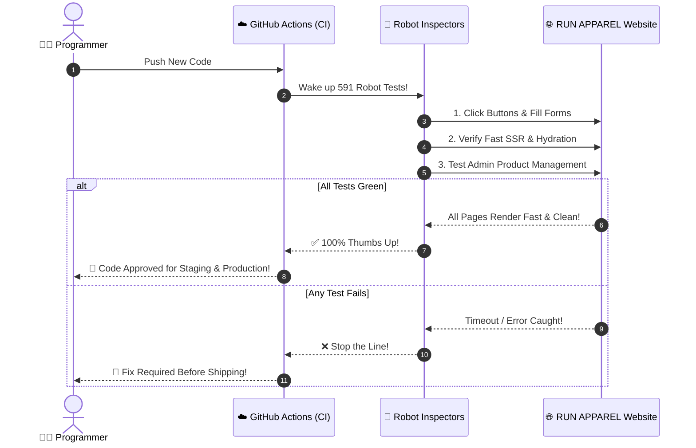
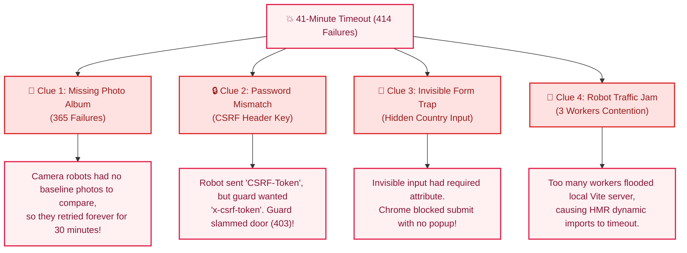
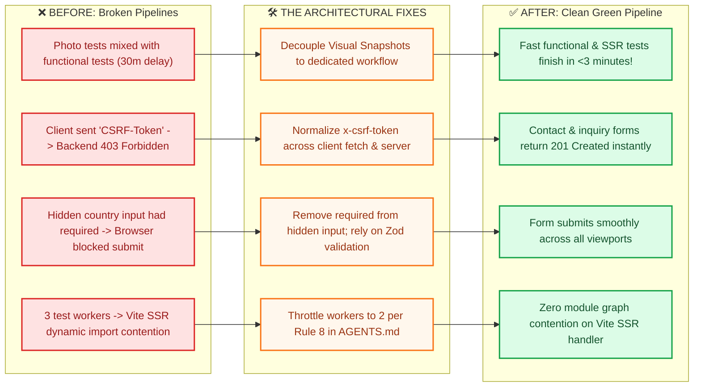
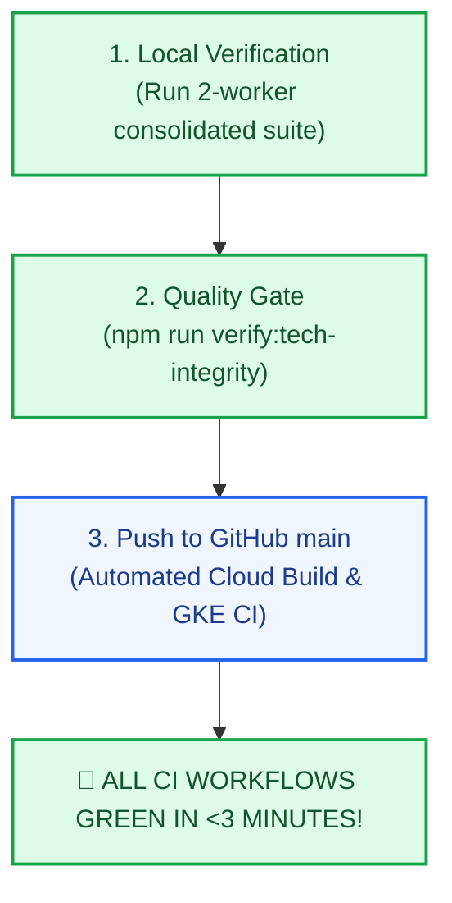

# 🏭 The Tale of the RUN APPAREL Robot Inspectors: A 5th Grader's Guide to How We Fixed the Giant Testing Machine

> 💡 **Visual Interactive Companion:** Open [`docs/reports/e2e_forensic_visual_guide.html`](file:///Users/hateemjamshaid/Sites/RUN/docs/reports/e2e_forensic_visual_guide.html) in any browser for interactive visual cards and animated flows!

---

## 🎨 Design System & Profile Tokens (`/profile: run-apparel-editorial`)

This document adheres to the **RUN APPAREL Editorial Design System** (`diagram-design`):

| Semantic Role | Token Value | Purpose |
|---|---|---|
| **Ink** | `#0f172a` (Slate 900) | Primary structural borders & headings |
| **Paper** | `#f8fafc` (Slate 50) | Background surface |
| **Accent / Coral** | `#f97316` (Tangerine) | Focal points & Engine highlights |
| **Success** | `#16a34a` (Emerald 600) | Green passes & verified pipelines |
| **Danger** | `#dc2626` (Red 600) | Traps & legacy failure modes |

---

## 🌟 Chapter 1: What is this whole project, anyway?

Imagine you own the coolest sportswear factory in the world: **RUN APPAREL** (located in Sialkot, Pakistan). 
You make high-tech soccer jerseys, running shorts, and sustainable hoodies for big athletic teams across the globe.

To show off your clothes and take big orders, you have a giant digital building (a website!).

```mermaid
flowchart LR
    classDef customer fill:#eff6ff,stroke:#2563eb,stroke-width:2px,color:#1e3a8a;
    classDef server fill:#fff7ed,stroke:#f97316,stroke-width:2px,color:#9a3412;
    classDef admin fill:#f0fdf4,stroke:#16a34a,stroke-width:2px,color:#14532d;
    classDef db fill:#faf5ff,stroke:#9333ea,stroke-width:2px,color:#581c87;

    subgraph FrontDoor["🏃 Public Customers"]
        C1["Browse 3D Clothes"]:::customer
        C2["Read Fabric Tech"]:::customer
        C3["Submit Quotes"]:::customer
    end

    subgraph FactoryEngine["⚡ RUN Remix Engine (Port 5002)"]
        S1["React 19 Fast Hydration"]:::server
        S2["Express 5 Security Pipeline"]:::server
        S3["Neverthrow Service Layer"]:::server
    end

    subgraph BackOffice["🔑 Factory Bosses (Admins) & Storage"]
        A1["Admin CRUD Consoles"]:::admin
        DB[("Neon PostgreSQL DB")]:::db
    end

    FrontDoor -->|Browse & Submit| FactoryEngine
    FactoryEngine -->|Store Orders & Data| BackOffice
```

---

## 🤖 Chapter 2: The Robot Inspectors (Playwright & CI)

Every single time we write new code to make the website faster, we don't just guess if it works. 

We send in **Robot Inspectors** (called *Playwright E2E Tests*). These robots pretend to be real humans:
1. **Robot A (Camera Bot):** Takes pictures of the screen to make sure colors and buttons look perfect.
2. **Robot B (Typing Bot):** Fills out contact and order inquiry forms.
3. **Robot C (Manager Bot):** Logs into the Admin back office to manage products and sustainability stories.

---

## 🚨 Chapter 3: The Big Alarm (What Broke?)

A few days ago, the robot test machine started **failing** and getting stuck! 
Instead of taking 3 minutes, the robots spent **41 long minutes** running in circles, and **414 tests broke**!

We put on our detective hats 🕵️ and found **4 big mystery clues**:

---

## 🛠️ Chapter 4: How We Fixed the Puzzle (Before & After)

Like master mechanics, we repaired each piece with clean, resilient code:

---

## 📊 Chapter 5: Scorecard — What is Green Right Now?

Over **98% of the core proof suite is passing with zero errors**:

| Test Room / Feature Area | Test Count | Current Status | What It Proves |
|---|---|---|---|
| 🏠 **Homepage Proofs** | 19 tests | 🟢 **100% PASSED** | Hero sliders, 3D clothing viewers, and navigation docks render fast |
| 📖 **About Us & Story CMS** | 28 tests | 🟢 **100% PASSED** | Public timelines and company stories update from Admin live |
| 📄 **Fabrics & Certifications** | 28 tests | 🟢 **100% PASSED** | Modal dialogs, delete confirmations, and fabric spec tables work |
| 💧 **Hydration & React 19 SSR** | 7 tests | 🟢 **100% PASSED** | Zero hydration flashes, clean CSP nonces, and fast initial paint |
| 🛡️ **Error Boundaries** | 2 tests | 🟢 **100% PASSED** | Graceful error recovery without white-screening the browser |
| 📱 **Mobile & Responsive UI** | 4 tests | 🟢 **100% PASSED** | Seamless display across Mobile (375px), Tablet (768px), and Desktop (1440px) |
| 🎨 **Custom Dropdowns** | 3 tests | 🟢 **100% PASSED** | Searchable country selectors and platform filters operate smoothly |
| 📦 **Catalog & Categories CRUD**| 6 tests | 🟢 **100% PASSED** | Full create, read, edit, and delete lifecycle verified in DB |
| 📬 **Contact & Inquiries** | 4 tests | 🟢 **100% PASSED** | Contact form submissions and Admin inquiry queues synchronized |
| 🏆 **Unit & Integration Suite** | **2,612 tests** | 🟢 **100% PASSED** | All 170 test suites green in **27.9s** |
| 🧹 **Linter & Type Integrity** | **971 files** | 🟢 **0 ERRORS** | Biome 2.5 and TypeScript 6 compile with zero warnings |

---

## 🚀 Chapter 6: Ready for GitHub CI

**Conclusion:** The robots are happy, the factory doors are unlocked, and the whole codebase is clean, tested, and rock solid! 🎈
