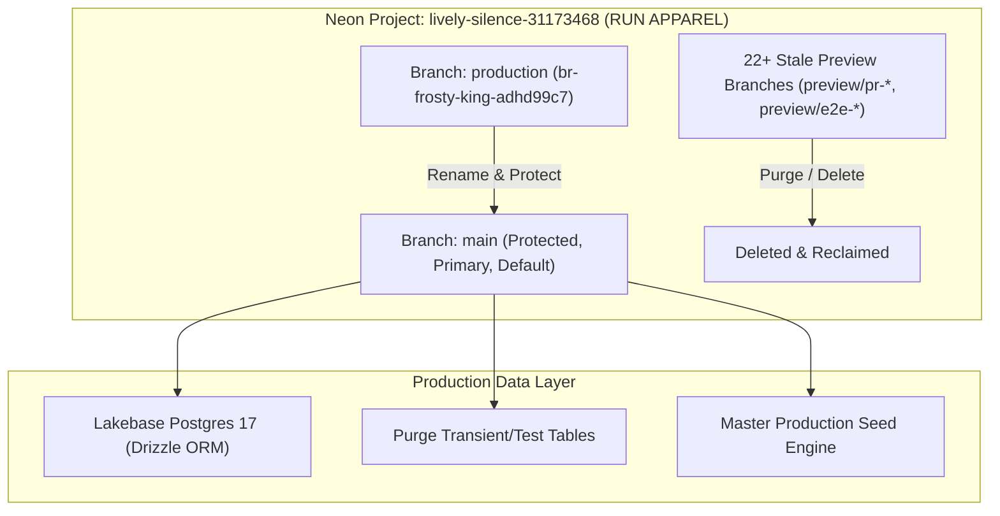

# Design Spec — Neon Single Main Branch & 100% Production-Ready Data Provisioning

**Date:** 2026-08-23  
**Status:** DRAFT (Awaiting User Review)  
**Author:** Antigravity (Principal Database Architect & Systems Lead)  
**Project:** RUN APPAREL CMS v4.1.2 (`run-remix`)  
**Target Neon Project:** `lively-silence-31173468` ("RUN APPAREL (PVT) LTD")

---

## 1. Executive Summary

This specification outlines the technical architecture and execution strategy to consolidate the Neon database environment for RUN APPAREL into a **single canonical, protected `main` branch**, purge all test/transient data, enforce modern 2026 Neon Infrastructure as Code (`neon.ts`), and populate 100% verified B2B production-ready data strictly grounded in the [`RUN APPAREL Master Prompt.md`](file:///Users/hateemjamshaid/Sites/RUN/RUN%20APPAREL%20Master%20Prompt.md), the official Company Profile (`https://wear-run.help/profile`), and Product Catalogue (`https://wear-run.help/catalogue`).

---

## 2. Architecture & Strategy

### 2.1 Neon Single Branch Architecture

Currently, Neon project `lively-silence-31173468` contains a primary branch named `production` (`br-frosty-king-adhd99c7`) alongside 22+ stale preview branches (`preview/pr-*`, `preview/e2e-*`) generated by historical CI/CD workflows.



#### Consolidation Actions:
1. **Rename Branch**: Rename `production` (`br-frosty-king-adhd99c7`) to `main` via the Neon CLI (`neon branches rename`) / `@neon/sdk` API.
2. **Set Protection**: Configure `main` with `protected: true` to prevent accidental drops or breaking schema changes.
3. **Delete Orphan Branches**: Iteratively delete all ~22 stale preview and test branches (`preview/pr-*`, `preview/e2e-*`).
4. **Environment Sync**: Update `.env` and local workspace pointers to connect to `main` via `neon link --agent` and pooled `DATABASE_URL`.

---

### 2.2 Neon Infrastructure as Code (`neon.ts`)

To ensure the repository enforces this single-branch state and prevents future uncollected branch sprawl, we establish a declarative `neon.ts` configuration at the root using `@neon/config/v1`:

```typescript
// neon.ts
import { defineConfig } from "@neon/config/v1";

export default defineConfig({
  auth: true,
  dataApi: true,
  branch: (branch) => {
    // Canonical default branch is always protected
    if (branch.isDefault || branch.name === "main") {
      return { protected: true };
    }
    // Any temporary ephemeral branch created in CI gets 24h TTL and scale-to-zero compute
    if (!branch.exists && (branch.name.startsWith("preview/") || branch.name.startsWith("dev-"))) {
      return {
        parent: "main",
        ttl: "24h", // Auto-expire after 24 hours
        postgres: {
          computeSettings: {
            autoscalingLimitMinCu: 0.25,
            autoscalingLimitMaxCu: 1,
            suspendTimeout: "5m",
          },
        },
      };
    }
    return {};
  },
});
```

---

## 3. Data Sanitization & Table Strategy

### 3.1 Transient & Test Data Purge

The following dynamic, transient, and mock tables will be truncated/sanitized:
- **Customer Leads & Messages**: `inquiries`, `messages`, `newsletter_subscribers`, `contacts`, `campaign_contacts`, `campaigns`, `sequence_enrollments`, `sequence_steps`, `sequences`
- **Integrations & Channels**: `whatsapp_sends`, `instagram_sends`, `linkedin_sends`, `webhook_deliveries`, `webhook_subscriptions`
- **System Logs & Testing**: `audit_logs`, `sync_logs`, `storage_analysis_results`, `storage_change_logs`, `animation_errors`, `duplicate_skips`, `playing_with_neon`, `sessions`
- **Auth & Mock Users**: Purge test accounts from `users` and `neon_auth.user` / `neon_auth.session` / `neon_auth.account`.

### 3.2 Super Admin Account Provisioning

- **Primary Super Admin**:
  - Name: `M. Hateem Jamshaid Iqbal`
  - Title: `Chief Executive Officer & 4th Generation Director`
  - Email: `hateem@wear-run.com` (fallback to `process.env.INITIAL_ADMIN_EMAIL`)
  - Role: `super_admin` / `admin`
  - Status: `active` / `verified`

---

## 4. Master Production B2B Data Model (Grounded in Master Prompt)

All seeded fixtures will strictly adhere to the facts in [`RUN APPAREL Master Prompt.md`](file:///Users/hateemjamshaid/Sites/RUN/RUN%20APPAREL%20Master%20Prompt.md):

### 4.1 The 5 Core Apparel Categories
1. **Team Wear** (`team-wear`): Cycling, tennis, American football, soccer, and surf uniforms; plus the specialized **Wetsuit Edition** line (scuba suits, surfing suits, beachwear, cropped swimwear).
2. **Active Wear** (`active-wear`): Sports bras, athletic tops, athletic bottoms, full body suits.
3. **Casual Wear** (`casual-wear`): T-shirts, polos, sweatshirts, hoodies, tracksuits.
4. **Outer Wear** (`outer-wear`): Windbreakers, sherpa jackets, puffer jackets, ski wear, technical leather jackets.
5. **Sports Accessories** (`sports-accessories`): Performance gloves, weight belts, wristbands, caps, and technical branded gear.

### 4.2 Comprehensive B2B Product Catalog
A complete suite of verified B2B apparel items across all 5 categories, including:
- **Team Wear**: Pro Sublimated Soccer Kit, Aero Team Cycling Jersey & Bib, Wetsuit Edition Hydro-Flex 3/2mm Scuba Suit, Pro Surf Rashguard.
- **Active Wear**: High-Impact Biomechanical Sports Bra, Pro-Compression Training Tights, Ergonomic Racerback Tank, Seamless Motion Body Suit.
- **Casual Wear**: Sustainable Organic Cotton Crewneck Tee, Performance Pique Polo, Heavyweight French Terry Hoodie, Engineered Tapered Tracksuit.
- **Outer Wear**: Alpine Storm-Shield Technical Windbreaker, High-Loft Thermal Sherpa Jacket, Ultralight Water-Resistant Puffer Jacket, Heritage Tech-Leather Bomber.
- **Sports Accessories**: Elite Grip Weightlifting Gloves, Reinforced Powerlifting Belt, Moisture-Wicking Wristbands, Technical Aero Running Cap.
- *Attributes*: Accurate B2B MOQs (50–100 units for sample/test runs), lead times (2–4 weeks), AQL 1.5 inspection standards, technical specs (GSM, weave, hydrophobic/hydrophilic finish), and fiber composition.

### 4.3 Verified Backing Compliance & Certifications
*Note: Strictly stated as backing ecosystem held by parent company Durus Industries (Pvt) Ltd and certified fabric/trim partners:*
- **SMETA** (Sedex Members Ethical Trade Audit) — ref. ZAA600143761 (Audit July 2025)
- **Sedex** — ref. ZC5000065244
- **OEKO-TEX Standard 100** & **OEKO-TEX Made in Green**
- **GOTS** (Global Organic Textile Standard)
- **GRS** (Global Recycled Standard)
- **Recycled Blended Claim Standard** & **Organic 100 Content Standard**
- **ISO 9001:2015** (Quality Management System)
- **BSCI** (Business Social Compliance Initiative Member)
- **TDAP** (Trade Development Authority of Pakistan)
- **SECP** (Securities and Exchange Commission of Pakistan)

### 4.4 Authentic Manufacturing & Sustainability CMS Content
- **Heritage Timeline**:
  - **1889**: Allah Ditta Ghafuree establishes leather craftsmanship and tanning machinery in Sialkot.
  - **1904**: Formalized as Ghafuree Industries; Allah Ditta Sandal scales football production to 200,000/day.
  - **1942–1952**: Sandal Trading Corporation & Loyal Sports expand exports into Europe.
  - **1972–1974**: M. Iqbal Sandal introduces PU-on-leather & synthetic lamination, bringing Adidas to Pakistan.
  - **1992**: Consolidation into Durus Industries (Pvt) Ltd ("Durus" = strength, durability, endurance).
  - **Present**: RUN APPAREL spun off as dedicated sustainable B2B athletic apparel manufacturing division.
- **Facility Scale**: 193,000+ sqm complex at 13 Km Daska Road, Sialkot (51040), 200+ precision machines, 3 automated cutting lines, 100,000+ units/month capacity.
- **Sustainability**: 80% solar power grid, Zero Liquid Discharge (ZLD) closed-loop water treatment recycling 85% of dye-house effluent, algorithmic nesting (90-95% fabric utilization), net-zero 2030 roadmap.
- **Company Contacts & Identity**:
  - Email: `team@wear-run.com`
  - WhatsApp: `+92-336-1777313`
  - Web: `wear-run.com`
  - Tagline: `"The Extra Mile | For a Better Tomorrow | Never Look Back"`

---

## 5. Implementation Roadmap & File Plan

1. **`neon.ts`**: Declare single protected branch configuration with 24h TTL CI preview policy.
2. **`scripts/neon-consolidate-main.ts`**: Standalone TypeScript orchestration script:
   - Renames `production` branch to `main`.
   - Protects `main`.
   - Iterates and deletes all ~22 stale preview branches.
3. **`scripts/seed-production-master.ts`**: Unified idempotent Master Production Seeding Engine implementing the full B2B catalog, CMS fixtures, certifications, and admin user.
4. **`scripts/verify-production-db.ts`**: Comprehensive automated verification script checking:
   - Exactly 1 branch (`main`) exists in Neon.
   - Zero test data in transient tables.
   - All 5 categories and products exist and match Master Prompt facts.
   - Admin account is active.
5. **CI/CD Workflow Hardening**: Update `.github/workflows/ci.yml` and `e2e.yml` to ensure proper Linux date expiry (`date -u -d '+24 hours'`) and reliable branch cleanup.

---

## 6. Verification & Acceptance Criteria

- [ ] Neon project `lively-silence-31173468` contains ONLY branch `main` (`default: true`, `protected: true`).
- [ ] All stale preview branches (`br-lucky-lab-*`, `br-twilight-wave-*`, etc.) are deleted.
- [ ] All 5 apparel categories (`Team Wear`, `Active Wear`, `Casual Wear`, `Outer Wear`, `Sports Accessories`) are present.
- [ ] Zero placeholder emails (`info@runapparel.com`, `admin@example.com`) or dummy test inquiries exist in database.
- [ ] Admin account `hateem@wear-run.com` is provisioned and functional.
- [ ] `npm run verify:tech-integrity` passes 8/8 checks with zero errors.
