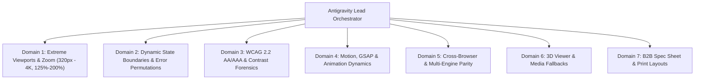
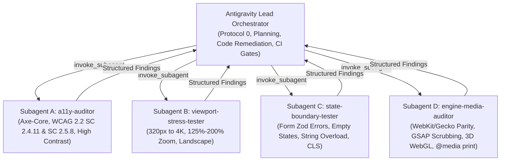

# RUN APPAREL CMS (v4.1.2) — Advanced 7-Domain Visual, Accessibility & Stress-Testing Suite Design Specification

**Document Version:** 1.0.0  
**Date:** 2026-08-23  
**Status:** Approved Architecture Draft  
**Author:** Antigravity — Principal Front-End Architect, Performance Lead & Design Systems Auditor  
**Corporate Entity:** RUN APPAREL (PVT) LTD, Sialkot, Pakistan (100% B2B Premium Sustainable Manufacturing)  

---

## 1. Executive Summary & Mission Scope

This specification establishes an industrial-grade, multi-engine testing, accessibility, and stress-resilience suite for **RUN APPAREL CMS v4.1.2** across all 42 routes (public showcase routes and admin CMS modules). Grounded in RUN APPAREL's premium B2B sustainable manufacturing identity, this architecture ensures flawless visual presentation, strict WCAG 2.2 AA/AAA compliance, fluid typography resilience, dynamic error-state stability, cross-browser rendering parity (Chromium, WebKit, Gecko), 3D WebGL fallback reliability, and dedicated `@media print` spec-sheet generation.

---

## 2. The 7 Investigation & Testing Domains

### Domain 1: Extreme Viewports, Zoom & Aspect Ratio Stress-Testing
1. **Ultra-Wide Screens (1920px, 2560px, 3840px / 4K)**:
   - Verify `max-w-*` structural container bounds, full-bleed hero backgrounds, and floating dock horizontal centering.
2. **Compact Viewports (320px — iPhone SE 1st Gen & Foldable Outer Screens)**:
   - Stress-test admin data tables, action toolbars, filter chips, and dialogs for horizontal scroll leakage (`overflow-x`) and brutalist heading clamp bounds (`≤ 2.125rem` / 34px).
3. **Browser Zoom & OS Large-Font Scaling (125%, 150%, 200%)**:
   - Verify text containers avoid fixed heights (`h-[...]`) that clip scaled typography under 200% zoom (WCAG SC 1.4.4 Resize Text).
4. **Mobile & Tablet Landscape (667×375px, 844×390px, 1024×768px)**:
   - Enforce compact header dock presentation and guarantee vertical scrolling in modal dialogs and navigation drawers.

### Domain 2: Dynamic State & Data Boundary Permutations
1. **Form Validation & Zod Error Boundaries**:
   - Programmatically trigger Zod validation error states across all public forms (Inquiry, Quote Request, Sample Request) and Admin CRUD modules (empty required fields, invalid email format, negative MOQ values, file-size limits).
   - Verify inline error messages, `focus-visible:ring-destructive`, and Sonner toast notifications.
2. **Zero-Data (Empty) States**:
   - Intercept API responses to return empty arrays (`{ data: [], total: 0 }`) across all 22 admin modules and public catalog listings.
   - Assert presence of intentional empty state illustrations, call-to-action triggers, and pagination control hiding.
3. **Extreme String & Code Overload**:
   - Inject 200-character unbroken technical codes, German compound industrial terms, and lengthy URLs into tables and badges to verify `break-words` and `truncate` safety without DOM expansion.
4. **Network Throttling & Skeleton Shimmer Layout Shift (CLS)**:
   - Measure Cumulative Layout Shift (CLS < 0.05) under Fast 3G / Slow 4G network throttling during async data loading.

### Domain 3: Automated WCAG 2.2 AA/AAA & Contrast Forensics
1. **Automated Axe-Core Audits (`@axe-core/playwright`)**:
   - Execute full automated Axe sweeps across all 42 routes in Light and Dark modes.
   - Enforce 0 critical, 0 serious, and 0 moderate violations.
2. **Keyboard Tab Navigation & Focus Not Obscured (SC 2.4.11)**:
   - Step through DOM trees with `Tab` / `Shift+Tab`.
   - Enforce `scroll-padding-top: 5rem` on scroll containers so floating navigation headers never obscure focused inputs or controls.
   - Verify visible focus rings (`focus-visible:ring-2 focus-visible:ring-primary outline-hidden`).
3. **Interactive Target Size Minimum (SC 2.5.8 ≥ 24×24px)**:
   - Audit interactive elements (table checkboxes, pagination buttons, modal close icons, accordion toggles) ensuring minimum 24×24px bounding boxes.
4. **Forced-Colors & High-Contrast Mode (`forced-colors: active`)**:
   - Verify custom SVGs, borders, and controls retain clear structural contrast when Windows High Contrast mode is active.

### Domain 4: Motion, GSAP ScrollTrigger & Animation Dynamics
1. **Rapid & Reverse Scroll Scrubbing**:
   - Stress-test GSAP ScrollTrigger timelines (interactive manufacturing timeline, capability blueprints, flip cards) under rapid wheel scrubbing and directional reversals to prevent pin desynchronization.
2. **Reduced Motion (`prefers-reduced-motion: reduce`)**:
   - Verify all GSAP timelines and CSS transitions collapse gracefully into immediate transitions or subtle opacity fades without coordinate jumps.
3. **Smooth Scroll (`locomotive-scroll`) Stability**:
   - Audit momentum scrolling and gesture interactions for layout stability and zero console warnings.

### Domain 5: Cross-Browser & Multi-Engine Rendering Differences
1. **WebKit Engine (Apple Safari macOS & iOS)**:
   - Audit `backdrop-filter: blur()` hardware acceleration on the floating dock header.
   - Verify `-webkit-font-smoothing: antialiased` subpixel text rendering on custom display fonts (`Neue Stance`).
   - Verify dynamic iOS Safari viewport behavior (`100dvh` vs `100vh`).
2. **Gecko Engine (Mozilla Firefox)**:
   - Audit custom scrollbar styling (`scrollbar-gutter: stable`), date/time picker inputs, and subpixel flexbox gap rendering.

### Domain 6: 3D Viewer & Media Asset Fallbacks
1. **WebGL Failure & Context Loss Simulation**:
   - Simulate WebGL disabled / context loss to guarantee `ModelViewerErrorBoundary` activates and displays 2D fallback posters.
2. **Broken & Missing Media Handling**:
   - Verify placeholder image fallbacks and graceful degradation when CDN asset URLs return 404 or 500 status codes.

### Domain 7: Print & Document Export Layouts (`@media print`)
1. **B2B Spec Sheet & Document Print Styles**:
   - Target routes: Product Spec Sheets, Size Charts, Factory Capabilities, Sustainability Certificates, and Inquiry Quote summaries.
   - Centralize `@media print` rules in modular stylesheets and Tailwind `print:*` utility classes.
   - Strip headers, footers, dark backgrounds, and navigation drawers.
   - Inject official RUN APPAREL B2B Spec Header and ensure table rows do not break awkwardly across printed pages (`break-inside-avoid`).

---

## 3. Autonomous Multi-Agent Hierarchy & Delegation

---

## 4. Playwright Test Harnesses & Configuration

### New Test Suites to Implement:
1. `e2e/a11y-wcag22.spec.ts` — Comprehensive 42-route Axe scans, SC 2.4.11 focus visibility, SC 2.5.8 touch target bounding boxes, forced-colors emulation.
2. `e2e/viewport-stress.spec.ts` — 320px, 375px, 768px, 1440px, 1920px, 2560px, 3840px, 150%/200% zoom scaling, mobile landscape orientations.
3. `e2e/state-boundaries.spec.ts` — Zod error triggers, 0-row empty states, 200-char unbroken string overflow, Fast 3G network throttling CLS.
4. `e2e/cross-engine.spec.ts` — WebKit & Firefox rendering sweeps, GSAP rapid scrubbing, WebGL context loss fallback, and `@media print` layout assertions.

### Configuration Updates:
- Update `playwright.config.ts` to support multi-engine projects (`chromium`, `firefox`, `webkit`, `a11y`, `visual`, `stress`) while maintaining dev server stability.

---

## 5. Verification Matrix & Monorepo Gates

Before completion, the following gates must strictly pass:
1. `npm run verify:clean-seed` -> 🟢 PASS (0 test artifacts in database)
2. `npm run check` -> 🟢 PASS (0 errors across whole monorepo)
3. `npm run build` -> 🟢 PASS (3/3 packages built in Turborepo)
4. `npm run verify:tech-integrity` -> 🟢 PASS (8/8 integrity checks)
5. `npx playwright test` -> 🟢 PASS (All new and existing suites pass)
