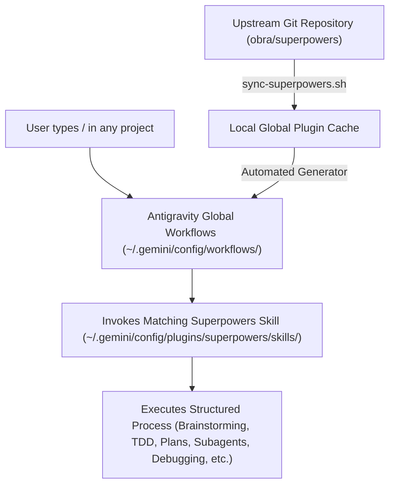

# Global Superpowers Skills & Slash Commands Integration Design

**Author:** Antigravity (Gemini)  
**Date:** 2026-08-24  
**Status:** Approved via `/grill-me`  
**Target Repository:** `https://github.com/obra/superpowers`  
**Scope:** Machine-Global (`~/.gemini/config/`) & Universal Multi-Project  

---

## 1. Executive Summary

This specification establishes a permanent, machine-global installation and workflow registration of Jesse Vincent's **Superpowers** skills suite (`https://github.com/obra/superpowers`) within Google Antigravity. By registering the plugin and configuring corresponding global `/` slash commands under `~/.gemini/config/workflows/`, all 14 Superpowers skills become natively discoverable and executable across any project workspace on this machine.

---

## 2. Requirements & Design Decisions

### 2.1 Scope & Global Discoverability

1. **Global Plugin Root**: The upstream repository `https://github.com/obra/superpowers` is cloned and maintained at `~/.gemini/config/plugins/superpowers/`.
2. **Plugin Manifest**: `~/.gemini/config/plugins/superpowers/plugin.json` and `gemini-extension.json` declare the plugin for Antigravity's global plugin engine.
3. **Workspace Invariant**: Global skills under `~/.gemini/config/plugins/` are automatically surfaced in every active Antigravity workspace without requiring local project modification.

### 2.2 Slash Command Architecture

Per the `/grill-me` alignment, slash commands are mapped strictly using **Full Skill Names**:

| # | Skill Name | Slash Command | Global Workflow File | Primary Purpose |
|---|------------|---------------|----------------------|-----------------|
| 1 | `brainstorming` | `/brainstorming` | `~/.gemini/config/workflows/brainstorming.md` | Explore user intent, requirements, and design alternatives before code |
| 2 | `dispatching-parallel-agents` | `/dispatching-parallel-agents` | `~/.gemini/config/workflows/dispatching-parallel-agents.md` | Dispatch 2+ independent subagents concurrently |
| 3 | `executing-plans` | `/executing-plans` | `~/.gemini/config/workflows/executing-plans.md` | Execute written plans with batch checkpoints |
| 4 | `finishing-a-development-branch` | `/finishing-a-development-branch` | `~/.gemini/config/workflows/finishing-a-development-branch.md` | Determine branch integration, squash, or PR strategy |
| 5 | `receiving-code-review` | `/receiving-code-review` | `~/.gemini/config/workflows/receiving-code-review.md` | Critically review feedback before implementing suggestions |
| 6 | `requesting-code-review` | `/requesting-code-review` | `~/.gemini/config/workflows/requesting-code-review.md` | Perform comprehensive code review against requirements |
| 7 | `subagent-driven-development` | `/subagent-driven-development` | `~/.gemini/config/workflows/subagent-driven-development.md` | Implement tasks via isolated subagents with two-stage review |
| 8 | `systematic-debugging` | `/systematic-debugging` | `~/.gemini/config/workflows/systematic-debugging.md` | 4-phase root-cause investigation before proposing fixes |
| 9 | `test-driven-development` | `/test-driven-development` | `~/.gemini/config/workflows/test-driven-development.md` | Strict RED-GREEN-REFACTOR cycle before writing production code |
| 10 | `using-git-worktrees` | `/using-git-worktrees` | `~/.gemini/config/workflows/using-git-worktrees.md` | Create isolated git worktree environments for features |
| 11 | `using-superpowers` | `/using-superpowers` | `~/.gemini/config/workflows/using-superpowers.md` | Establish mandatory skill discovery and execution protocol |
| 12 | `verification-before-completion` | `/verification-before-completion` | `~/.gemini/config/workflows/verification-before-completion.md` | Evidence-first verification before claiming completion |
| 13 | `writing-plans` | `/writing-plans` | `~/.gemini/config/workflows/writing-plans.md` | Create bite-sized, comprehensive implementation plans |
| 14 | `writing-skills` | `/writing-skills` | `~/.gemini/config/workflows/writing-skills.md` | Author, edit, and verify new Antigravity skills |

### 2.3 Universal Project-Agnostic Workflows

- All project-specific hardcoded commands (e.g. `pnpm`, `Tauri`, `BWR`, `QR modules`) from prior workspace tests in `~/.gemini/config/workflows/` are purged or updated.
- Workflows dynamically adapt to the active monorepo/repository package manager (`npm`, `pnpm`, `yarn`, `cargo`, `poetry`, etc.) and invoke the corresponding Superpowers skill instructions.
- Non-conflicting general utilities (e.g. `/diagram`, `/deep-think`) remain preserved.

### 2.4 Automated Synchronization Script (`sync-superpowers.sh`)

A dedicated executable script `~/.gemini/config/scripts/sync-superpowers.sh` will:
1. `git pull origin main` in `~/.gemini/config/plugins/superpowers`.
2. Parse all skills in `~/.gemini/config/plugins/superpowers/skills/*/SKILL.md`.
3. Auto-generate/update corresponding `~/.gemini/config/workflows/<skill-name>.md` files with correct frontmatter descriptions.
4. Verify file permissions and integrity.

---

## 3. Verification Plan

1. **Upstream Git Status**: Confirm `~/.gemini/config/plugins/superpowers` is synchronized with `https://github.com/obra/superpowers`.
2. **Skill Inventory**: Confirm all 14 skills exist with valid `SKILL.md` frontmatter.
3. **Workflow Parity**: Confirm all 14 global workflows exist in `~/.gemini/config/workflows/` and parse cleanly.
4. **Sync Script Execution**: Execute `sync-superpowers.sh` and verify idempotent clean execution.
