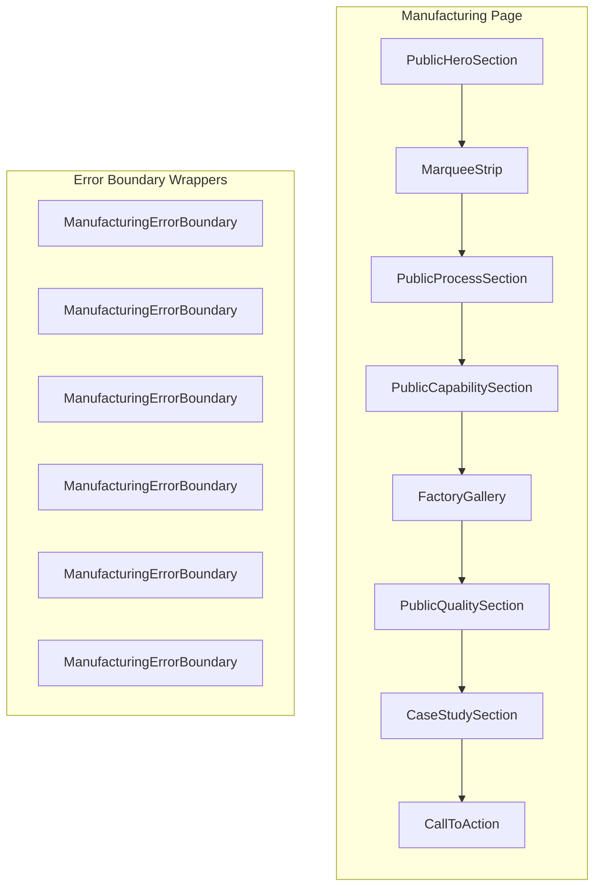
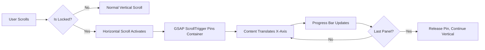
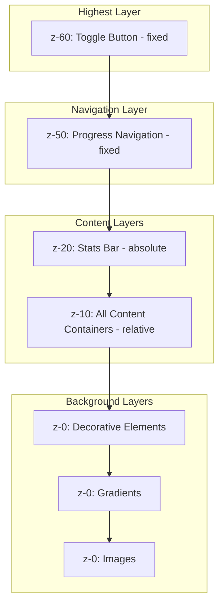
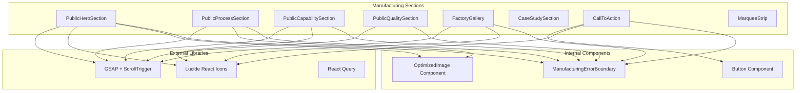

# Manufacturing Page - Visual Design & Z-Axis Analysis

**Document Version:** 1.0.0  
**Last Updated:** February 2026  
**Author:** Kilo Code (Architect Mode)

---

## 1. Page Structure Overview

The Manufacturing page (`/manufacturing`) consists of 8 distinct sections wrapped in error boundaries, following a dark theme design system.



### Section Components

| Section | Component File | Purpose |
|---------|---------------|---------|
| Hero | [`PublicHeroSection.tsx`](client/app/components/public/manufacturing/PublicHeroSection.tsx) | Full-screen hero with headline, stats bar |
| Marquee | [`marquee-strip.tsx`](client/app/components/ui/marquee-strip.tsx) | Scrolling brand text strip |
| Processes | [`PublicProcessSection.tsx`](client/app/components/public/manufacturing/PublicProcessSection.tsx) | Horizontal scroll with GSAP pinning |
| Capabilities | [`PublicCapabilitySection.tsx`](client/app/components/public/manufacturing/PublicCapabilitySection.tsx) | Bento grid layout |
| Gallery | [`FactoryGallery.tsx`](client/app/components/public/manufacturing/FactoryGallery.tsx) | Draggable image gallery |
| Quality | [`PublicQualitySection.tsx`](client/app/components/public/manufacturing/PublicQualitySection.tsx) | Circular progress metrics |
| Case Study | [`CaseStudySection.tsx`](client/app/components/public/manufacturing/CaseStudySection.tsx) | Snap scroll carousel |
| CTA | [`CallToAction.tsx`](client/app/components/public/manufacturing/CallToAction.tsx) | Final call-to-action |

---

## 2. Z-Index Hierarchy Map

### Complete Z-Axis Stacking Context

```
┌─────────────────────────────────────────────────────────────────┐
│ Z-INDEX LAYERING - Manufacturing Page                           │
├─────────────────────────────────────────────────────────────────┤
│                                                                 │
│  z-[60] ─── Floating Toggle Button (Lock/Unlock Scroll)        │
│              └── fixed top-8 right-8                           │
│                                                                 │
│  z-50 ──── Progress Navigation (Process Section)               │
│              └── fixed top-0 left-0 w-full                     │
│                                                                 │
│  z-20 ──── Floating Stats Bar (Hero Section)                   │
│              └── absolute bottom-12                            │
│                                                                 │
│  z-10 ──── Content Containers (All Sections)                   │
│              └── relative z-10                                 │
│                                                                 │
│  z-0 ───── Background Layers (All Sections)                    │
│              ├── Editorial Grid Overlay                        │
│              ├── Radial Gradients                              │
│              ├── Background Images                             │
│              └── Decorative Elements                           │
│                                                                 │
└─────────────────────────────────────────────────────────────────┘
```

### Z-Index Values by Component

#### PublicHeroSection
| Z-Index | Element | CSS Class | Purpose |
|---------|---------|-----------|---------|
| `z-0` | Editorial Grid Overlay | `absolute inset-0 z-0 opacity-5` | Decorative grid pattern |
| `z-0` | Background Gradient | `absolute inset-0 z-0 bg-[radial-gradient...]` | Subtle gold glow |
| `z-0` | Background Image | `absolute inset-0 z-0` | Hero background media |
| `z-10` | Content Container | `relative z-10` | Headline, subheadline, CTAs |
| `z-20` | Stats Bar | `absolute bottom-12 ... z-20` | Floating statistics cards |

#### PublicProcessSection
| Z-Index | Element | CSS Class | Purpose |
|---------|---------|-----------|---------|
| `z-[60]` | Toggle Button | `fixed top-8 right-8 z-[60]` | Lock/unlock scroll toggle |
| `z-50` | Progress Navigation | `fixed top-0 left-0 z-50` | Progress dots and line |
| `z-10` | Content Area | `relative z-10` | Process step content |
| `z-0` | Background Aura | `absolute inset-0 z-0` | Decorative gradient |

#### PublicCapabilitySection
| Z-Index | Element | CSS Class | Purpose |
|---------|---------|-----------|---------|
| `z-10` | Card Content | `relative z-10` | Icon, title, description |

#### PublicQualitySection
| Z-Index | Element | CSS Class | Purpose |
|---------|---------|-----------|---------|
| `z-10` | Content Container | `relative z-10` | Headline and metrics grid |

#### CallToAction
| Z-Index | Element | CSS Class | Purpose |
|---------|---------|-----------|---------|
| `z-0` | Mesh Gradient Background | `absolute inset-0 z-0` | Premium gradient effect |
| `z-10` | Content Container | `relative z-10` | CTA text and buttons |
| `z-10` | Inner Content | `relative z-10` | Inside glassmorphism card |

---

## 3. Color Palette

### Primary Colors

| Color Name | Hex Value | Usage |
|------------|-----------|-------|
| Deep Black | `#0A0A0A` | Primary background |
| Carbon | `#121212` | Secondary background, cards |
| Brand Gold | `#D4A853` | Accent color, highlights, CTAs |
| Off-White | `#E3DFD6` | Secondary text, descriptions |
| Slate Blue | `#68869A` | Muted text, labels |

### Color with Opacity Variants

| Variant | Value | Usage |
|---------|-------|-------|
| Gold 15% | `#D4A85315` | Background gradients |
| Gold 11% | `#D4A85311` | Icon backgrounds |
| Gold 22% | `#D4A85322` | Icon borders |
| Gold 33% | `#D4A85333` | Badge borders |
| Gold 44% | `#D4A85344` | Hover states |
| Gold 5% | `#D4A85305` | Subtle backgrounds |
| White 3% | `white/[0.03]` | Card backgrounds |
| White 4% | `white/[0.04]` | Card backgrounds |
| White 5% | `white/[0.05]` | Hover states |
| White 6% | `white/[0.06]` | Active states |
| White 8% | `white/[0.08]` | Hover states |
| White 10% | `white/10` | Borders |
| White 20% | `white/20` | Decorative elements |
| White 40% | `white/40` | Muted text |

---

## 4. Typography System

### Font Families

| Font Name | CSS Class | Usage |
|-----------|-----------|-------|
| Neue Stance | `font-neue-stance` | Headlines, numbers, stats |
| Helvetica | `font-helvetica` | Body text, descriptions |

### Font Sizes

| Size Class | Value | Usage |
|------------|-------|-------|
| `text-6xl` | 3.75rem | Mobile headlines |
| `text-7xl` | 4.5rem | Tablet headlines |
| `text-8xl` | 6rem | Desktop headlines |
| `text-9xl` | 8rem | Large display text |
| `text-5xl` | 3rem | Section titles |
| `text-4xl` | 2.25rem | Subsection titles |
| `text-3xl` | 1.875rem | Card titles |
| `text-2xl` | 1.5rem | Stats numbers |
| `text-xl` | 1.25rem | Descriptions |
| `text-lg` | 1.125rem | Body text |
| `text-base` | 1rem | Default body |
| `text-sm` | 0.875rem | Small text |
| `text-xs` | 0.75rem | Labels, captions |
| `text-[10px]` | 10px | Micro labels |

### Font Weights

| Weight | Class | Usage |
|--------|-------|-------|
| Black | `font-black` | Large headlines |
| Bold | `font-bold` | Headlines, emphasis |
| Medium | `font-medium` | Labels, badges |

### Letter Spacing

| Class | Value | Usage |
|-------|-------|-------|
| `tracking-tighter` | -0.05em | Headlines |
| `tracking-tight` | -0.025em | Section titles |
| `tracking-widest` | 0.1em | Labels, badges |
| `tracking-[0.2em]` | 0.2em | Uppercase labels |
| `tracking-[0.3em]` | 0.3em | Large labels |

---

## 5. Glassmorphism Patterns

### Standard Glassmorphism Card

```css
/* Base Pattern */
.glass-card {
  background: rgba(255, 255, 255, 0.03);
  backdrop-filter: blur(24px); /* backdrop-blur-xl */
  border: 1px solid rgba(255, 255, 255, 0.1);
  border-radius: 1.5rem; /* rounded-3xl */
}
```

### Glassmorphism Variants

| Variant | Background | Blur | Border | Usage |
|---------|------------|------|--------|-------|
| Light | `bg-white/[0.03]` | `backdrop-blur-xl` | `border-white/10` | Stats cards, quality cards |
| Medium | `bg-white/[0.04]` | `backdrop-blur-xl` | `border-white/10` | Process step cards |
| Heavy | `bg-white/[0.05]` | `backdrop-blur-3xl` | `border-white/10` | CTA card |
| Subtle | `bg-white/[0.02]` | `backdrop-blur-sm` | `border-white/[0.08]` | Marquee strip |

### Glassmorphism Hover States

```css
/* Hover Enhancement */
.glass-card:hover {
  background: rgba(255, 255, 255, 0.06);
  border-color: rgba(212, 168, 83, 0.27); /* #D4A85344 */
}
```

---

## 6. Animation Patterns

### GSAP ScrollTrigger Animations

#### Hero Section Animations
| Animation | Target | Properties | Trigger |
|-----------|--------|------------|---------|
| Word Reveal | `.word` elements | `y: 100, opacity: 0 → 1` | `top 80%` |
| Subheadline | `subheadlineRef` | `opacity: 0 → 1, y: 20` | Delay 0.8s |
| CTA Buttons | `ctaRef` | `opacity: 0 → 1, y: 20` | Delay 1.1s |
| Counter | `.stat-number` | Count up animation | `top 90%` |

#### Process Section Animations
| Animation | Target | Properties | Trigger |
|-----------|--------|------------|---------|
| Horizontal Scroll | `innerRef` | `xPercent: -100 * (n-1)` | Pinned scroll |
| Progress Bar | `progressBarRef` | `scaleX: 0 → 1` | On scroll update |

#### Capabilities Section Animations
| Animation | Target | Properties | Trigger |
|-----------|--------|------------|---------|
| Card Reveal | `.capability-card` | `y: 50, opacity: 0 → 1` | `top 80%` |
| Stagger | All cards | `stagger: 0.15` | Sequential |

#### Quality Section Animations
| Animation | Target | Properties | Trigger |
|-----------|--------|------------|---------|
| Ring Progress | `.quality-ring circle` | `strokeDashoffset` | `top 85%` |
| Card Fade | `.quality-card` | `opacity: 0, x: 20 → 1, 0` | `top 70%` |

### Hover Transitions

| Element | Property | Duration | Easing |
|---------|----------|----------|--------|
| Cards | `bg, border` | `transition-all` | Default |
| Images | `scale, grayscale` | `duration-1000` | Default |
| Buttons | `scale` | `transition-transform` | `hover:scale-105` |
| Accent Border | `height` | `duration-500` | Default |
| Overlay Content | `translate, opacity` | `duration-500` | Default |

---

## 7. UX Patterns

### 7.1 Horizontal Scroll with Pinning (Process Section)



**Implementation Details:**
- **Pin Container**: `triggerRef` with `h-screen overflow-hidden`
- **Scroll Distance**: `(totalPanels - 1) * window.innerWidth`
- **Scrub**: `scrub: 1` for smooth scroll linking
- **Mobile Fallback**: Vertical scroll on `width < 768px`

### 7.2 Lock/Unlock Scroll Toggle

| State | Button Text | Icon | Behavior |
|-------|-------------|------|----------|
| Unlocked | "Sticky View" | `Lock` | Horizontal scroll active |
| Locked | "Release Scroll" | `Unlock` | Normal vertical scroll |

**Position:** `fixed top-8 right-8 z-[60]`

### 7.3 Draggable Gallery (Factory Gallery)

```typescript
Draggable.create(sliderRef.current, {
  type: "x",
  edgeResistance: 0.65,
  bounds: containerRef.current,
  inertia: true,
  onDrag: function() {
    // Update current index based on position
  }
});
```

### 7.4 Snap Scroll Carousel (Case Studies)

- **CSS:** `overflow-x-auto snap-x snap-mandatory`
- **Snap Points:** `snap-center` on each card
- **Card Width:** `340px` mobile, `420px` desktop

---

## 8. Fixed Positioning Map

### Fixed Elements

| Element | Position | Z-Index | Visibility |
|---------|----------|---------|------------|
| Toggle Button | `top-8 right-8` | `z-[60]` | Desktop only (`!isMobile`) |
| Progress Navigation | `top-0 left-0 w-full` | `z-50` | Desktop only (`!isMobile`) |

### Absolute Positioned Elements

| Element | Section | Position | Purpose |
|---------|---------|----------|---------|
| Editorial Grid | Hero | `inset-0` | Decorative background |
| Background Gradient | Hero | `inset-0` | Radial glow |
| Background Image | Hero | `inset-0` | Hero media |
| Stats Bar | Hero | `bottom-12` | Floating stats |
| Background Aura | Process | `inset-0` | Decorative gradient |
| Accent Border | Capabilities | `left-0 top-1/2` | Card accent line |
| Decorative Glow | Capabilities | `-right-8 -bottom-8` | Card glow effect |
| Mesh Gradient | CTA | `inset-0` | Premium background |
| Glossy Reflection | CTA | `-top-[100%] left-0` | Hover effect |

---

## 9. Responsive Breakpoints

### Breakpoint Usage

| Breakpoint | Min Width | Usage |
|------------|-----------|-------|
| Default | 0px | Mobile first styles |
| `sm:` | 640px | Small screens |
| `md:` | 768px | Tablets, desktop features |
| `lg:` | 1024px | Large desktop |

### Key Responsive Changes

| Feature | Mobile | Desktop |
|---------|--------|---------|
| Process Section | Vertical scroll | Horizontal pinned scroll |
| Toggle Button | Hidden | Visible |
| Progress Navigation | Hidden | Visible |
| Headline Size | `text-6xl` | `text-8xl` to `text-9xl` |
| Stats Grid | `grid-cols-2` | `grid-cols-4` |
| Capabilities Grid | `grid-cols-1` | `grid-cols-3` |
| Quality Grid | `grid-cols-1` | `lg:grid-cols-2` |

---

## 10. Stacking Context Diagram



---

## 11. Potential Z-Index Conflicts

### Analysis Results

**No conflicts detected.** The z-index values are properly spaced:

1. **z-[60]** - Highest UI element (toggle button)
2. **z-50** - Navigation elements
3. **z-20** - Floating content
4. **z-10** - Main content
5. **z-0** - Backgrounds

### Recommendations

1. **Modal/Overlay Range:** If adding modals, use `z-[70]` to `z-[100]`
2. **Toast Notifications:** Use `z-[100]` or higher
3. **Dropdown Menus:** Use `z-[40]` to stay below fixed navigation

---

## 12. CSS Architecture Summary

### Tailwind Utilities Used

| Category | Classes |
|----------|---------|
| Positioning | `relative`, `absolute`, `fixed` |
| Z-Index | `z-0`, `z-10`, `z-20`, `z-50`, `z-[60]` |
| Backdrop | `backdrop-blur-xl`, `backdrop-blur-sm`, `backdrop-blur-3xl` |
| Background | `bg-white/[0.03]`, `bg-[#0A0A0A]`, `bg-[#121212]` |
| Border | `border-white/10`, `border-[#D4A85344]` |
| Overflow | `overflow-hidden`, `overflow-x-auto` |
| Transitions | `transition-all`, `transition-transform`, `transition-opacity` |

### Custom CSS Patterns

1. **Radial Gradients:** `bg-[radial-gradient(circle_at_50%_50%,#D4A85315_0%,transparent_50%)]`
2. **Grid Patterns:** `backgroundImage: linear-gradient(...)` for editorial grid
3. **Blur Effects:** `blur-[120px]`, `blur-[60px]`, `blur-3xl`

---

## 13. Component Dependencies



---

## 14. Testing Recommendations

### Visual Regression Tests

1. **Z-Index Stacking:** Verify no elements overlap incorrectly
2. **Glassmorphism:** Test backdrop-blur rendering across browsers
3. **Fixed Elements:** Verify toggle button and progress nav stay in position
4. **Responsive:** Test all breakpoints for layout shifts

### Interaction Tests

1. **Horizontal Scroll:** Verify GSAP pinning works correctly
2. **Toggle Button:** Test lock/unlock functionality
3. **Draggable Gallery:** Verify drag interactions
4. **Snap Carousel:** Test snap behavior

### Accessibility Tests

1. **Focus Order:** Verify z-index doesn't break tab order
2. **Screen Reader:** Test fixed elements are announced correctly
3. **Keyboard Navigation:** Verify all interactive elements accessible

---

**Document End**

*This analysis was generated by Kilo Code in Architect mode as part of the Manufacturing page deep testing task.*
