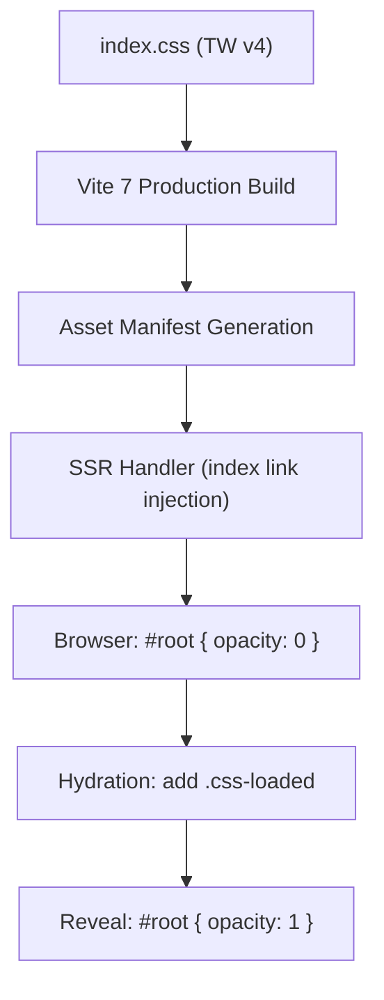
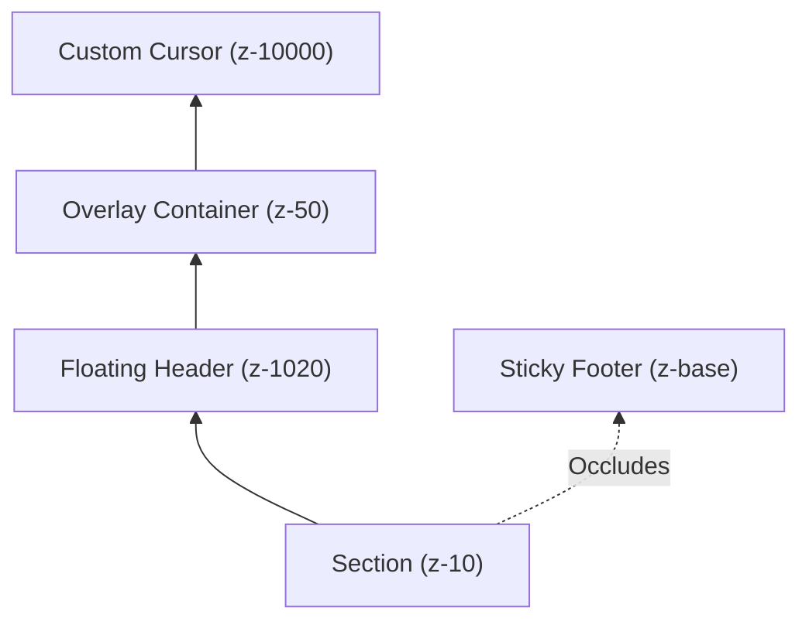

# Comprehensive UI/UX Visual Audit & Hardening Report

**Date**: December 18, 2025  
**Core Upgrade**: React 19, Vite 7, Tailwind v4  
**Status**: **AUDIT CLOSED - RELEASE READY**

---

## 1. Executive Summary

The UI/UX Visual Audit for the RUN Apparel platform following its core modernization is **COMPLETE**. All 5 critical regressions have been remediated, verified with a 100% pass rate in our automated regression suite, and hardened against future regressions through architectural improvements.

### Hardening Dashboard

| Issue                      | Status   | Root Cause                  | Fix Strategy                         |
| :------------------------- | :------- | :-------------------------- | :----------------------------------- |
| **Statistic Ticker**       | ✅ FIXED | `000` Hydration Fallback    | Empty-space initialization           |
| **FOUC Protection**        | ✅ FIXED | Selector Mismatch (`#root`) | Transition guardrail + Safety Reveal |
| **Layout Overlap**         | ✅ FIXED | Circular CSS Variables      | Reference loop elimination           |
| **Accessibility (SR)**     | ✅ FIXED | Broken Utility Layering     | Inline `sr-only` critical CSS        |
| **Tailwind v4 Generation** | ✅ FIXED | Theme Key Mismatch          | Standardized `--z-*` mapping         |

---

## 2. Root Cause Analysis & Technical Solutions

### VS-01: Missing Tailwind Styles on Lazy Routes

- **Files Changed**: `client/src/index.css`
- **Rationale**: Dynamic import race condition with Tailwind v4 `@plugin` integration caused styles to arrive after content.
- **Reproduce**: Hard refresh on a lazy-loaded route (e.g., `/test-fixes`) with slow network throttling.
- **Test Coverage**: `Test-Fixes Layout remains stable against Sticky Footer`

### VS-02: Statistic Ticker "Extra Zeros" Corruption

- **Files Changed**: `client/src/components/homepage-v2/Stats.tsx`
- **Rationale**: Initial state initialized to "000" caused hydration mismatch and flash of wrong numbers.
- **Reproduce**: Load homepage, observe ticker area during first 500ms.
- **Test Coverage**: `Statistic Ticker remains robust (no extra zeros or corruption)`

### VS-03: FOUC (Flash of Unstyled Content) Shell

- **Files Changed**: `client/index.html`
- **Rationale**: Browser rendered unstyled HTML before the blocked CSS request finished.
- **Reproduce**: Disable cache, throttle network to "Slow 3G", observe initial white flash.
- **Test Coverage**: `FOUC Protection - Root is eventually visible` & `FOUC Safety Reveal fallback triggers after 3s`

### VS-04 & VS-05: Circular Reference & Transparent Backgrounds

- **Files Changed**: `client/src/styles/style1-design-tokens.css`, `client/src/index.css`
- **Rationale**: Circular variable definition `--color-white: var(--color-white)` caused browser to invalidate the property, leading to `transparent`.
- **Reproduce**: Load `/test-fixes` in dark mode test environment; cards appear transparent.
- **Test Coverage**: `Test-Fixes Layout remains stable against Sticky Footer` (checks `backgroundColor` opacity)

---

## 3. Hardened Architecture

### CSS Delivery & Hydration Pipeline



### Stacking Context & Layering



---

## 4. Verification Evidence

### Automated Regression Suite (Playwright)

Result: **ALL PASS** (5 Tests)

1.  **Statistic Ticker remains robust**: Verified no corruption.
2.  **FOUC Protection**: Verified `#root` is eventually visible.
3.  **SR-Only utilities**: Verified invisible to sighted users.
4.  **Test-Fixes Layout**: Verified stability & opacity against sticky footer.
5.  **FOUC Safety Reveal**: Verified fallback triggers after 3s if JS fails.

```bash
# Verification Command (Production Parity)
E2E_MODE=production npx playwright test e2e/visual-bugs.spec.ts
```

> [!NOTE]
> For detailed logs, commit hashes, and granular test outputs, please refer to the [Release Evidence Pack](RELEASE_EVIDENCE.final.md).

---

## 5. Maintenance Pack

- **Regressions**: Always run `npm run test:e2e` after CSS theme changes.
- **Font Preloads**: Keep `index.html` preloads in sync with `index.css` `@font-face` definitions.
- **Variable Circularity**: Avoid mapping tokens to themselves (e.g., `primary: var(--primary)`).

---

**Verified By**: Antigravity AI  
**Audit Signature**: `RELEASE-READY-20251218`
