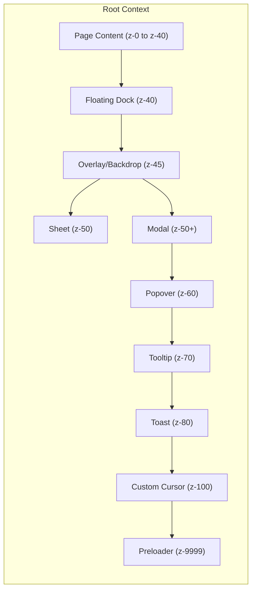

# UI Visual Layering & Z-Index Contract

> [!IMPORTANT] > **Strict Adherence Required**: Z-index chaos leads to visual regressions. Use only the defined semantic utilities.

## Core Principles

1.  **Semantic over Magic Numbers**: Never use arbitrary `z-[123]`. Use `z-modal`, `z-tooltip`, etc.
2.  **Context Isolation**: Use `isolation: isolate` (Tw: `isolate`) when creating new internal stacking contexts to prevent leaking.
3.  **One Scale to Rule Them All**: Modifications to the z-index scale in `index.css` require team review.

## Z-Index Scale

The z-index scale is defined in `client/src/index.css` as semantic variables and utilities.

| Utility Class      | Value | Semantics                                                                 |
| ------------------ | ----- | ------------------------------------------------------------------------- |
| `z-0` to `z-50`    | 0-50  | Standard layout levels. `z-50` is generally the ceiling for page content. |
| `z-dock`           | 40    | Floating navigation dock. Must be above page content but below modals.    |
| `z-sheet`          | 50    | Slide-over sheets and sidebars.                                           |
| `z-modal-backdrop` | 45    | The dark overlay behind modals.                                           |
| `z-modal`          | 50+   | Dialogs and Modals. (Often uses `var(--z-modal)`).                        |
| `z-popover`        | 60    | Dropdowns, Select menus, Popovers.                                        |
| `z-tooltip`        | 70    | Tooltips, hovering info cards.                                            |
| `z-toast`          | 80    | Toasts, notifications.                                                    |
| `z-cursor`         | 100   | Custom cursor elements.                                                   |
| `z-preloader`      | 9999  | App initialization preloader (should disappear).                          |

### Reserved / Legacy (Do Not Use New)

| Utility Class          | Value | Notes                                         |
| ---------------------- | ----- | --------------------------------------------- |
| `z-modal-overlay-1..3` | 51-53 | Legacy overlay levels. Use `z-modal` instead. |
| `z-modal-nested-1..3`  | 51-53 | Legacy nested modal levels.                   |
| `z-modal-critical`     | 60    | Critical error modals.                        |



## Approved Patterns

### Modals

Modals should use `z-modal` or `z-50`. Ensure they are rendered in a Portal if possible to avoid stacking context traps.

```tsx
// ✅ Correct
<DialogContent className="z-modal"> ... </DialogContent>

// ❌ Incorrect
<div className="z-[9999]"> ... </div>
```

### Dropdowns

Dropdowns should use `z-popover`.

```tsx
<PopoverContent className="z-popover"> ... </PopoverContent>
```

## Common "Footguns"

1.  **Opacity < 1**: Setting `opacity` to anything less than 1 creates a new stacking context. `z-index` inside will not escape.
2.  **Transform**: Applying `transform`, `filter`, `perspective`, etc., also creates a new stacking context.
3.  **Fixed Positioning**: `fixed` elements inside a transformed parent act like `absolute` relative to that parent, not the viewport.

## Linter Enforcement

We use `scripts/lint-css-contract.mjs` to strictly enforce this policy.
Run `npm run lint:css-contract` to verify your changes.

**Violation Policy**:

- **Arbitrary values (`z-[...]`)**: Strictly Forbidden. Exception must be added to allowlist in linter config with comment.
- **Undefined semantic classes**: Forbidden. Add new class to `index.css` via `@utility` first.
