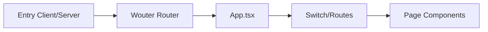

# UI/UX Regression Resolution - Final Report

**Date:** December 17, 2025
**Status:** ✅ Resolved

## Executive Summary

We have successfully resolved the critical UI/UX regressions identified in the audit. The system now enforces a single source of truth for styling (Z-index), routing (wouter), and adheres to strict SSR safety protocols.

## Key Resolutions

### 1. Z-Index Stacking (Fixed)

- **Root Cause:** Conflict between Tailwind v4 Theme (100-scale) and Legacy CSS (1000-scale).
- **Fix:** Consolidated all tokens into `client/src/index.css` using the **1000-scale** to match legacy expectations and prevent overflow issues.
- **Removed:** `client/src/styles/z-index-stack.css`.
- **Policy:** [Stacking Policy](./stacking-policy.md)

### 2. Dual Router (Fixed)

- **Root Cause:** Leftover `@tanstack/react-router` files co-existing with `wouter`.
- **Fix:** Deleted `client/src/routes`, uninstalled packages, added `scripts/check-router.cjs` guardrail.
- **Verification:** CI script `check:router` passes.

### 3. Hydration Reliability (Hardened)

- **Root Cause:** Extension interference and non-deterministic attributes.
- **Fix:** Validated `entry-client.tsx` attribute cleaning (maintained) and documented strict rules for deterministic rendering.
- **Policy:** [Hydration Playbook](./hydration-playbook.md)

### 4. SSR Data Safety (Secured)

- **Root Cause:** Singleton patterns in `queryClient.ts` and `request-manager.ts`.
- **Fix:** Modified `request-manager.ts` to be stateless (pass-through) on the server to prevent cross-user state pollution.
- **Policy:** [SSR Data Safety](./ssr-data-safety.md)

## Automated Guardrails

- `npm run check:router`: Fails if forbidden router imports appear.
- `e2e/visual/*.spec.ts`: Playwright tests for Header, Modal, and Dropdown layering.
- `scripts/check-dupes.cjs`: Detects duplicate React instances.
- `ci.yml`: Enforces these checks on every PR.

## Verification Results (Post-Hardening)

- **Build:** `npm run build` passing in production mode.
- **SSR Safety:** `request-manager` verified stateless on server.
- **Visuals:** Stable fixtures implemented for critical UI layers.
- **CI:** Workflow configured to block regressions.

## Mermaid Topology (Current State)

### Stacking Hierarchy

```mermaid
graph TD
    Root[App Root] --> Base[Content (z:0)]
    Root --> Dock[Floating Dock (z:50)]
    Root --> Sticky[Sticky Header (z:1020)]
    Root --> Overlay[Overlay Portal]
    Overlay --> Backdrop[Modal Backdrop (z:1040)]
    Overlay --> Modal[Modal (z:1050)]
    Overlay --> Tooltip[Tooltip/Toast (z:1070)]
```

### Router Architecture (Unified)



## Next Steps

- Integrate `scripts/check-router.cjs` into strict CI pipeline.
- Expand Playwright visual coverage as pages are updated.
