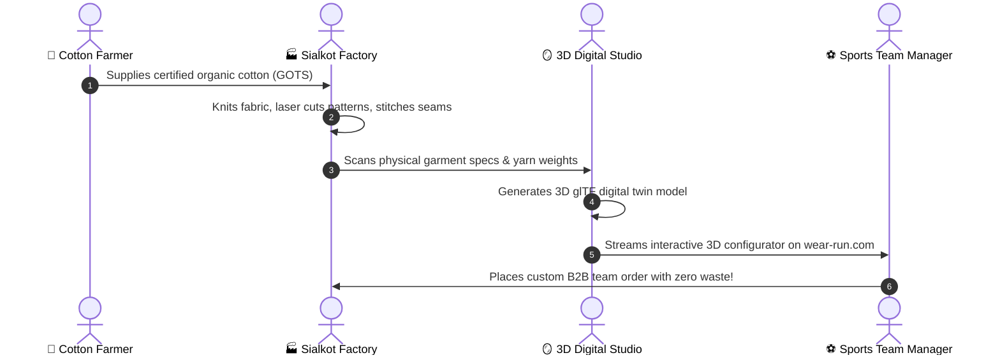

# 🧵 Chapter 1: The Garment Journey

**Topic:** Manufacturing Lifecycle & 3D Digital Twins  
**Metaphor:** "From a Soft Cotton Seed in Punjab to a 3D Spinning Jersey on Your Phone"  

---

## 🌟 The Magical Story of an Athletic Jersey

Have you ever wondered where the jersey worn by your favorite soccer player or basketball star comes from?

It doesn't just appear out of thin air — it takes a blend of ancient farming craft, heavy industrial machinery, and super-smart 3D computer graphics!

```
┌────────────────────────────────────────────────────────────────────────┐
│                   THE 6 STAGES OF A GARMENT'S LIFE                     │
├────────────────────────────────────────────────────────────────────────┤
│                                                                        │
│   🌱 1. THE SEED      ──► 🧶 2. THE LOOM      ──► 🎨 3. THE DYEHOUSE   │
│   Organic Cotton          High-speed circular     Non-toxic colors     │
│   & Recycled Yarn         knitting machines       with 85% water reuse │
│                                                                        │
│                                                          │             │
│                                                          ▼             │
│                                                                        │
│   ✈️ 6. THE STADIUM   ◄── 💻 5. THE 3D TWIN   ◄── ✂️ 4. THE STITCH     │
│   Delivered to teams      Rendered in real-time   Master tailors &     │
│   across the world        via React 19 WebGL      laser cut patterns   │
│                                                                        │
└────────────────────────────────────────────────────────────────────────┘
```

---

## 🧭 Step-by-Step Lifecycle



---

## 🔬 The Physical vs Digital Twin

| Physical Realm (Sialkot Factory) | Digital Realm (RUN Remix Web App) |
|-----------------------------------|-----------------------------------|
| **Yarn Weight (GSM):** 180–220 GSM breathable interlock knit | **Mesh Resolution:** High-polygon glTF model with progressive LOD |
| **Dye Chemistry:** Eco-friendly OEKO-TEX 100 non-carcinogenic dyes | **Color Palette:** Hex/P3 colorway swatches rendered with real-world lighting |
| **Laser Cutting:** 0.1mm robotic fabric cutting tables | **UV Mapping:** Seam-accurate texture maps wrapped over 3D torso |
| **Stitching:** Flatlock anti-chafing ergonomic seams | **Motion Engine:** GSAP 3.15 scroll-triggered garment animations |

---

## 🏆 Fun Fact

Did you know Sialkot, Pakistan is the sports manufacturing capital of the world? Over **70% of all official soccer balls used in international tournaments** are hand-crafted and thermally bonded in Sialkot! RUN APPAREL brings that exact world-class precision to athletic garments.
