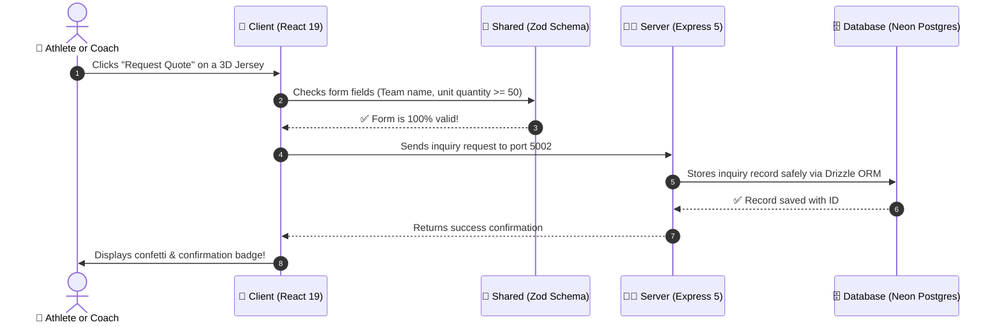

# 🏬 Chapter 2: How the Website Works

**Topic:** Full-Stack Web Architecture  
**Metaphor:** "The Storefront Window, The Universal Dictionary, The Kitchen, and The Magic Vault"  

---

## 🏗️ The 4 Rooms of Our Web House

When you click a button on the RUN Remix website, what happens behind the scenes?

Think of our software like a well-organized restaurant or department store with 4 specialized rooms:

```
┌────────────────────────────────────────────────────────────────────────┐
│                   THE 4 ROOMS OF THE RUN REMIX ENGINE                  │
├────────────────────────────────────────────────────────────────────────┤
│                                                                        │
│   🏬 ROOM 1: THE STOREFRONT (`client/`)                                │
│   • What visitors see on their screen                                  │
│   • React 19, Tailwind CSS v4, 3D glTF Model Viewer, GSAP Animations   │
│                                    │                                   │
│                                    ▼                                   │
│   📖 ROOM 2: THE UNIVERSAL DICTIONARY (`shared/`)                      │
│   • The rulebook that checks every order to make sure it is valid      │
│   • Zod data validators & TypeScript shapes                            │
│                                    │                                   │
│                                    ▼                                   │
│   🧑‍🍳 ROOM 3: THE FACTORY KITCHEN (`server/`)                           │
│   • The chefs who process requests, calculate prices, and send emails  │
│   • Express 5, Node 24, neverthrow error contracts                     │
│                                    │                                   │
│                                    ▼                                   │
│   🗄️ ROOM 4: THE MAGIC VAULT (`Neon PostgreSQL`)                       │
│   • The infinite filing cabinet that stores fabrics, products & orders │
│   • Neon Serverless Postgres, Drizzle ORM, Auto-sleeps to save power   │
│                                                                        │
└────────────────────────────────────────────────────────────────────────┘
```

---

## ⚡ What Happens When You Request a Quote



---

## 🛠️ The Tech Stack Cheat Sheet

| Room | Technology | Why We Use It |
|------|------------|---------------|
| **Storefront** | React 19 & Vite 8 | Lightning-fast page loads and instant screen updates without refreshing. |
| **Styling** | Tailwind CSS v4 | Clean, high-contrast dark/light mode tokens in `theme.css`. |
| **Motion** | GSAP 3.15 + locomotive-scroll | Silky-smooth garment physics and scroll transitions. |
| **Kitchen** | Express 5.2 | Industry-standard web server handling thousands of requests per second. |
| **Vault** | Neon PostgreSQL 17 | Serverless database that branches like code and sleeps when not in use. |
| **Linter** | Biome 2.5 | Blazing-fast Rust-based code checker keeping all files clean. |
