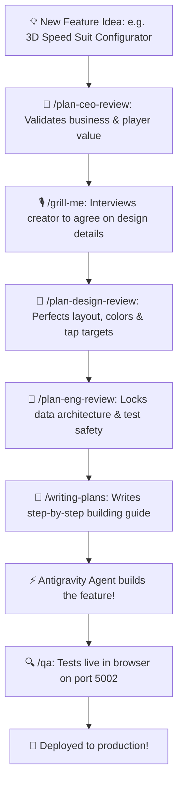

# 🤖 Chapter 3: Meet the Robot Helpers

**Topic:** AI Agent Workflows & Slash Commands  
**Metaphor:** "The Specialized Robot Assembly Crew in Our Digital Factory"  

---

## 🛠️ The Robot Assembly Crew

In our digital factory, software engineers don't work alone! We have an awesome team of specialized **AI Robot Assistants**.

Each robot has one special superpower: some are great at big ideas, some are master builders who double-check every brick, and some make sure everything looks beautiful.

```
┌────────────────────────────────────────────────────────────────────────┐
│                   THE ROBOT CREW AT THE FACTORY TABLE                  │
├────────────────────────────────────────────────────────────────────────┤
│                                                                        │
│   👔 THE BIG BOSS (CEO)       📐 THE MASTER BUILDER    🎨 THE ARTIST   │
│   `/office-hours`             `/plan-eng-review`       `/plan-design-review`│
│   "Does this help athletes?"  "Will the pipes hold?"   "Is it gorgeous?"│
│                                                                        │
│                                   │                                    │
│                                   ▼                                    │
│                                                                        │
│   🎙️ THE INTERVIEWER          📝 THE CHIEF SCRIBE      🔍 THE INSPECTOR│
│   `/grill-me`                 `/writing-plans`         `/qa`           │
│   "Let's get 100% aligned!"   "Step-by-step checklist!" "Zero bugs allowed!"│
│                                                                        │
└────────────────────────────────────────────────────────────────────────┘
```

---

## 🧭 How the Robots Work Together



---

## 📋 Slash Command Quick Reference

| Slash Command | Robot Persona | When to Call Them |
|---------------|---------------|-------------------|
| `/office-hours` | 👔 **The Big Boss** | When you have a brand-new idea and need advice on strategy and business goals. |
| `/plan-ceo-review` | 🎯 **The Strategist** | When you want to rethink a feature to make sure you are building the right thing. |
| `/grill-me` | 🎙️ **The Interviewer** | When you want the robot to interview you one question at a time until you agree on a plan. |
| `/plan-design-review` | 🎨 **The Artist** | When you want to review screens, typography, colors, and accessibility. |
| `/plan-eng-review` | 📐 **The Master Builder** | When you need to lock down database tables, API contracts, and error tests. |
| `/writing-plans` | 📝 **The Scribe** | When you are ready to write an exact implementation plan with checkboxes. |
| `/brainstorming` | 💡 **The Thinker** | When turning rough ideas into polished technical specs. |
| `/qa` | 🔍 **The Inspector** | When you want to test live web pages across mobile and desktop viewports. |
