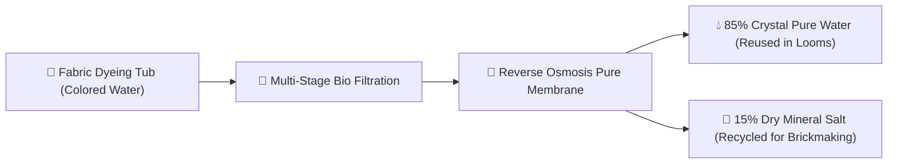

# 🌿 Chapter 4: Our Green Planet Lab

**Topic:** Sustainable Manufacturing & Clean Tech  
**Metaphor:** "The Factory That Drinks Sunshine and Cleans Its Own Water"  

---

## 🌎 Protecting Our Playground

At RUN APPAREL, we believe that making high-performance sportswear should make our planet greener, not dirtier.

Our factory in Sialkot, Pakistan is designed like a living ecosystem where almost nothing goes to waste!

```
┌────────────────────────────────────────────────────────────────────────┐
│                   THE 4 GREEN PILLARS OF OUR FACTORY                   │
├───────────────────┬───────────────────┬────────────────────────────────┤
│  ☀️ SOLAR POWER   │  💧 RECYCLED WATER│  🌿 ORGANIC YARN & FIBERS      │
├───────────────────┼───────────────────┼────────────────────────────────┤
│  • 1,200+ rooftop │  • 85% of dyehouse│  • GOTS certified organic      │
│    solar panels   │    water purified │    cotton                      │
│  • 80% of factory │  • Zero Liquid    │  • GRS certified recycled poly │
│    runs on sun!   │    Discharge (ZLD)│  • OEKO-TEX 100 non-toxic dyes │
└───────────────────┴───────────────────┴────────────────────────────────┘
```

---

## 💧 How We Clean & Recycle Water (Zero Liquid Discharge)



1. **Step 1:** After cotton fabrics are dyed, the colored water is piped into our on-site water treatment plant.
2. **Step 2:** Giant biological filters and bacteria consume excess dyes and natural starches.
3. **Step 3:** High-pressure reverse osmosis membranes separate crystal-clear pure water from natural minerals.
4. **Step 4:** 85% of the clean water goes right back into the factory to dye the next batch of jerseys, and zero dirty water enters local rivers!

---

## 🏅 Official Eco-Certifications

| Badge & Standard | What It Proves |
|------------------|----------------|
| **GOTS (Global Organic Textile Standard)** | 100% genuine organic cotton grown without synthetic pesticides or harmful fertilizers. |
| **OEKO-TEX Standard 100** | Every thread, button, and zipper is tested and guaranteed free of harmful chemicals. |
| **SMETA / Sedex ZAA600143761** | 4-Pillar audit verifying safe working conditions, fair living wages, and ethical management. |
| **ISO 9001:2015** | International standard of flawless manufacturing quality control and precision. |
