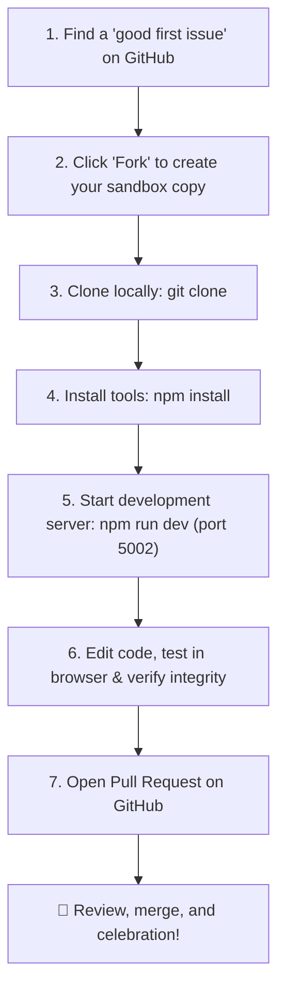

# 🧱 Chapter 5: How to Play & Contribute

**Topic:** Beginner's Guide to Open Source  
**Metaphor:** "Bringing Your Own Lego Brick to the Giant Castle Building Table"  

---

## 🌟 Anyone Can Be a Contributor

You don't need a computer science degree to help out! Whether you are a 5th grader fixing a spelling mistake in a document or a seasoned developer creating a new 3D shoe configurator, your contributions make RUN Remix better for everyone.

```
┌────────────────────────────────────────────────────────────────────────┐
│                   THE BEGINNER'S CONTRIBUTION PLAYBOOK                 │
├────────────────────────────────────────────────────────────────────────┤
│                                                                        │
│   1. PICK A TASK ──────► 2. MAKE A COPY ──────► 3. CHANGE & TEST       │
│   Find a typo, bug,      Fork repository to     Edit files and check   │
│   or "good first issue"  your GitHub account    `npm run verify`       │
│                                                       │                │
│                                                       ▼                │
│                                                                        │
│   🎉 HIGH FIVE!  ◄────── 5. ROBOT REVIEW ◄───── 4. OPEN PULL REQUEST   │
│   Your code is merged!   Automated CI checks    Send work to maintainers│
│                                                                        │
└────────────────────────────────────────────────────────────────────────┘
```

---

## 🛠️ Step-by-Step Walkthrough



### 1. Great First Tasks for Beginners

- 📝 **Fix a typo or unclear sentence** in our documentation or Wiki.
- 🎨 **Add a new colorway** to the jersey swatch palette.
- 🧪 **Write a new unit test** for a helper utility function.
- 🌐 **Improve keyboard accessibility** or screen reader descriptions.

### 2. The 3 Magic Commands You Need to Know

```bash
# 1. Start the live local website on port 5002
npm run dev

# 2. Automatically fix code formatting with Biome
npm run check:apply

# 3. Check all 8 safety systems before opening a PR
npm run verify:tech-integrity
```

---

## 🤝 Community Etiquette

Remember our [Code of Conduct](./../../CODE_OF_CONDUCT.md):
- Be kind and encouraging to other learners.
- Ask questions freely in [GitHub Discussions](<repository-url>/discussions).
- Never hesitate to ask for help if you get stuck!
