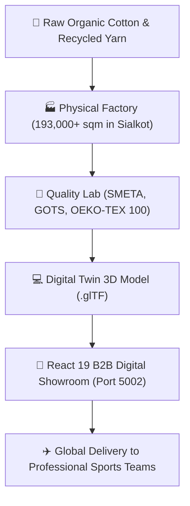

# 🏭 Welcome to the RUN Apparel Factory Grand Tour

**Welcome to the official Wiki of RUN Remix!**  

This illustrated visual knowledge book tells the story of how our physical sportswear factory in Sialkot, Pakistan (with roots going back to Durus Industries, est. **1889**) works hand-in-hand with cutting-edge 3D software and AI robots.

```
┌────────────────────────────────────────────────────────────────────────┐
│                   THE FACTORY CAMPUS MAP & ATTRACTIONS                 │
├────────────────────────────────────────────────────────────────────────┤
│                                                                        │
│   [ 1. The Loom & Dyehouse ] ────────► [ 2. The 3D Digital Studio ]    │
│   (Sialkot Heritage, Organic Cotton,    (React 19 & 3D Configurator)   │
│    Solar Roof & Recycled Water)                                        │
│                                                     │                  │
│                                                     ▼                  │
│                                                                        │
│   [ 4. The Green Planet Lab ] ◄──────── [ 3. The Robot Headquarters ]  │
│   (Zero Liquid Discharge, Solar Power,   (AI Agents, Slash Commands    │
│    OEKO-TEX & GOTS Clean Science)         & Automated Safety Checks)   │
│                                                                        │
└────────────────────────────────────────────────────────────────────────┘
```

---

## 🧭 Explore the 6 Chapters of the Factory

| Chapter | Title & Metaphor | What You Will Learn |
|---------|------------------|---------------------|
| [🧵 **Chapter 1**](./01-The-Garment-Journey.md) | **The Garment Journey** | From raw cotton seeds in Punjab to high-tech 3D digital twins on your phone screen. |
| [🏬 **Chapter 2**](./02-How-The-Website-Works.md) | **How the Website Works** | The Storefront Window, the Master Kitchen, and the Magic Database Vault. |
| [🤖 **Chapter 3**](./03-The-Robot-Helpers.md) | **Meet the Robot Helpers** | The CEO, Master Builder, Artist, and Inspector AI agents that keep things humming. |
| [🌿 **Chapter 4**](./04-Sustainable-Green-Factory.md) | **Our Green Planet Lab** | How 1,200 solar panels and 85% water recycling make sportswear eco-friendly. |
| [🧱 **Chapter 5**](./05-How-To-Play-And-Contribute.md) | **How to Play & Contribute** | How beginners and 5th graders can build Lego bricks and open Pull Requests. |
| [🔧 **Chapter 6**](./06-Troubleshooting-And-FAQ.md) | **The "Oops!" Runbook & FAQ** | Friendly step-by-step solutions when buttons glitch or servers take a nap. |

---

## ⚡ Interactive Factory Overview



---

## 📍 About RUN APPAREL (PVT) LTD

- **Established:** 1889 (Under Durus Industries textile lineage)
- **Headquarters:** 13 Km Daska Road, Sialkot, Punjab, Pakistan
- **Monthly Capacity:** 100,000+ high-performance athletic garments
- **Power Grid:** 80% on-site solar power generation
- **Water Recycling:** 85% industrial wastewater recycled via Zero Liquid Discharge
