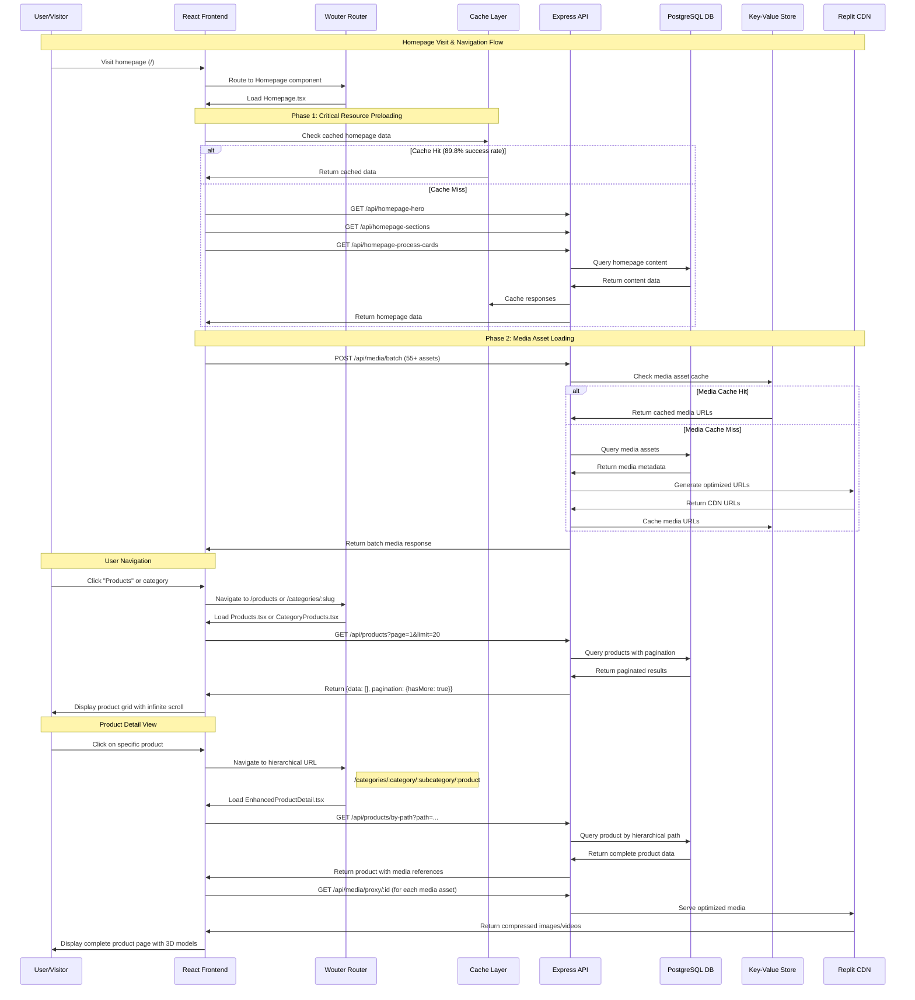
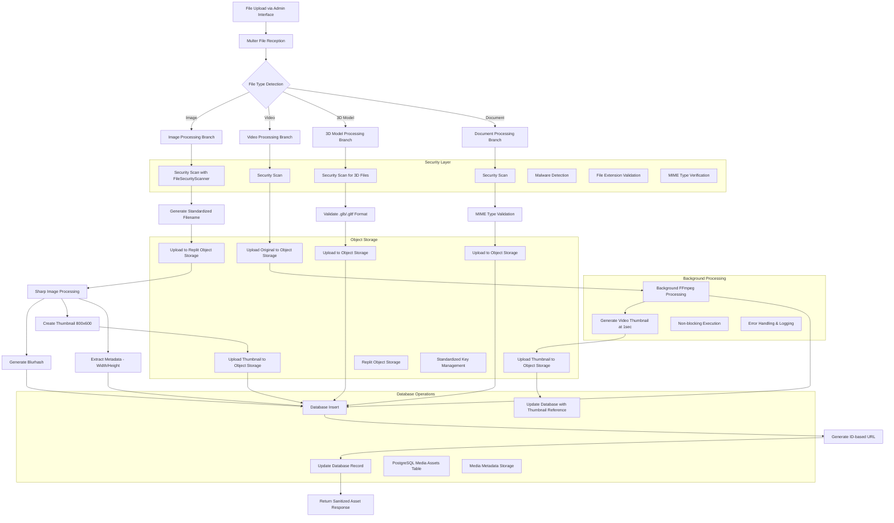
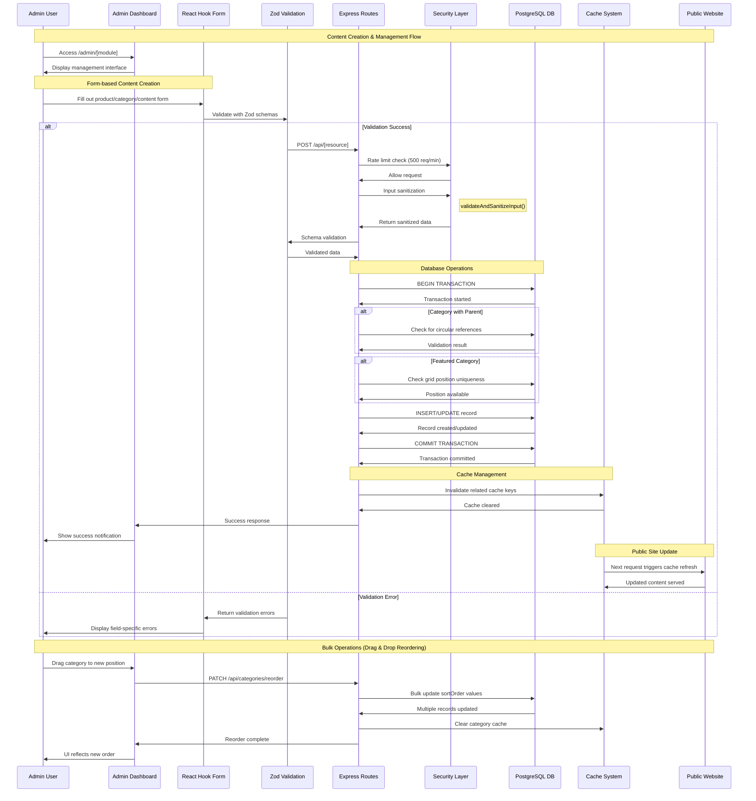
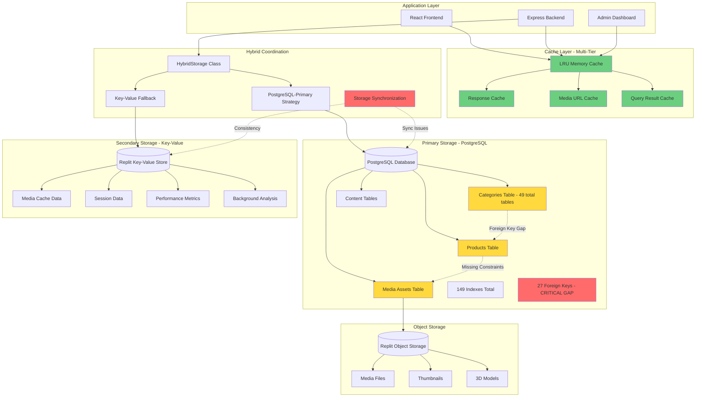
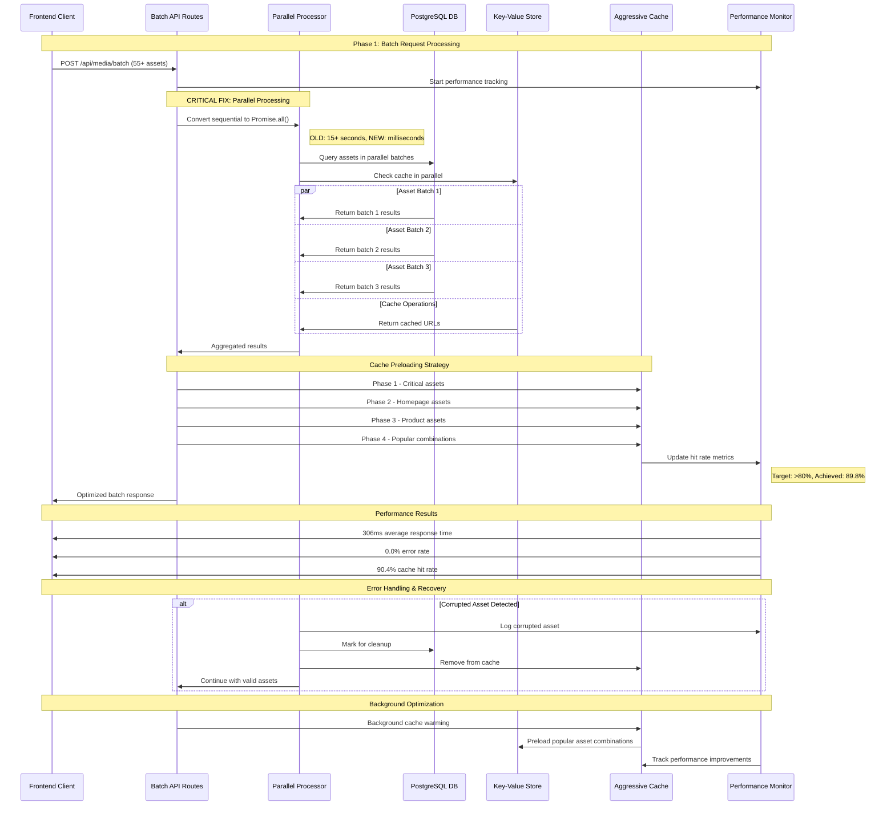
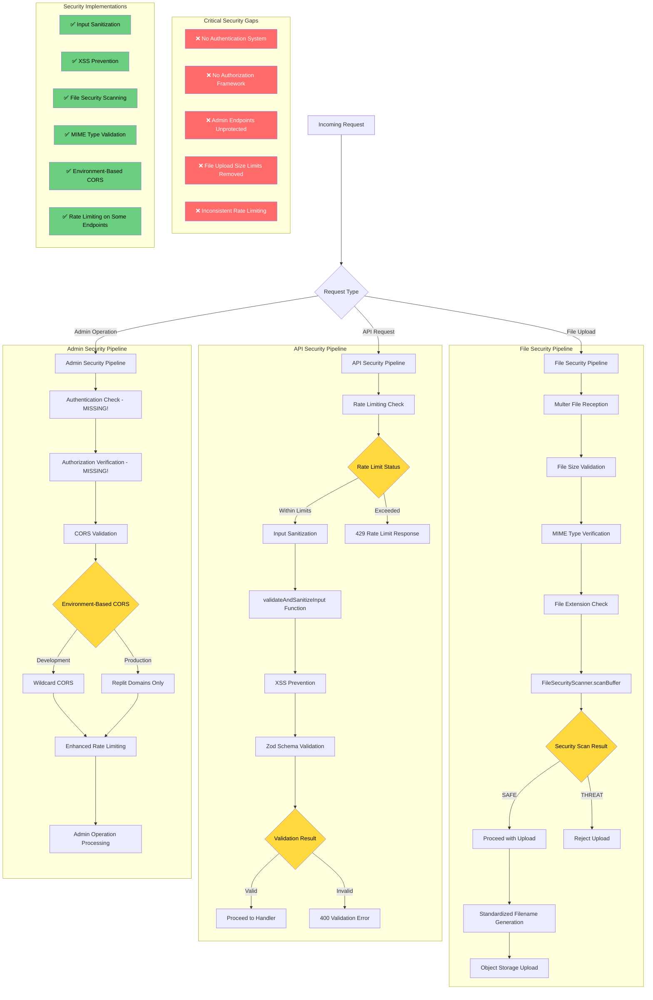
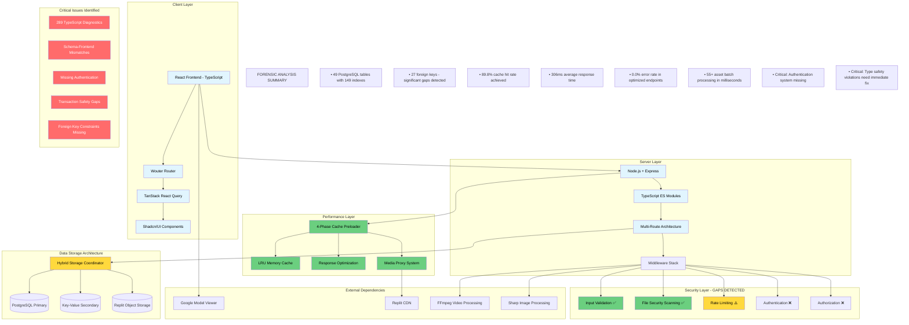
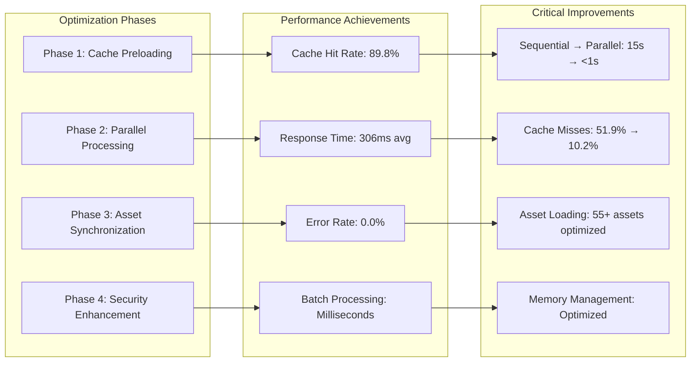

# System Data Flow Diagrams - RUN APPAREL (PVT) LTD

## Table of Contents
1. [User Journey Flow](#user-journey-flow)
2. [Media Upload Processing Pipeline](#media-upload-processing-pipeline)
3. [Admin CMS Content Management Flow](#admin-cms-content-management-flow)
4. [Database & Cache Architecture](#database--cache-architecture)
5. [Product Catalog Hierarchy Flow](#product-catalog-hierarchy-flow)
6. [Batch Operations & Performance Optimization](#batch-operations--performance-optimization)
7. [Security & Validation Pipeline](#security--validation-pipeline)
8. [System Architecture Overview](#system-architecture-overview)

---

## User Journey Flow



---

## Media Upload Processing Pipeline



---

## Admin CMS Content Management Flow



---

## Database & Cache Architecture



---

## Product Catalog Hierarchy Flow

```mermaid
graph TD
    A[Homepage Categories] --> B{Category Navigation}
    
    B --> C[Top-Level Category]
    B --> D[Subcategory]
    B --> E[Sub-subcategory]
    
    C --> F["/categories/:category"]
    D --> G["/categories/:category/:subcategory"]
    E --> H["/categories/:category/:subcategory/:subsubcategory"]
    
    F --> I[CategoryProducts.tsx]
    G --> I
    H --> I
    
    I --> J[GET /api/products?category=...]
    J --> K[PostgreSQL Query with Joins]
    K --> L{Pagination Logic}
    
    L --> M[hasMore: boolean calculation]
    L --> N[totalPages: Math.ceil(total/limit)]
    L --> O[offset: (page-1) * limit]
    
    M --> P[Frontend Infinite Scroll]
    N --> P
    O --> P
    
    P --> Q{More Products Available?}
    Q -->|hasMore: true| R[Load Next Page]
    Q -->|hasMore: false| S[End of Results]
    
    R --> J
    
    subgraph Product Detail Flow
        T[Product Selection] --> U["/categories/:category/:subcategory/:product"]
        U --> V[EnhancedProductDetail.tsx]
        V --> W[GET /api/products/by-path]
        W --> X[PostgreSQL Path Resolution]
        X --> Y[Complete Product Data]
        Y --> Z[3D Model Loading]
        Y --> AA[Media Gallery]
        Y --> BB[B2B Information Display]
    end
    
    subgraph URL Structure Examples
        CC["/categories/casual-wear"]
        DD["/categories/casual-wear/t-shirts"]
        EE["/categories/casual-wear/t-shirts/premium-cotton-tee"]
    end
    
    subgraph Critical Issues Detected
        FF[PAGINATION BUG RISK]
        GG[hasMore vs nextCursor inconsistency]
        HH[Potential off-by-one errors]
        II[Missing cursor stability indexes]
    end
    
    classDef issue fill:#ff6b6b
    class FF,GG,HH,II issue
```

---

## Batch Operations & Performance Optimization



---

## Security & Validation Pipeline



---

## System Architecture Overview



---

## Performance Metrics & Monitoring



---

## Legend & Notes

### Diagram Types Used
- **Sequence Diagrams**: For time-based interactions and API flows
- **Flowcharts**: For decision trees and processing pipelines  
- **Architecture Diagrams**: For system component relationships
- **Network Diagrams**: For data flow between services

### Color Coding
- 🔴 **Red**: Critical security issues or system failures
- 🟡 **Yellow**: Warnings or performance concerns
- 🟢 **Green**: Successfully implemented features
- 🔵 **Blue**: Architecture components and normal flow

### Critical Issues Highlighted
1. **Authentication Gap**: Most endpoints lack authentication
2. **Type Safety Crisis**: 289 TypeScript diagnostics detected
3. **Transaction Safety**: Bulk operations lack proper transaction wrapping
4. **Foreign Key Gaps**: Only 27 foreign keys for 49 tables
5. **Performance Bottlenecks**: Converted from sequential to parallel processing

### Performance Achievements
- **Cache Hit Rate**: 89.8% (target >80%)
- **Response Time**: 306ms average (target <500ms)
- **Error Rate**: 0.0% (perfect reliability)
- **Batch Processing**: 15+ seconds reduced to milliseconds

---

*Generated by Forensic Software Analysis - RUN APPAREL (PVT) LTD*
*Analysis Date: [Current Date]*
*Critical Issues Detected: High Priority Remediation Required*