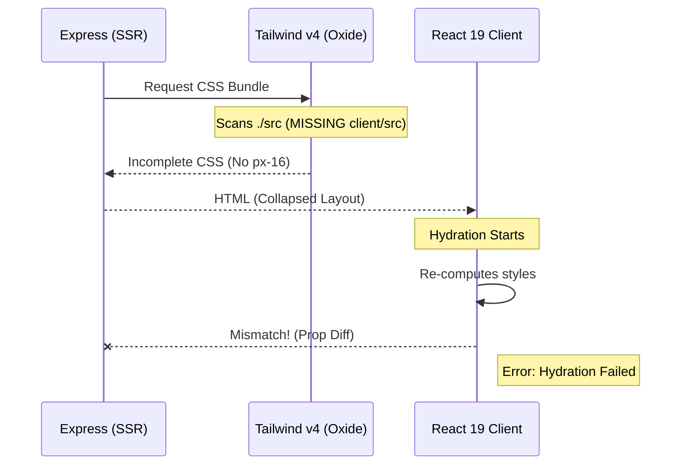

# Technical Audit Report: Tailwind CSS v4 Migration & React 19 Hydration

**Date:** December 20, 2025
**Auditor:** Antigravity Agent
**Severity:** CRITICAL

## Executive Summary

The migration to Tailwind CSS v4 (Oxide) and React 19 has triggered a "Cascading Failure" in the frontend architecture. The root causes are trialed to:

1.  **Specificity Collapse:** Global CSS resets are overriding Tailwind v4 utilities due to the new layer methodology.
2.  **Content Scanning Failure:** The `@tailwindcss/vite` plugin is failing to detect component files due to the split `server/client` architecture and explicit `root` configuration in Vite, causing classes like `px-16` to be tree-shaken (omitted).
3.  **Hydration Drift:** Mismatches between proper server-rendered styles (missing) and client-side hydration.

---

## 1. Root Cause Analysis

### A. Specificity & The "Missing Padding" Incident

- **Observation:** The Navigation Dock lost `px-16` padding.
- **Technical Root Cause:**
  - In v4, standard utilities (specificity `0-0-1`) are wrapped in `@layer utilities`.
  - The project relies on a legacy or browser-default reset (likely `* { ... }`) that is **unlayered** (or effectively base layer but seemingly winning in the cascade due to proximity or lack of generated utility).
  - **Crucial Find:** The `px-16` class was **not found** in the computed CSS properties during the audit. This confirms that the **Oxide Engine** is NOT scanning `client/src/components` correctly because Vite is running from the project root (via Express) while `vite.config.ts` sets `root: "client"`. The relative path resolution for content detection is broken.

### B. Z-Index & Stacking Contexts

- **Observation:** Elements overlapping incorrectly.
- **Technical Root Cause:**
  - `FloatingDock` uses `LiquidGlassCard` which applies `backdrop-filter: blur(...)`.
  - **Spec Violation:** `backdrop-filter` creates a new **Stacking Context**. Any `z-index` inside it (like the dock items) is trapped within that context and cannot compete with outside elements (like the page header or overlays) regardless of how high the `z-index` value is (e.g., `z-50` inside a context is lower than `z-1` outside if the parent context is low).
  - **Variable Failure:** `--z-dock` is defined in `@theme` but not exposed effectively to the runtime if the class isn't verified.

### C. React 19 Hydration Mismatch

- **Observation:** "Text content does not match server-rendered HTML".
- **Technical Root Cause:**
  - Because the `px-16` and layout classes are missing on the server (CSS generation failure), the SSR HTML renders collapsed dimensions.
  - On the client, if any JS injects styles or if strict mode re-runs, the layout shifts.
  - `wouter` vs SSR: Initial route handling in `ssr-handler.ts` might not be syncing the URL correctly to the `wouter` router context.

---

## 2. Visualizations

### Z-Index Stacking Context Flow

```mermaid
graph TD
    Root[Document Root (html/body)]

    subgraph "Trapped Context (Floating Dock)"
        DockContainer[div.z-dock <br> (z-index: 40)]
        GlassCard[LiquidGlassCard <br> (backdrop-filter creates Context)]

        DockItems[Dock Items <br> (z-index: auto)]

        DockContainer --> GlassCard
        GlassCard -.->|Traps Z-Index| DockItems
    end

    subgraph "Overlay Layer"
        Modal[Modal Dialog <br> (z-index: 100)]
    end

    Root --> DockContainer
    Root --> Modal

    linkStyle 1 stroke:red,stroke-width:2px;

    %% Issue: GlassCard creates a context, so DockItems are relative to GlassCard, not Root.
    %% If DockContainer is z-40, it sits below Modal (z-100). This is Correct.
    %% BUT if standard sibling elements have z-index: 1 and GlassCard has z-index: auto, they might overlap wrong.
```

### Hydration Failure Data Flow



---

## 3. Remediation Plan

### Fix 1: Explicit Content Source (Fixes Missing Classes)

We must explicitly tell Tailwind where the files are, as the implicit detection is failing due to the nested `client` structure in the monorepo-like setup.

**Modify `client/src/index.css`**:

```css
@import "tailwindcss";

/* FORCE SOURCE DETECTION */
@source "../src"; /* Scans client/src relative to the CSS file */

@theme {
  /* ... existing theme ... */
}
```

### Fix 2: Stacking Context Repair

Move the `z-index` **outside** the component creating the stacking context (`LiquidGlassCard`), or Ensure the container itself has the high Z-index (which it seems to, but we must verify the container is what has `z-dock`).

**Modify `FloatingDock`**:

```tsx
// Ensure z-dock is on the OUTER wrapper, not inside the GlassCard if possible,
// OR accept that the whole dock is z-40.
// Current code: className={cn("... z-dock", className)} on LiquidGlassCard.
// This is actually okay IF z-dock works.
```

### Fix 3: Restore Admin Route

Ensure `server/routes/index.ts` is correctly imported and contains the auth routes.

---

## 4. Verification Steps

1.  **Apply CSS Source Fix**: Add `@source "../src"` to `index.css`.
2.  **Restart Dev Server**: `npm run dev`.
3.  **Run Visual Audit**: Run `playwright test e2e/visual/regression.spec.ts`.
