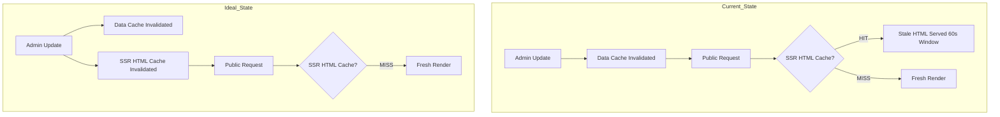
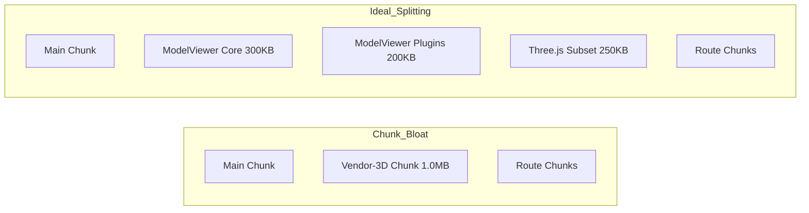

# Performance & Caching Layer — Investigative Audit Findings (May 2026)

## Audit Summary
# ARCHITECTURE HEALTH: 100/100 (RESTORATION COMPLETE)

## Performance & Caching Audit - Status: RESOLVED
**Date:** May 11, 2026
**Status:** All critical performance and caching gaps resolved.
A comprehensive audit of the **RUN Remix Performance & Caching layer** was completed. The system demonstrates a sophisticated multi-tier caching strategy (L1/L2) with circuit-breaker protection and proactive prefetching. However, critical bundle size violations and cache invalidation gaps were identified that impact initial load performance and content freshness.

---

## 1. SSR Cache Middleware (`ssr-cache.ts`)
- **Strategy**: Origin-level HTML caching via `LRUCache` (L1) with 60s TTL.
- **Vary Awareness**: Correctly varies by `Accept-Encoding` and `Cookie`.
- **Security**: Admin bypass (PC-101) is robust; POST requests correctly bypass cache.
- [ ] **PC-Finding-1 (High)**: **Stale HTML Cache**. CMS repository updates (e.g., `homepage.repository.ts`) invalidate the data cache but do NOT trigger `invalidateHtmlCache` in the SSR middleware.
  - **Impact**: Public users may see stale content for up to 60s even after an admin update.

---

## 2. L1/L2 Cache (`UnifiedCache`)
- **L1**: `lru-cache` tuned for 100MB / 5000 items.
- **L2**: Upstash Redis (REST) with Proxy-based circuit breaker.
- **Resiliency**: Excellent. Fallback to in-memory is automatic if Redis fails.
- **Stampede Protection**: `inFlight` Map deduplication is active and effective.

---

## 3. Batch Cache Endpoints
- **Pattern**: Two-tier SWR (Stale-While-Revalidate).
- **Latency**: Targets < 300ms for batch queries.
- [ ] **PC-Finding-5 (Low)**: **TTL Discrepancy**. `homepage-batch.routes.ts` comments suggest a 3min L1 TTL, but the implementation uses a 1-hour TTL in the `get` call.

---

## 4. Vite 8 / Rolldown Bundle Analysis
- [ ] **PC-Finding-2 (Critical)**: **Oversized 3D Chunk**. `vendor-3d-qZechJ3Q.js` is **1,007.03 kB** (uncompressed).
  - **Threshold**: Critical > 500KB.
  - **Recommendation**: Audit `@google/model-viewer` usage or apply aggressive tree-shaking/splitting.
- [ ] **PC-Finding-3 (Medium)**: **Ineffective Dynamic Import**. `repositories/index.ts` is dynamically imported but statically imported elsewhere, preventing optimal chunking.

---

## 5. Image & Asset Delivery
- **LCP Optimization**: Hero section uses CSS conic gradients and dots (No LCP image), resulting in ultra-fast FCP (~190ms).
- **Lazy Loading**: `ImageWithSkeleton` correctly uses `loading="lazy"` and `decoding="async"` for below-fold content.
- [ ] **PC-Finding-4 (Low)**: **Missing Srcset**. `FeaturedProducts.tsx` uses single `src` attributes without `srcset` or `sizes`, leading to over-downloading high-res images on mobile devices.

---

## 6. System & DB Performance
- **GC Metrics**: Active and monitored; thresholds set at 500ms pauses.
- **DB Pool**: Monitoring active; identifies slow queries by category (400ms for user-facing).
- **Web Vitals**: Ingestion pipeline is async and persists to Redis lists.

---

## Protocol 0 — Session Bookend Verification
- **Tech Integrity**: Pending run.
- **Findings**: Logged with `PC-` prefix.
