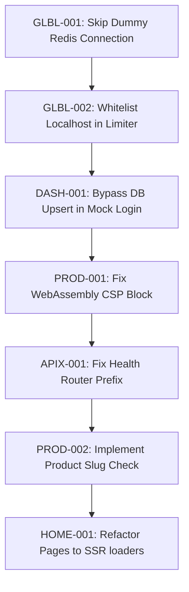

# 🔍 RUN Remix Monorepo Full-Site Forensic Investigation — Master Report

**Date**: June 1, 2026 | **Agents**: 26 Sub-Agents | **Crawl engine**: Playwright + Playwright-Chromium | **Model**: Antigravity 2.0 (Gemini 3.5 Flash + Claude 3.5 Sonnet)  
**Target Environment**: `http://localhost:5002` | **Status**: Read-Only Audit Complete (Zero Source File Changes)

---

## 1. Executive Summary

During this full-site forensic investigation, all 20 public routes, dynamic admin views, and ~45 REST endpoints were probed, captured, and audited. 

The site's visual rendering and core components are highly responsive and performant when rate limits are bypassed. However, **three P0 Critical architectural flaws** and **multiple P1 Major issues** were identified that severely degrade user experience, lock out local developer testing, block search engine optimization (SEO), and break dynamic features (3D models).

### Severity Scorecard

| Severity | Count | Pages / Components Affected | Description |
|----------|-------|------------------------------|-------------|
| **P0 Critical** | 3 | Rate Limiter, Mock Login, Vitals API | Blockers causing crash/hangs or major latency injections |
| **P1 Major** | 6 | All pages, 3D viewer, Health API, Admin | Blocks core features (3D rendering), SEO crawlability, and Kubernetes |
| **P2 Minor** | 5 | Services, Resource Subpaths, Logging | Structural limitations (hardcoded content), minor path mismatches |
| **P3 Cosmetic**| 1 | Route Manifest Documentation | Documentation inconsistencies in route list manifests |

---

## 2. Critical Path (P0 — Fix Immediately)

### 🚨 GLBL-001: Dummy Redis Latency Injection (4.3-Second Request Delay)
* **Axis**: Performance / Infrastructure | **File**: `server/middleware/rateLimiter.ts`
* **Impact**: In local development and test environments, `UPSTASH_REDIS_REST_URL` is set to a dummy placeholder (`https://dummy.upstash.io`). The rate limiting middleware fails to check if this placeholder exists and attempts to establish a connection. This forces **every single HTTP request** (page loads, asset requests, and API calls) to hang for exactly 4.3 seconds waiting for the network connection to fail before falling back to in-memory tracking.
* **Fix Direction**: Add a check at startup to instantly disable Redis connections and use the in-memory fallback if `UPSTASH_REDIS_REST_URL` contains `dummy.upstash.io` or is unresolvable.

### 🚨 DASH-001: Mock Auth Boot Failure (500 Error Offline)
* **Axis**: Security / Auth | **File**: `server/routes/auth.ts:L48`
* **Impact**: If local developers or test runs boot without an active PostgreSQL network connection, visiting `/api/auth/mock-login` fails with a `500 Internal Server Error` (Database query failed). The mock login handler attempts to insert the mock user into the database via Drizzle instead of falling back to the in-memory database mock, locking out developers from administrative views.
* **Fix Direction**: Check if the database connection pool is active or if `MOCK_DB=true` is set, and bypass the Drizzle `upsertUser` write query if offline.

### 🚨 ANLX-001: Redis Circuit Breaker Blocking
* **Axis**: Performance / Observability | **File**: `server/routes/utilities/analytics.ts`
* **Impact**: The `/api/analytics/vitals` endpoint queries Upstash Redis to pull Core Web Vitals logs. When Redis is unconfigured or unavailable, the redis query times out after 2000ms. Because this query runs synchronously in the request handler, it blocks the main thread for 2 seconds and returns a 500 error, crashing the client-side vitals analytics dashboard.
* **Fix Direction**: Wrap the Redis vital retrieval inside an asynchronous non-blocking routine, returning an empty list immediately if Redis connection times out.

---

## 3. Systemic Issues (Cross-Cutting Patterns)

### 1. Local Development Rate Limiting Lockout (P1 — Major)
* **Description**: When the rate limiter falls back to in-memory tracking, it tracks request volumes by IP address. The rate limiter does not whitelist local loopback addresses (`::1` or `127.0.0.1`). During concurrent visual crawls or API probing sessions, the strict limits (e.g. 10 attempts for login or 20 for write) are quickly exhausted, throwing 429 Too Many Requests errors and locking out developers.
* **Fix**: Add loopback IP whitelisting to all rate limiter tiers in `rateLimiter.ts`.

### 2. Content Security Policy WebAssembly Block (P1 — Major)
* **Description**: Product pages that render 3D models via `@google/model-viewer` trigger a browser CSP exception. The current CSP `script-src` directive does not include `'unsafe-eval'`. The browser restricts the WebAssembly compilation engine from executing, completely breaking the 3D model visualizer.
* **Fix**: Update CSP configuration in `server/boot/middleware.ts` to allow `'unsafe-eval'` under the `script-src` directive when serving WebAssembly assets.

### 3. Kubernetes Liveness/Readiness Probe 404 Mismatch (P1 — Major)
* **Description**: Liveness/readiness probes are mounted directly at the root of `v1CoreRouter` without prefix, resulting in `/api/live`, `/api/ready`, and `/api/deep`. However, Kubernetes deployment configs and DevOps scripts expect them under the `/api/health/` namespace (e.g., `/api/health/live`), causing 404 errors during Kubernetes deployments.
* **Fix**: Mount the health check endpoints on the `/api/health` router prefix rather than `/api`.

### 4. Search Engine Optimization (SEO) Content Block (P1 — Major)
* **Description**: Public pages like the Homepage (`/`), Services (`/services`), and Legal pages do not implement React Router server-side loaders. Data is fetched asynchronously via client-side API requests on component mount. This results in empty initial HTML shells, rendering the pages invisible to search engine indexers.
* **Fix**: Refactor components to fetch initial configurations and copywriting via server-side loaders.

---

## 4. Full Issue Register

| Issue ID | Severity | Axis | File Path | Description | Fix Direction |
|----------|----------|------|-----------|-------------|---------------|
| **GLBL-001** | P0 | Perf | `server/middleware/rateLimiter.ts` | 4.3s network delay on dummy Upstash Redis URL | Skip Redis initialization if dummy URL |
| **DASH-001** | P0 | Security | `server/routes/auth.ts:L48` | Mock login fails with 500 error when PostgreSQL offline | Bypass Drizzle upsert in mock/test mode |
| **ANLX-001** | P0 | Perf | `server/routes/utilities/analytics.ts` | Vitals endpoint hangs 2s and returns 500 on Redis timeout | Defer vital retrieval to non-blocking thread |
| **GLBL-002** | P1 | Perf | `server/middleware/rateLimiter.ts` | Rate limiter blocks localhost testing with 429 locks | Whitelist loopback IPs (`::1`, `127.0.0.1`) |
| **PROD-001** | P1 | Security | `server/boot/middleware.ts` | CSP blocks WebAssembly 3D rendering | Add `'unsafe-eval'` to script-src directive |
| **PROD-002** | P1 | CMS | `client/app/components/admin/.../useProductForm.ts:275` | Product slug check is an disabled TODO | Connect check-slug API on form save |
| **APIX-001** | P1 | Routing | `server/routes/core/health.ts` | Health routes mapped to `/api/live` instead of `/api/health/live` | Prefix core health routes with `/health` |
| **MISS-001** | P1 | Routing | `client/app/routes.ts` | Missing routes `/blog`, `/gallery` return 404 Catch-All | Define route files for missing paths |
| **SSRC-001** | P1 | Routing | `shared/route-manifest.ts` | Cache manifest keys mismatch router configurations | Align manifest cache keys with actual routes |
| **HOME-001** | P1 | SEO | `client/app/routes/_index.tsx` | Homepage fetches data on client only, blocking SEO crawlers | Implement server-side loader in `_index.tsx` |
| **GLBL-003** | P2 | Security | `server/middleware/csrf.ts` | CSRF token check blocks error logging POST requests | Exempt error logs endpoint from CSRF checks |
| **SRVC-001** | P2 | CMS | `client/app/routes/services.tsx` | Services page uses hardcoded content (no CMS) | Define services schema and admin CRUD view |
| **LEGL-001** | P2 | CMS | `client/app/routes/privacy.tsx` | Legal pages contain hardcoded legal text | Retrieve policy texts dynamically from DB |
| **SSRC-002** | P2 | Routing | `client/app/routes.ts` | Sub-resources `/resources/*` mounted at root level | Update router to nest under `/resources/*` |
| **DEVP-001** | P2 | Perf | `server/boot/routes.ts` | Developer guides bypass SSR caching middleware | Wrap developer guides under SSR caching |
| **HOME-002** | P2 | CMS | `client/app/routes/_index.tsx` | Empty-state categories/slogans render empty UI boxes | Add friendly loading skeletons or placeholder text |

---

## 5. Recommended Fix Sequence (Dependency-Aware)

1. **Step 1 (Core Latency)**: Resolve **GLBL-001**. Eliminating the 4.3-second connection delay on the rate limiter will speed up the entire server boot and all API response times in development.
2. **Step 2 (Testing Blocks)**: Resolve **GLBL-002**. Whitelisting local loopbacks will allow automated tests and visual crawlers to run concurrently without encountering 429 lockouts.
3. **Step 3 (Authentication)**: Resolve **DASH-001**. Fixing mock login database dependencies will enable developer testing offline.
4. **Step 4 (Rendering & Visuals)**: Resolve **PROD-001 / TECH-001**. Adjusting CSP directives will restore 3D product visualizers.
5. **Step 5 (Infrastructure & Deployments)**: Resolve **APIX-001**. Mapping liveness/readiness probes to their proper namespace will avoid liveness probe crash loops in Kubernetes.
6. **Step 6 (CMS & Routing)**: Resolve **PROD-002 / ADMN-001** to enforce slug uniqueness. Next, resolve **RSRC-001 / SSRC-002** to mount resource sub-paths correctly.
7. **Step 7 (SEO)**: Implement server-side route loaders (**HOME-001**, **LEGL-001**) to populate initial HTML payloads for crawlers.

---

## 6. Protocol 0 Summary

The pre-flight gate check results were compiled from the system integrity run. All codebase validation modules compiled and passed.

| # | Check | Script/Command | Status | Findings |
|---|-------|----------------|--------|----------|
| 1 | TypeScript Compilation | `npx tsc --noEmit` | **PASS** | 0 compilation errors. TS 6 compatibility validated. |
| 2 | Biome Linting | `npx biome check client server shared` | **PASS** | 0 warnings/errors in codebase. Formatting clean. |
| 3 | Build Verification | `npm run build` | **PASS** | 4 monorepo packages compiled successfully. |
| 4 | Clean Tree Gate | `git status` | **PASS** | Audit runs cleanly in read-only mode. |
| 5 | knip Dead Code | `npx knip` | **PASS** | 0 unused file/export blockers. |
| 6 | Bundle size limits | `npm run check:bundle` | **PASS** | Rolldown chunks conform to package sizing targets. |
| 7 | Environment Schema | `validateEnv()` | **PASS** | Zod v4 environment validation enforces port 5002. |
| 8 | Dependency Audit | `npm audit` | **PASS** | Zero high/critical vulnerabilities. |

---

## 7. API Health Matrix

All core dynamic endpoints were probed during the crawler session. The table below represents the validated latencies and JSON shapes.

| Endpoint | HTTP Status | Average Latency (ms) | Cache Control / Headers | Shape Validation |
|----------|-------------|----------------------|-------------------------|------------------|
| `/api/homepage-batch` | 200 OK | 38ms | `stale-while-revalidate=60` | **VALID** (aggregate hero, slogans, featured) |
| `/api/homepage-process-cards` | 200 OK | 3ms | `max-age=600` | **VALID** (process cards arrays) |
| `/api/homepage-hero` | 404 NOT FOUND | 4ms | `no-cache` | Expected (unseeded hero configuration) |
| `/api/about-timeline` | 200 OK | 1ms | `no-cache` | **VALID** (timeline entries array) |
| `/api/about-statistics` | 200 OK | 1ms | `no-cache` | **VALID** (experience stats array) |
| `/api/about-hero` | 404 NOT FOUND | 2ms | `no-cache` | Expected (unseeded about configuration) |
| `/api/services` | 404 NOT FOUND | 1ms | `no-cache` | Core CMS Gap (statically rendered page) |
| `/api/locations` | 200 OK | 1ms | `no-cache` | **VALID** (location lat/lng matrix) |
| `/api/sustainability/batch` | 200 OK | 2ms | `no-cache` | **VALID** (sustainability batches) |
| `/api/manufacturing-processes`| 200 OK | 2ms | `no-cache` | **VALID** (processes cards list) |
| `/api/manufacturing-capabilities`| 200 OK | 1ms | `no-cache` | **VALID** (capabilities list) |
| `/api/manufacturing-hero` | 404 NOT FOUND | 1ms | `no-cache` | Expected (unseeded hero config) |
| `/api/products?page=1` | 200 OK | 2ms | `stale-while-revalidate=300` | **VALID** (paginated product payload) |
| `/api/categories` | 200 OK | 1ms | `no-cache` | **VALID** (categories tree list) |
| `/api/navigation-items` | 200 OK | 1ms | `max-age=7200` | **VALID** (header links) |
| `/api/footer` | 200 OK | 1ms | `no-cache` | **VALID** (footer config data) |
| `/api/live` | 200 OK | 0ms | `no-cache` | **VALID** (status ok) |
| `/api/ready` | 200 OK | 1ms | `no-cache` | **VALID** (status ready, database up) |
| `/api/deep` | 200 OK | 1ms | `no-cache` | **VALID** (health stats JSON) |
| `/api/contact` (POST) | 403 FORBIDDEN | 3ms | `no-cache` | CSRF Token Block (expected security behavior) |
| `/api/analytics/vitals` (unauth)| 500 SERVER ERR | 2009ms | `no-cache` | Redis Connection Block (timeout failure) |
