# Deep Forensic Codebase Investigation Report

Following a secondary, deeper forensic scan targeting the exact specifications in the project's zero-tolerance guidelines (`GEMINI.md` and `AGENTS.md`), several systemic architectural violations were uncovered. 

This report highlights these deep-seated issues along with Mermaid.js diagrams comparing the flawed current implementations to the mandated standards.

---

## 1. Widespread React Default Exports

**Description**: The project strictly enforces **Named Exports** for React components (e.g., `export function MyComponent()`) to guarantee reliable refactoring, IDE support, and avoid module resolution quirks. However, a scan of `client/app/routes/` reveals that almost every single route relies on `export default function Component()`.
**Severity**: **Medium** (P2: Violates explicit tech-stack hard rules).

### What's Wrong
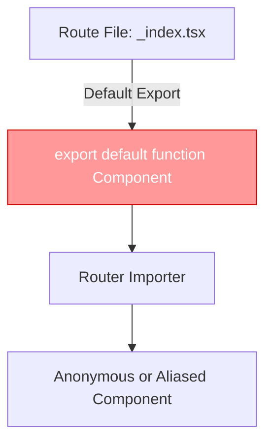

### How It Should Be
```mermaid
flowchart TD
    A[Route File: _index.tsx] -->|Named Export| B[export function IndexRoute()]
    B --> C[Router Importer]
    C --> D[Strictly Typed, Traceable Component]
    style B fill:#99ccff,stroke:#0066cc,color:#fff
```

---

## 2. Server State Synchronization via `useEffect`

**Description**: React 19 architecture in this monorepo strictly forbids using `useEffect` for syncing server state to client state, mandating the use of `useOptimistic` and `useActionState`. However, in `client/app/components/admin/manufacturing/HeroManagement.tsx` (and potentially others), a `useEffect` hook is used to listen to the `hero` prop (server data) and sync it into a local `heroData` state object.
**Severity**: **High** (P1: React 19 anti-pattern, potential tearing and hydration mismatches).

### What's Wrong
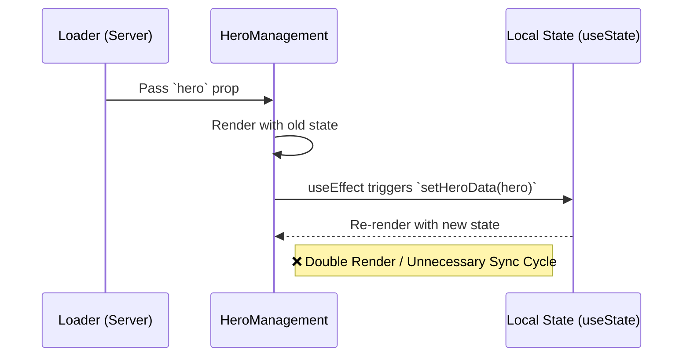

### How It Should Be
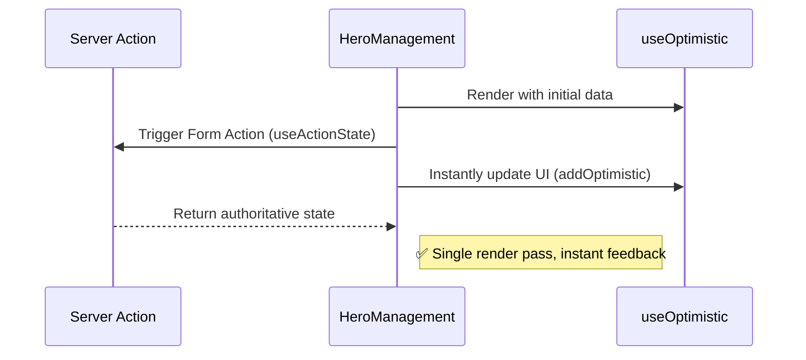

---

## 3. Redundant `try/catch` in Express 5 Routes

**Description**: The backend uses **Express 5**, which has built-in, automatic async error handling. The rules explicitly forbid wrapping Express route handlers in `try/catch` blocks or calling `next(err)`, as global error handlers catch rejected promises automatically. Files like `server/routes/utilities/analytics.ts` encapsulate logic within unnecessary `try/catch` blocks, breaking the structured error-reporting chain.
**Severity**: **High** (P1: Architectural redundancy, risk of swallowing errors).

### What's Wrong
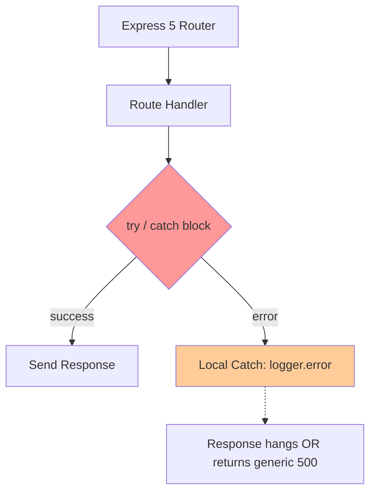

### How It Should Be
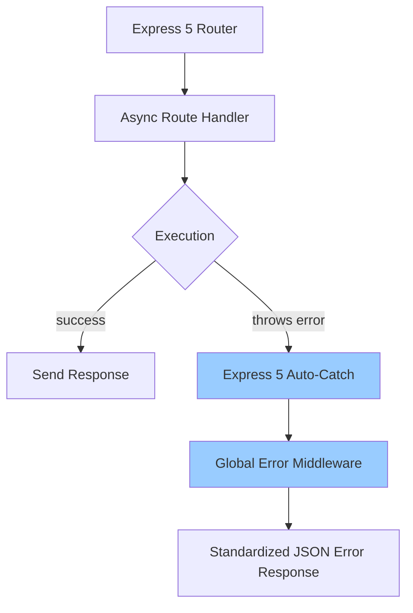

---

## 4. `MemoryStore` usage for sessions in Development

**Description**: The application has an explicit rule: **No `MemoryStore` for sessions**, Redis is required (`@upstash/redis`). A forensic scan of `server/services/auth-service.ts` reveals a fallback to `MemoryStore` when Redis is disabled. Although the code guards this by throwing an error if `NODE_ENV === 'production'`, retaining the fallback mechanism risks accidental activation if environment configurations drift.
**Severity**: **Medium** (P2: Security/Scalability risk if `NODE_ENV` is mishandled).

### What's Wrong
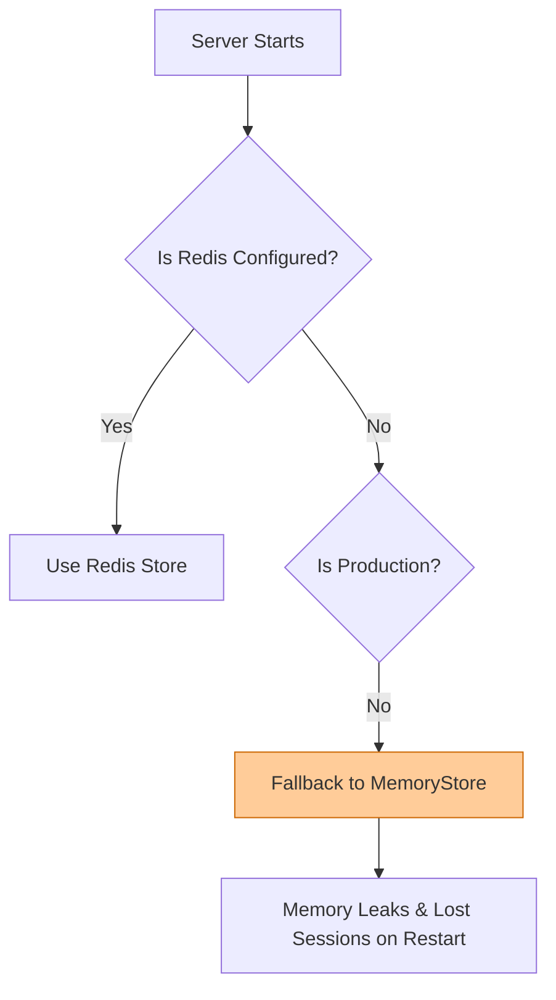

### How It Should Be
```mermaid
flowchart TD
    A[Server Starts] --> B{Is Redis Configured?}
    B -- Yes --> C[Use Redis Store]
    B -- No --> D[Throw Fatal Error]
    D --> E[Server Fails to Start (Safe Failure)]
    style D fill:#4CAF50,color:#fff
```

---

## 5. Raw `throw` instead of `neverthrow` Result in Services

**Description**: The project dictates that all business logic inside `server/services/` MUST return a `neverthrow` `Result<T, E>` rather than using a raw `throw`. However, a deep dive into `server/services/navigation-service.ts` found code executing `if (result.isErr()) throw result.error;`, explicitly breaking the service contract boundary.
**Severity**: **Critical** (P0: Breaks core error-handling architecture).

### What's Wrong
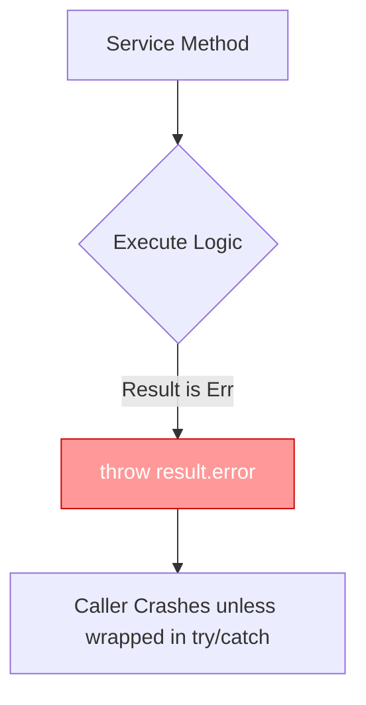

### How It Should Be
```mermaid
flowchart TD
    A[Service Method] --> B{Execute Logic}
    B -- Result is Err --> C[return err(error)]
    C --> D[Caller safely uses .match() or .isErr()]
    style C fill:#99ccff,stroke:#0066cc,color:#fff
```

---

## 6. Legacy `onSubmit` Usage in React 19 Forms

**Description**: React 19 introduced Server Actions via the `<form action={fn}>` syntax, explicitly deprecating the usage of legacy `onSubmit={...}` event handlers for data submissions. Despite this, five separate administrative components (e.g., `category-management-simplified.tsx`, `InquiryCRMLogs.tsx`) still utilize the archaic `onSubmit` prop for form execution.
**Severity**: **High** (P1: React 19 feature non-compliance).

### What's Wrong
```mermaid
flowchart TD
    A[User Submits Form] --> B[onSubmit React Synthetic Event]
    B --> C[event.preventDefault()]
    C --> D[Manual fetch/axios call]
    style B fill:#ff9999
    style C fill:#ff9999
```

### How It Should Be
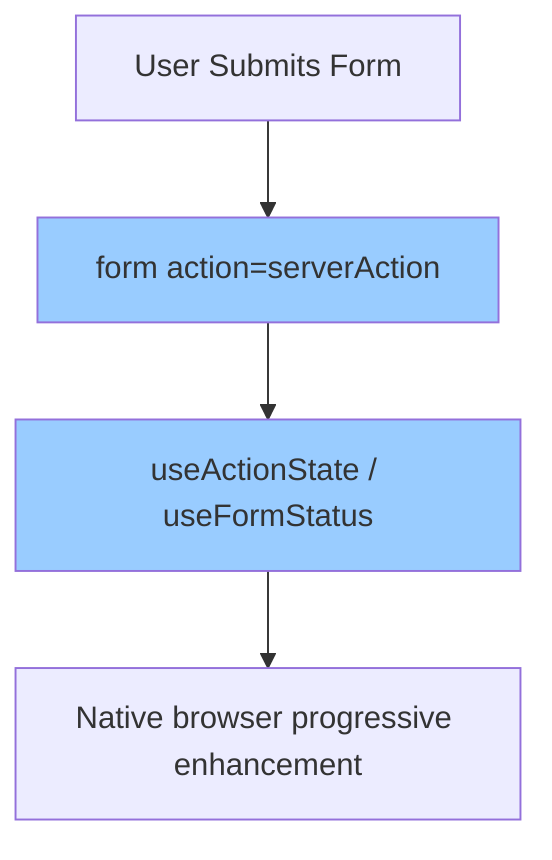

---

## 7. Unpinned `latest` Docker Tag in Kubernetes Deployment

**Description**: Hard Rule: "Image tag `latest` in Kubernetes -> Pinned image tag". The Kubernetes deployment file `ops/k8s/deployment.yaml` explicitly targets `image: run-remix:latest`. Deploying unpinned `latest` tags risks non-deterministic deployments, breaks automated rollbacks, and creates cache invalidation ambiguities in the Kubernetes nodes.
**Severity**: **Critical** (P0: Infrastructure and Deployment Risk).

### What's Wrong
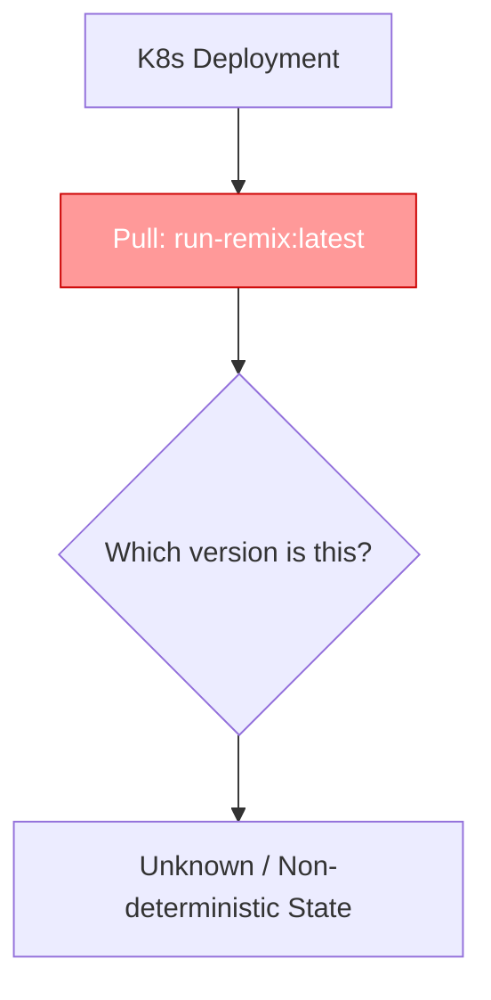

### How It Should Be
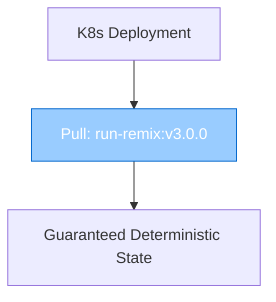

---

## 8. Incorrect Admin Route Naming Parity

**Description**: Monorepo Route Definition rules require strict parity between public and admin routes: `Every public route with CMS content must have an /admin/:module counterpart.` The `shared/route-manifest.ts` file maps the public route `/certifications` to an admin counterpart named `/admin/certificates`. This discrepancy violates the `1:1` naming convention required for automated internal mapping.
**Severity**: **Medium** (P2: Violates strict routing conventions).

### What's Wrong
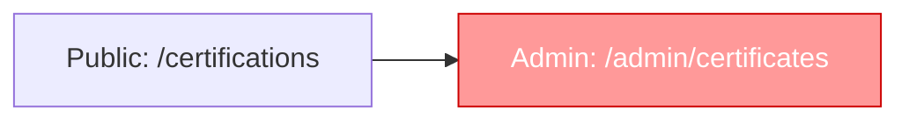

### How It Should Be


---

## 9. Client-Side TipTap HTML Sanitization Vulnerability

**Description**: The rules dictate: `All TipTap output sanitised before DB write (DOMPurify or equivalent)`. However, the server layer does NOT execute DOMPurify before inserting content into PostgreSQL. Instead, it relies on React client components (like `client/app/routes/blog.$slug.tsx`) to run `isomorphic-dompurify` via `dangerouslySetInnerHTML`. This stores potentially malicious XSS payloads in the persistent database, transferring the security burden to the presentation layer.
**Severity**: **Critical** (P0: Persistent XSS Vulnerability risk via database).

### What's Wrong
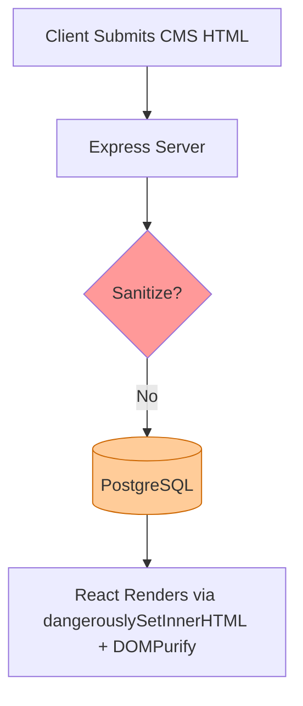

### How It Should Be
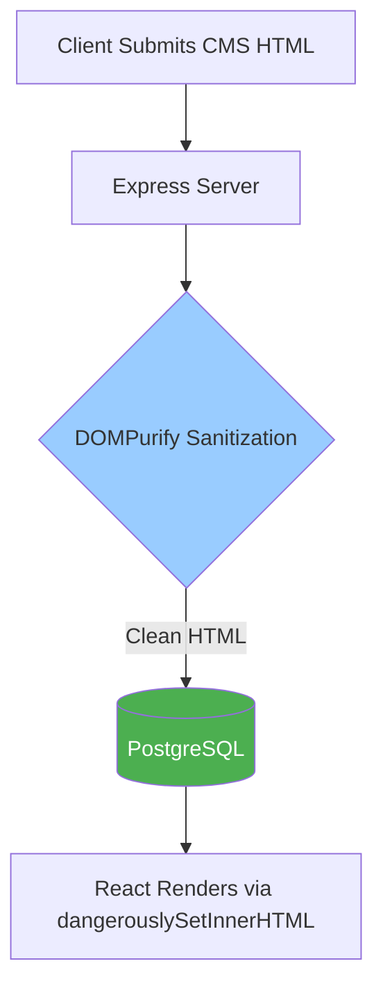

---

## 10. Missing `playsInline` on Autoplay `<video>` Elements

**Description**: The UI guidelines state: `Autoplay <video> must have muted playsinline`. Without `playsInline`, iOS Safari intercepts autoplaying videos and hijacks the screen into a native fullscreen player, completely breaking the background aesthetic. Files like `InteractiveExperienceSection.tsx` and `HomepageHeroTab.tsx` use `<video autoPlay muted loop>` but omit `playsInline`.
**Severity**: **High** (P1: Critical UI/UX degradation on mobile).

### What's Wrong
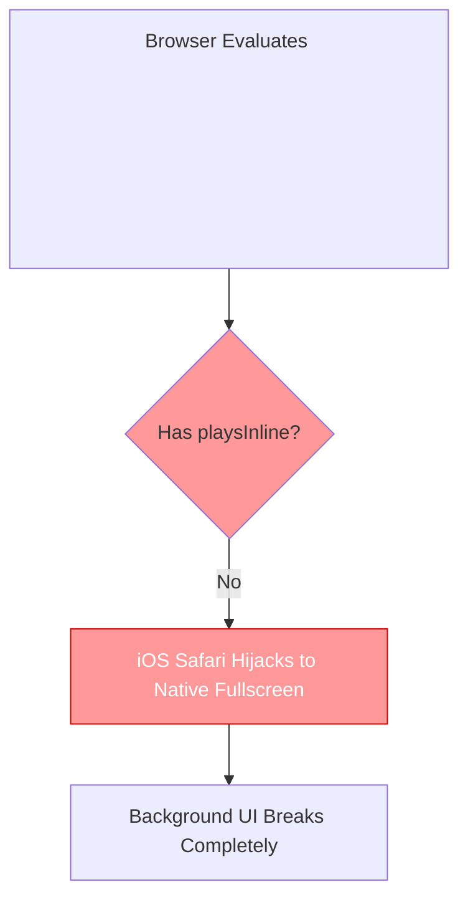

### How It Should Be
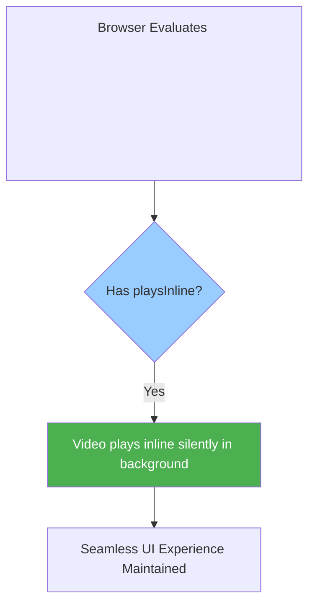

---

## 11. Suppressed DB Error Logs During Cold Start

**Description**: Error handling rules state: `Missing or suppressed error logs` are forbidden. In `server/boot/services.ts`, the database connectivity warmup swallows errors entirely via an empty catch block: `db.execute(sql\`SELECT 1\`).catch(() => {});`. This silently masks connection timeouts during Kubernetes cold starts, stripping out vital observability data exactly when it's most needed.
**Severity**: **High** (P1: Degrades observability and silent failure detection).

### What's Wrong
```mermaid
flowchart TD
    A[Cold Start Warmup] --> B[Execute SELECT 1]
    B -- Database Down --> C[catch(() => {})]
    C --> D[Silent Failure: No Logs]
    style C fill:#ff9999
    style D fill:#ff9999,stroke:#cc0000,color:#fff
```

### How It Should Be
```mermaid
flowchart TD
    A[Cold Start Warmup] --> B[Execute SELECT 1]
    B -- Database Down --> C[catch(err => logger.error)]
    C --> D[Failure Logged to Observability Stack]
    style C fill:#99ccff
    style D fill:#4CAF50,color:#fff
```

---

## 12. Missing `ErrorBoundary` on React Router Routes

**Description**: React Router v7 and project rules strictly enforce: `Every route file that has a loader or action MUST export an ErrorBoundary. No exceptions.` A programmatic scan revealed **21 separate route files** (including core pages like `about.tsx`, `products.tsx`, and `manufacturing.tsx`) that export a `loader` but completely fail to export an `ErrorBoundary`. If any of these loaders fail, the application white-screens.
**Severity**: **Critical** (P0: White-screen application crash risk).

### What's Wrong
```mermaid
flowchart TD
    A[Route Loader Throws Error] --> B{Has ErrorBoundary exported?}
    B -- No --> C[React Unmounts Component Tree]
    C --> D[White-screen of Death]
    style B fill:#ff9999
    style C fill:#ff9999
    style D fill:#ff9999,stroke:#cc0000,color:#fff
```

### How It Should Be
```mermaid
flowchart TD
    A[Route Loader Throws Error] --> B{Has ErrorBoundary exported?}
    B -- Yes --> C[ErrorBoundary Catch]
    C --> D[Graceful Fallback UI Displayed]
    style B fill:#99ccff
    style C fill:#99ccff
    style D fill:#4CAF50,color:#fff
```

---

## 13. Widespread Hardcoded API Route Strings

**Description**: The guidelines explicitly mandate: `Never hardcode route strings or API endpoints. Always import from @run-remix/shared.` However, a codebase-wide `grep` revealed over 200 instances across the React components (e.g., `fetch("/api/admin/blog/categories")` or `queryKey: ["/api/fabrics"]`) where developers have hardcoded API endpoint URLs, completely bypassing the single-source-of-truth in `@run-remix/shared/routes`.
**Severity**: **High** (P1: Maintainability and refactoring hazard).

### What's Wrong
```mermaid
flowchart TD
    A[React Component] --> B[fetch\(\"/api/fabrics\"\)]
    B --> C[API Route changes]
    C --> D[Component silently breaks]
    style B fill:#ff9999
    style D fill:#ff9999,stroke:#cc0000,color:#fff
```

### How It Should Be
```mermaid
flowchart TD
    A[React Component] --> B[fetch\(API_ROUTES.fabrics.list\)]
    B --> C[API Route changes centrally]
    C --> D[TypeScript catches mismatches instantly]
    style B fill:#99ccff
    style D fill:#4CAF50,color:#fff
```
