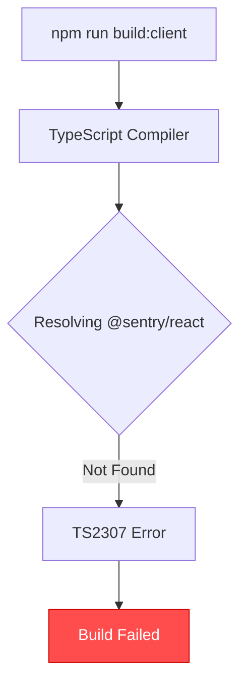
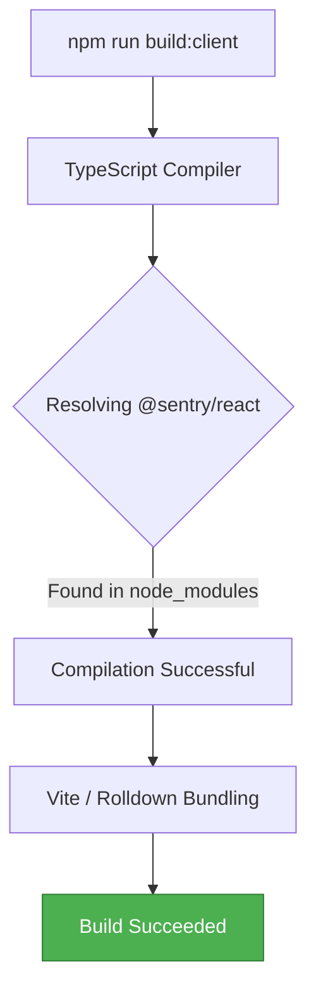
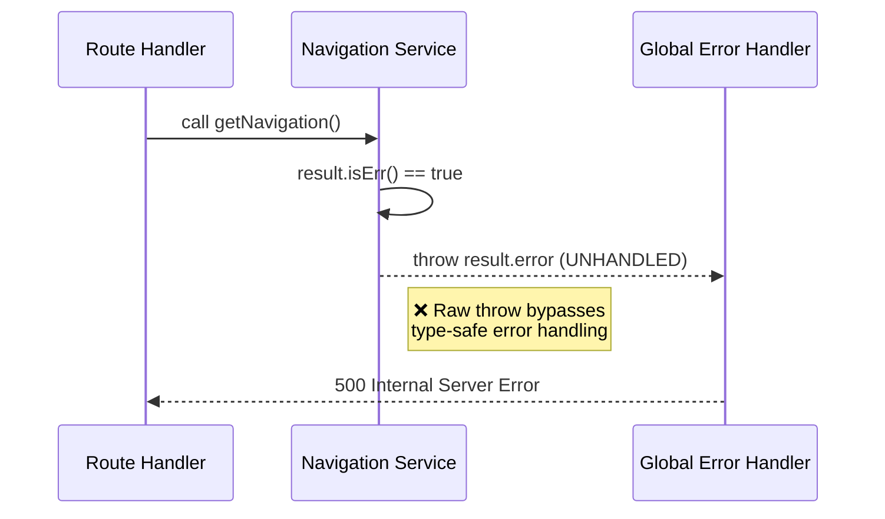
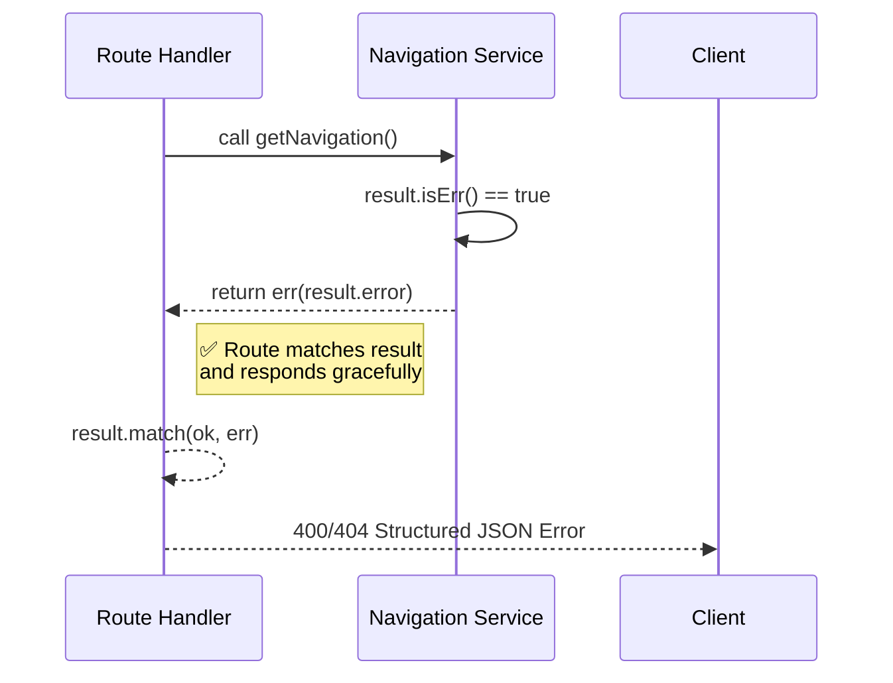
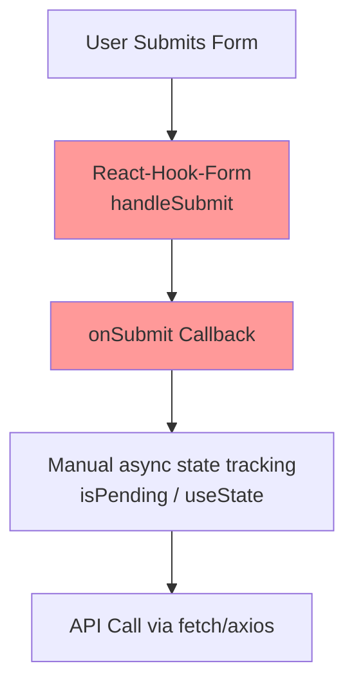
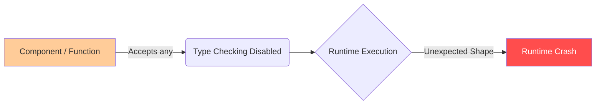
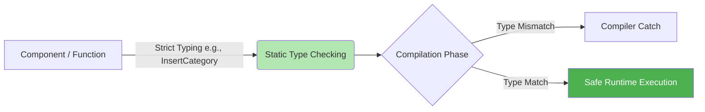
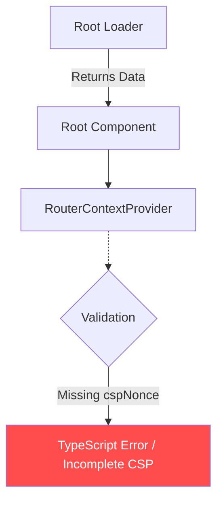
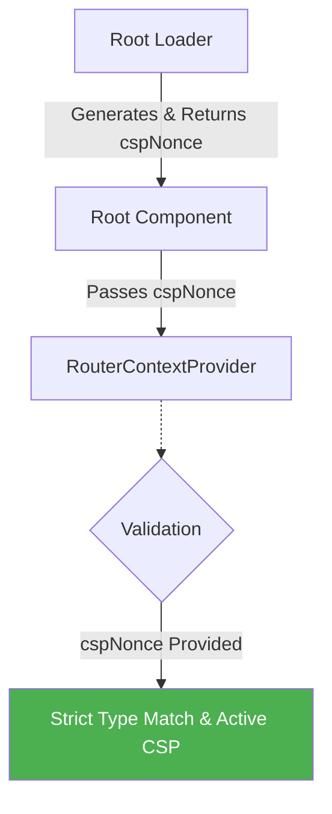

# Codebase Investigation Report

Based on a thorough scan of the `run-remix-monorepo` and the results of the `verify:tech-integrity` script, several significant issues and violations of the project's strict architecture and coding standards have been identified. 

Below is the detailed report outlining each issue, the root cause, and how it must be corrected.

---

## 1. Missing Sentry Dependencies (Build Failure)

**Description**: The client workspace is failing to build because the `@sentry/react` and `@sentry/vite-plugin` modules are imported in several files (`GlobalErrorBoundary.tsx`, `entry.client.tsx`, `sentry.ts`, and `vite.config.ts`), but they are not present in the dependencies. 
**Severity**: **Critical** (Breaks CI/CD and production builds).

### What's Wrong


### How It Should Be


---

## 2. Raw `throw` in Service Layer (neverthrow Violation)

**Description**: The project has a **Zero Tolerance Hard Rule** against raw `throw` statements in the `server/services/` layer, requiring the use of `neverthrow`'s `Result<T, E>`. However, `server/services/auth-service.ts` and `server/services/navigation-service.ts` contain raw throws. Specifically, `navigation-service.ts` contains `if (result.isErr()) throw result.error;`, which mimics forbidden `.unwrap()` behavior.
**Severity**: **High** (Violates Core Architecture).

### What's Wrong


### How It Should Be


---

## 3. React 19 Form Pattern Violations (onSubmit vs Form Actions)

**Description**: The project explicitly forbids `onSubmit` event handlers in favor of React 19's native `<form action={fn}>` and `useActionState` server actions. Multiple components (e.g., `InquiryForm.tsx`, `ContactPageSettings.tsx`, `CategoryForm.tsx`) continue to use React-Hook-Form's `handleSubmit(onSubmit)` pattern, sometimes wrapping it unnaturally in an `action={...}` closure.
**Severity**: **High** (Violates React 19 Architecture Patterns).

### What's Wrong


### How It Should Be
```mermaid
flowchart TD
    A[User Submits Form] --> B[React 19 Form Action<br>action={serverAction}]
    B --> C[useActionState<br>Handles Pending/State]
    C --> D[useOptimistic<br>Instant UI Update]
    D --> E[Server Action Executes]
    style B fill:#99ccff
    style C fill:#99ccff
    style D fill:#99ccff
```

---

## 4. Widespread `any` Type Usages 

**Description**: Biome is strictly configured with `noExplicitAny: error`, yet implicit and explicit `any` types exist in the codebase. Examples include `event` in `client/app/lib/sentry.ts`, `data: any` in `test_rhf.tsx`, and explicit `as any` casts in `ProductCreateEditModal.tsx`. 
**Severity**: **Medium** (Breaks tech-integrity pipeline).

### What's Wrong


### How It Should Be


---

## 5. Missing `cspNonce` in Root Context

**Description**: In `client/app/root.tsx`, the `RouterContextProvider` is missing the `cspNonce` property required by its interface. This results in a `TS2352` mismatch and could potentially break Content Security Policy (CSP) enforcement.
**Severity**: **High** (Security / Strict TypeScript Violation).

### What's Wrong


### How It Should Be


---

## 6. Biome Linting & Formatting Violations

**Description**: Multiple files fail the `biome check .` verification due to:
- Missing `node:` protocols for Node.js built-ins (`require('fs')` instead of `require('node:fs')` in `fix_routes.cjs` & `fix_shared_extensions.cjs`).
- Unsorted imports in several UI components (`CategoryForm.tsx`, `TechnologyRoadmapManagement.tsx`, `FooterInquiryForm.tsx`).
- String concatenation instead of template literals (`useTemplate` violation in `fix_shared_extensions.cjs`).
**Severity**: **Medium** (Code Quality Degradation).

### What's Wrong
```mermaid
flowchart LR
    A[Developer writes code] --> B[require('fs')]
    B --> C[Unsorted Imports]
    C --> D[Biome Lint Pipeline]
    D --> E[CI Pipeline Fails]
    style E fill:#ff4d4d,color:#fff
```

### How It Should Be
```mermaid
flowchart LR
    A[Developer writes code] --> B[require('node:fs')]
    B --> C[Auto-sorted Imports on Save]
    C --> D[Biome Lint Pipeline]
    D --> E[CI Pipeline Succeeds]
    style E fill:#4CAF50,color:#fff
```
