# Welcome to the RUN APPAREL Wiki 🏭

**RUN APPAREL (PVT) LTD** — *Sialkot, Pakistan* | Subsidiary of **Durus Industries** (est. 1889)

[](./Release-Notes)
[](./Architecture)
[](./Tech-Stack)
[](./Tech-Stack)
[](./Getting-Started)

> **RUN Remix** is the production-grade CMS and B2B e-commerce platform powering RUN APPAREL's premium sustainable sportswear manufacturing business. This wiki serves as the **evergreen knowledge hub** — covering architecture, roadmap, operations, and developer onboarding.

> [!NOTE]
> This wiki supplements the in-repo `docs/` directory. Versioned technical specs live in `docs/`; this wiki covers high-level architecture, roadmaps, operational guides, and cross-cutting concerns that evolve independently of code releases.

---

## Quick Navigation

| 🏛️ Architecture & Tech | ⚡ Agentic Factory | 🔒 Security & Ops | 🚀 Developer Hub |
| :--- | :--- | :--- | :--- |
| [System Architecture](./Architecture) | [B.L.A.S.T. Protocol](./BLAST-Protocol) | [Security Model](./Security-Model) | [Getting Started](./Getting-Started) |
| [Visual Gallery (12 Diagrams)](./Visual-Architecture) | [Agent Roles & Ethos](./Agent-Directory) | [CSRF Protection](./CSRF-Protection) | [Development Workflow](./Workflow) |
| [Tech Stack Reference](./Tech-Stack) | [SOPs & Runbooks](./SOPs) | [Disaster Recovery](./Disaster-Recovery) | [Coding Standards](./Coding-Standards) |
| [ADR Index](./ADR-Index) | [Design System](./Design-System) | [Multi-Region Strategy](./Multi-Region) | [Troubleshooting](./Troubleshooting) |
| [API & Error Specs](./API-Reference) | [Route Manifest](./Route-Manifest) | [Observability (OTel)](./Observability) | [Contributing](./Contributing) |
| [Data Models (ERD)](./Data-Models) | | | |

---

## Project Identity

**RUN Remix** is **not** a generic CMS. It is an **Agentic Software Factory** — a fully staffed virtual engineering organisation operating inside a single monorepo. Heritage craftsmanship meets advanced agentic engineering to ship production-grade software at 10× velocity.

### Core Principles (from the [Factory Manifesto](./Ethos))

1. **Vision First (Blueprint)** — Reasoning in markdown precedes logic in TypeScript. We build "The Why" before "The How."
2. **Physical Excellence (The Wow)** — Software must reflect the quality of the garments we manufacture. Every interaction is premium, responsive, and visually stunning.
3. **Absolute Integrity (Non-Negotiable)** — Vulnerabilities, slop, and `any` types are unacceptable. Zero tolerance for technical debt.
4. **Continuous Evolution (Evolve)** — The factory learns from every sprint. Every retrospective patches a process and updates an SOP.

---

## System Status & Health Matrix

> **Last Verified:** 15 August 2026

| Parameter | Current | Target | Status |
| :--- | :--- | :--- | :--- |
| **CMS Version** | `v4.1.2` | Semantic Release | 🟢 Stable |
| **Architecture Health Score** | **100 / 100** | $\geq 95$ | 🟢 Impeccable |
| **Test Suites** | 170+ files · 2,612 tests | $\geq 80\%$ service coverage | 🟢 Passing |
| **TypeScript & Biome** | 0 errors / 1,015 files | 0 errors | 🟢 Clean |
| **AI Slop Detector (`detect.mjs`)** | 0 anti-patterns | 0 anti-patterns | 🟢 Clean |
| **Dedicated Port** | `5002` (hardcoded) | Never 3000 | 🟢 Enforced |
| **Heuristic Critique Score** | 40 / 40 | $\geq 36$ | 🟢 Perfect |

---

## System Architecture

> [!TIP]
> **High-Fidelity Editorial Diagrams**: Access the complete set of 12 vector-rendered, self-contained SVG diagrams in the [Visual Architecture Gallery](./Visual-Architecture) or open the interactive tabbed viewer at [`wiki/diagrams/index.html`](file:///Users/hateemjamshaid/Sites/RUN/wiki/diagrams/index.html).

### C4 Context Diagram

The platform follows a **decoupled, SSR-native** architecture with strict workspace boundaries:

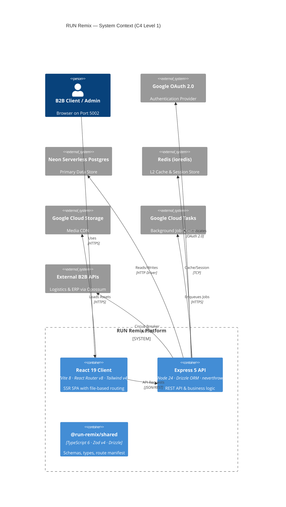

### Monorepo Structure

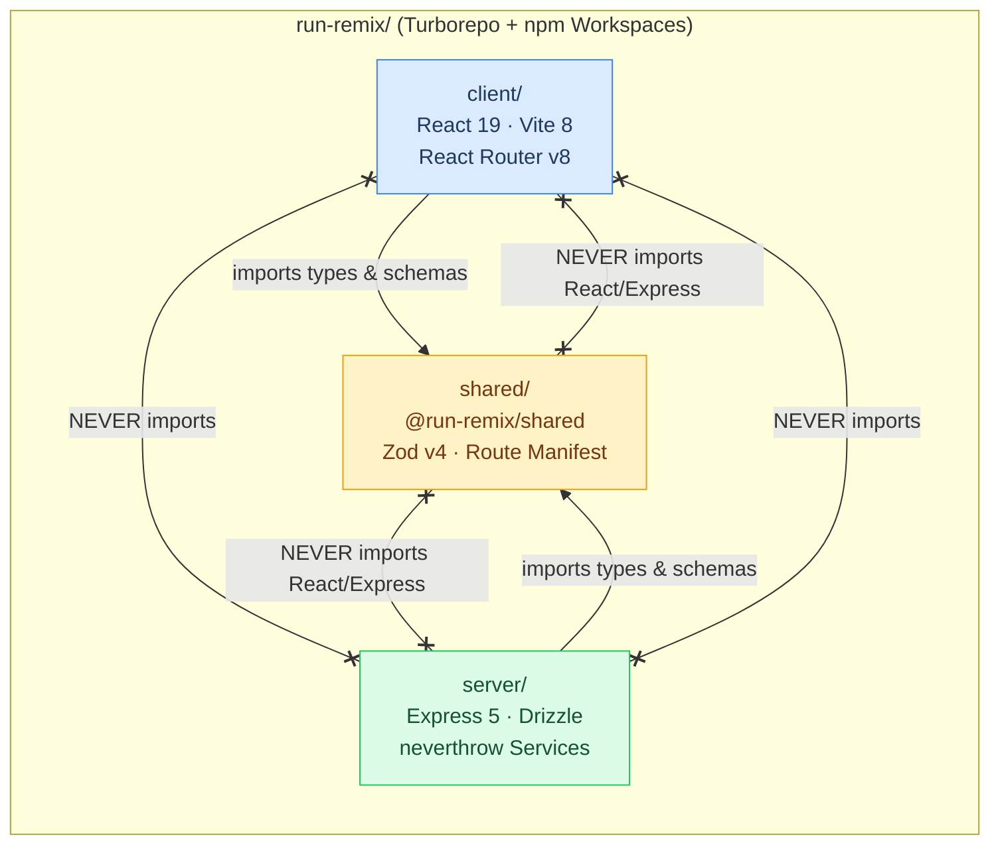

> [!IMPORTANT]
> **Import boundary is sacred.** Deep imports into `@run-remix/shared/schemas/*` are prohibited. Always use the barrel export: `import { ... } from "@run-remix/shared"`.

### Server Layered Architecture

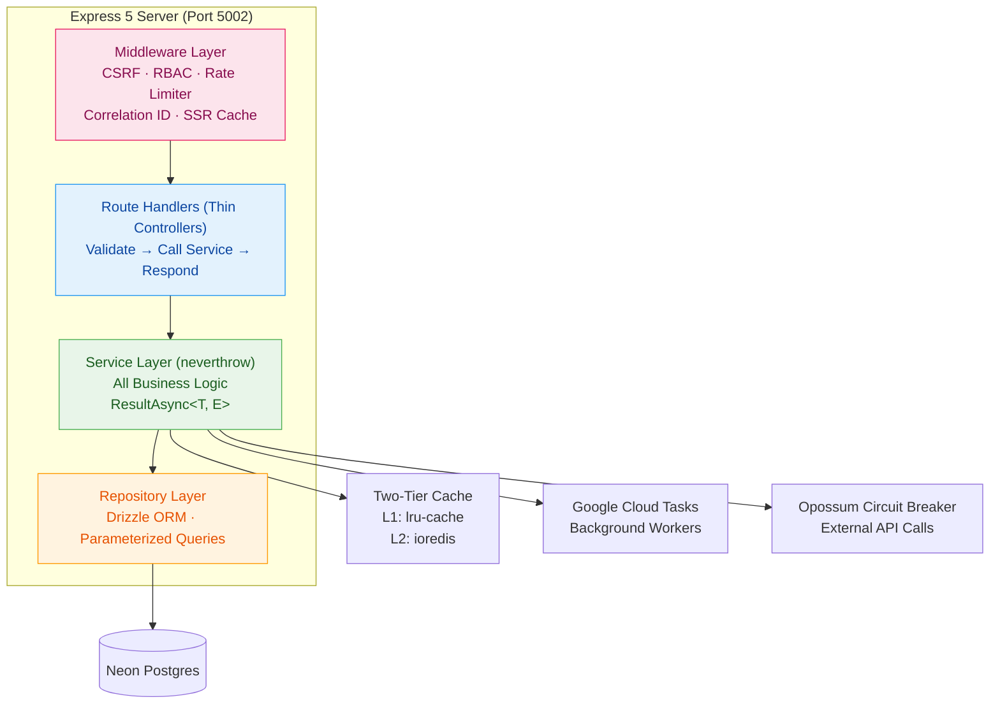

> [!TIP]
> **Thin Controller Rule:** If a route handler contains an `if` statement with domain logic, a database call, or a data transformation — it is a violation. Move it to `server/services/`.

---

## Request Lifecycle

### Product Load — Full Data Flow

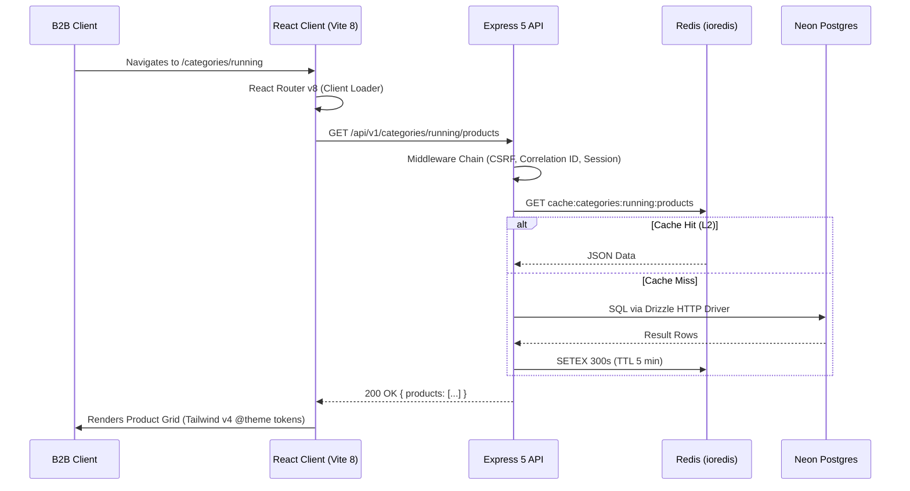

### Admin Media Upload — Background Task Flow

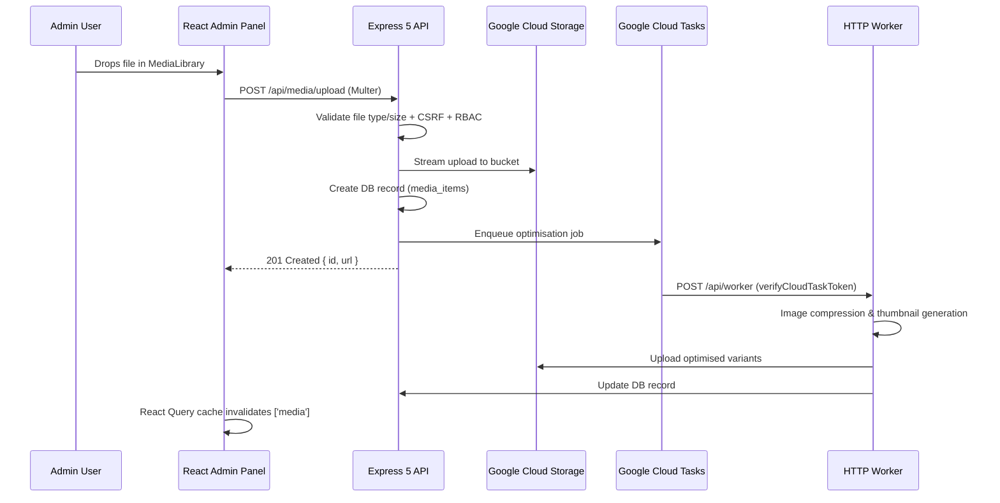

---

## Data Models (ERD)

Derived from `shared/schemas/` — the single source of truth for all data shapes.

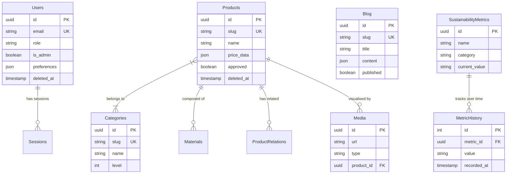

---

## CI/CD & Deployment Pipeline

### Cloud Build — Canary Rollout Strategy

```mermaid
graph LR
    subgraph CI["Google Cloud Build"]
        INSTALL["npm ci"] --> INTEGRITY["verify:tech-integrity"]
        INTEGRITY --> DOCS["check:docs"]
        DOCS --> BUILD["Docker Build<br/>(Multi-stage · Node 24 Alpine)"]
    end

    BUILD --> PUSH["Push to<br/>Container Registry"]
    PUSH --> MIGRATE["Drizzle DB Migration<br/>(runs BEFORE new code)"]
    MIGRATE --> CANARY["Deploy Canary<br/>(no traffic)"]
    CANARY --> HEALTH["Health Check<br/>/api/health × 5 retries"]
    HEALTH --> T10["Shift 10% Traffic"]
    T10 --> WAIT1["Monitor 30s"]
    WAIT1 --> T50["Shift 50% Traffic"]
    T50 --> WAIT2["Monitor 30s"]
    WAIT2 --> FULL["Full Rollout<br/>(--to-latest)"]

    style CANARY fill:#fff3e0,stroke:#ff9800
    style FULL fill:#e8f5e9,stroke:#4caf50
```

### Dockerfile Highlights

| Stage | Detail |
| :--- | :--- |
| **Builder** | `node:24-alpine` · `npm ci --include=dev` · `turbo run build` |
| **Runtime** | `node:24-alpine` · `npm ci --only=production` · Tini init · Non-root `USER node` |
| **Port** | `ENV PORT=5002` · `EXPOSE 5002` |
| **Healthcheck** | `node scripts/healthcheck.js` every 30s, 3 retries |

---

## Security Architecture

The platform implements **defence-in-depth** across all layers:

| Control | Implementation |
| :--- | :--- |
| **Authentication** | Google OAuth 2.0 (no email/password). Session rotation every 15 min. |
| **Sessions** | `DrizzleSessionStore` (Neon PostgreSQL). `HttpOnly` + `SameSite=strict` cookies. |
| **CSRF** | Double-Submit Cookie pattern. `crypto.timingSafeEqual` validation. |
| **Rate Limiting** | Redis-backed sliding-window rate limiter with tiered policies. |
| **Input Validation** | Zod v4 schemas on **all** external inputs. |
| **SQL Injection** | Drizzle ORM parameterized queries — no raw SQL permitted. |
| **Circuit Breakers** | `opossum` wrapping all external API and database calls. |
| **Error Handling** | `neverthrow` `ResultAsync<T, E>` — no raw `throw` or `try/catch` in services. |
| **Headers** | Helmet.js: strict CSP, HSTS, X-Frame-Options, nosniff. |
| **Secrets** | GCP Secret Manager references in `cloudbuild.yaml`. Never committed to git. |
| **CI Scanning** | `security.yml` pipeline: Trivy, secret scanning, `npm audit`. |
| **Container** | Non-root user, Alpine base, Tini init, healthchecks. |

### Authentication Flow (Google OAuth 2.0 + Sliding Sessions)

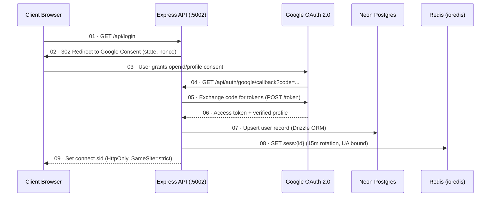

### Vulnerability Response SLAs

| Severity | Acknowledgment | Target Patch |
| :--- | :--- | :--- |
| Critical | 24 hours | 7 days |
| High | 48 hours | 14 days |
| Medium | 5 business days | 30 days |
| Low | 10 business days | Next release |

> [!CAUTION]
> **Never** open a public GitHub issue for security vulnerabilities. Use [GitHub's private vulnerability reporting](https://docs.github.com/en/code-security/security-advisories/guidance-on-reporting-and-writing/privately-reporting-a-security-vulnerability) or contact M. Hateem Jamshaid directly.

---

## Tech Stack Reference

| Layer | Technology | Version | Key Constraint |
| :--- | :--- | :--- | :--- |
| **Runtime** | Node.js | 24.15.0 | LTS only |
| **Frontend** | React + React Router v8 | 19.2.7 | No `forwardRef`. Named exports. |
| **Build** | Vite 8 (Rolldown bundler) | 8.0.10+ | Programmatic via `ssr-handler.ts` |
| **Language** | TypeScript | 6.0.3 | Strict mode. No `any`. |
| **Styling** | Tailwind CSS v4 | 4.2.4+ | `@theme` tokens only. `@utility` directive. No arbitrary values. |
| **Animations** | GSAP 3 + locomotive-scroll | 3.15 / 5.0.1 | No framer-motion or lenis. |
| **Backend** | Express 5 | 5.2.1 | Async-native. No `try/catch` in handlers. |
| **ORM** | Drizzle ORM + drizzle-zod | 0.45.2 | Parameterised queries only. |
| **Database** | Neon Serverless PostgreSQL | — | HTTP driver. Soft deletes mandatory. |
| **Schema** | Zod | 4.2.1+ | All schemas in `@run-remix/shared`. |
| **Error Handling** | neverthrow | — | `ResultAsync<T, E>`. Never `.unwrap()`. |
| **Sessions** | DrizzleSessionStore | — | No MemoryStore, no JWT in localStorage. |
| **Cache** | lru-cache (L1) + ioredis (L2) | — | No `@upstash/redis` or `connect-redis`. |
| **Background** | Google Cloud Tasks | — | HTTP workers via `verifyCloudTaskToken`. |
| **3D Viewer** | LazyUnifiedModelViewer | — | No `@react-three/fiber` or drei. |
| **Rich Text** | TipTap | 3.20.1+ | — |
| **Toasts** | sonner | 2.0.7+ | No custom implementations. |
| **Linting** | Biome | 2.3.10+ | No ESLint or Prettier. |
| **Testing** | Vitest + Playwright | — | 80%+ service coverage. |
| **Logging** | Pino | — | No `console.log` in server. |
| **Tracing** | OpenTelemetry | — | — |
| **Icons** | lucide-react (primary), @tabler/icons-react (secondary) | — | — |
| **CI/CD** | Google Cloud Build | — | Canary rollouts. |
| **Orchestration** | Google Cloud Run | — | Multi-region planned. |
| **Dev Port** | 5002 | **Hardcoded** | **Never 3000.** |

---

## Frontend-to-Admin Route Mapping

> [!IMPORTANT]
> **Architectural Invariant:** Every public page that renders CMS content MUST have a corresponding `/admin/:module` counterpart. Creating a public route without its admin pair is a violation.

| Public Route | Admin Route | API Endpoint | Description |
| :--- | :--- | :--- | :--- |
| `/` | `/admin/dashboard` | `/api/dashboard/stats` | Homepage / Dashboard |
| `/products` | `/admin/products` | `/api/products` | Product Catalog |
| `/categories` | `/admin/categories` | `/api/categories` | Category Browser |
| `/blog` | `/admin/blog` | `/api/blog/posts` | Blog Listing |
| `/about` | `/admin/about` | `/api/pages/about` | About Page |
| `/contact` | `/admin/contact` | `/api/contact-info` | Contact Page |
| `/gallery` | `/admin/gallery` | `/api/media` | Media Gallery |
| `/manufacturing` | `/admin/manufacturing` | `/api/manufacturing/status` | Manufacturing Facilities |
| `/sustainability` | `/admin/sustainability` | `/api/sustainability` | Sustainability Reports |
| `/technology` | `/admin/technology` | `/api/technology` | Innovation Lab |
| `/services` | `/admin/services` | `/api/services` | Manufacturing Services |
| `/fabrics` | `/admin/fabrics` | `/api/fabrics` | Fabric Catalog |
| `/fibers` | `/admin/fibers` | `/api/fibers` | Fiber & Yarn Catalog |
| `/accessories` | `/admin/accessories` | `/api/accessories` | Accessories Catalog |
| `/certifications` | `/admin/certifications` | `/api/certifications` | Certifications |
| `/size-charts` | `/admin/size-charts` | `/api/size-charts` | Size Charts |
| `/resources` | `/admin/resources` | `/api/resources` | B2B Resources |

**URL pattern distinction:**
- **Public routes** use human-readable slugs (e.g., `/blog/my-post-slug`)
- **Admin routes** use database IDs (e.g., `/admin/blog/posts/123/edit`)
- **Public API** returns only published content; **Admin API** returns all content including drafts.

---

## B.L.A.S.T. Protocol

Every engineering task follows the deterministic **B.L.A.S.T.** methodology — no exceptions:

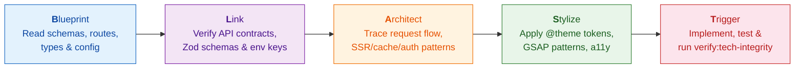

| Phase | What to do |
| :--- | :--- |
| **Blueprint** | Read every relevant schema, route, type, and config file before writing a single line of code. Map the full data contract. |
| **Link** | Verify all API contracts, Zod schemas, and env keys. Confirm `@run-remix/shared` has everything you need. |
| **Architect** | Trace the full request/data flow. Confirm SSR/cache/auth patterns. Check for side effects. |
| **Stylize** | Apply correct Tailwind v4 `@theme` tokens, GSAP patterns, and design system constraints. |
| **Trigger** | Implement, verify with `npm run verify:tech-integrity`, and ship. |

---

## 2026 Strategic Roadmap

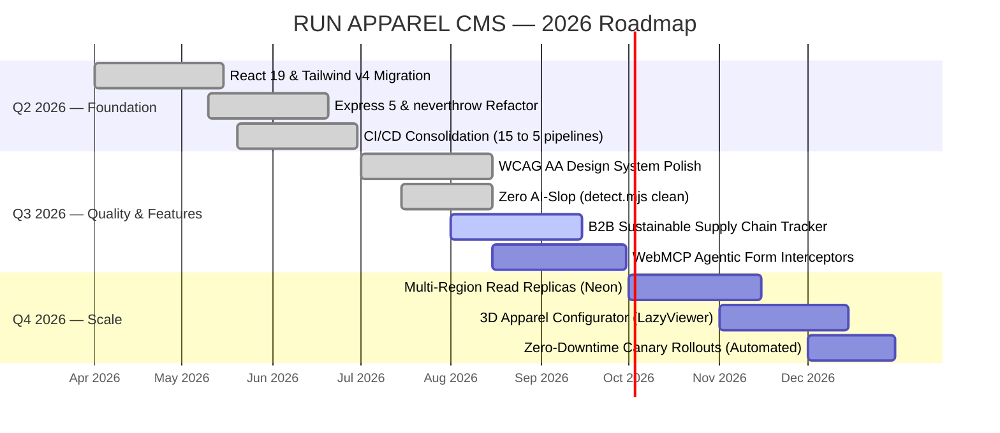

### Current Sprint (Q3 2026)

- [x] Universal WCAG AA accessibility — touch targets $\geq 44\text{px}$, high-contrast tokens, semantic headings
- [x] Zero design anti-patterns — eradicated AI-slop gradients, elastic beziers, side-tab accents via `detect.mjs`
- [x] Architecture Health Score → **100/100** across all 10 categories
- [ ] B2B sustainable supply chain visualiser — live tracking of organic yarn lots and recycled polyester batches
- [ ] WebMCP agentic form interception — integrated synthetic form actions with agent-invoked response streaming

---

## Getting Started (Developer Onboarding)

### Prerequisites

| Requirement | Version |
| :--- | :--- |
| Node.js | $\geq$ 24.15.0 (`nvm use 24`) |
| npm | $\geq$ 10.9.2 |
| Port | **5002** (non-negotiable) |

### 1. Clone & Setup

```bash
git clone <repository-url>
cd RUN

# Install all workspace dependencies
npm ci

# Copy environment template
cp .env.example .env
# Fill in: DATABASE_URL, GOOGLE_CLIENT_ID, GOOGLE_CLIENT_SECRET, SESSION_SECRET

# Verify complete repository integrity
npm run verify:tech-integrity
```

### 2. Run Locally

```bash
# Launch unified dev server (Client + Server via Express SSR)
npm run dev
# → http://localhost:5002
# → Admin: http://localhost:5002/admin
# → API: http://localhost:5002/api/v1
```

### 3. Pre-Commit Verification Gate

```bash
npm run check:apply             # Biome format & lint (auto-fix)
npm run typecheck               # TypeScript zero-error check (client + server)
npm run test                    # Full Vitest suite (170+ files)
npm run verify:tech-integrity   # Non-negotiable 8-check integrity gate
```

> [!WARNING]
> If `verify:tech-integrity` fails, **do not commit**. Fix the issue first. This gate is enforced by pre-commit hooks and CI.

<details>
<summary><strong>Full list of available npm scripts</strong></summary>

| Script | Purpose |
| :--- | :--- |
| `npm run dev` | Start dev server (Port 5002) |
| `npm run build` | Full Turbo production build |
| `npm run test` | Run all Vitest suites |
| `npm run test:e2e` | Playwright end-to-end tests |
| `npm run test:integration` | Integration test suite |
| `npm run typecheck` | TypeScript type check (both workspaces) |
| `npm run check:apply` | Biome lint + format (auto-fix) |
| `npm run verify:tech-integrity` | 8-check integrity validator |
| `npm run verify-port` | Port 5002 compliance check |
| `npm run migrate:deploy` | Run Drizzle database migrations |
| `npm run build:analyze` | Bundle size analysis |
| `npm run check:docs` | Markdown link checker |
| `npm run check:secrets` | Secret scanning |
| `npm run check:bundle` | Bundle size threshold check |

</details>

---

## Architecture Decision Records (ADRs)

All significant architectural decisions are documented as ADRs in `docs/adr/`:

| ADR | Decision | Status |
| :--- | :--- | :--- |
| ADR-0002 | React 19 over Next.js | Accepted |
| ADR-0003 | Neon Serverless Database | Accepted |
| ADR-0004 | Express 5 Framework | Accepted |
| ADR-0005 | Drizzle ORM | Accepted |
| ADR-0006 | Tailwind v4 | Accepted |
| ADR-0007 | Cloud Run Deployment | Accepted |
| ADR-0009 | Biome over ESLint | Accepted |
| ADR-0010 | Monorepo Structure | Accepted |
| ADR-0011 | Google OAuth | Accepted |
| ADR-0012 | Two-Tier Caching | Accepted |
| ADR-0013 | Error Handling Architecture (neverthrow) | Accepted |
| ADR-0014 | Observability Pipeline (OTel) | Accepted |
| ADR-0015 | React Router v8 | Accepted |
| ADR-0016 | Admin Parity Pattern | Accepted |
| ADR-0017 | GSAP Animation | Accepted |

---

## Standard Operating Procedures (SOPs)

| SOP | Purpose |
| :--- | :--- |
| `SOP_CODE_CHANGE` | Standard workflow for any code modification |
| `SOP_DEPLOY` | Production deployment checklist |
| `SOP_ROLLBACK` | Emergency rollback procedure |
| `SOP_MIGRATE` | Database migration protocol |
| `SOP_API_HANDSHAKE` | API contract verification |
| `SOP_UI_UPGRADE` | Frontend component upgrade guide |
| `SOP_ARCHITECTURE_AUDIT` | Full architecture health assessment |
| `SOP_AGENTIC_SPRINT` | Agentic sprint ceremony protocol |
| `SOP_3D_OPTIMIZATION` | 3D model performance optimisation |

---

## API Error Specification

All API errors comply with **RFC 7807: Problem Details for HTTP APIs** (`application/problem+json`).

<details>
<summary><strong>Error response format & standard error codes</strong></summary>

### Response Format

```json
{
  "type": "https://api.run-remix.com/errors/validation-failed",
  "title": "Validation Failed",
  "status": 400,
  "detail": "The request contained invalid parameters.",
  "instance": "/api/subscribe",
  "requestId": "req_12345",
  "invalid-params": {
    "email": ["Invalid email format"]
  }
}
```

### Standard Error Codes

| Code | Status | Class | Description |
| :--- | :--- | :--- | :--- |
| `INVALID_INPUT` | 400 | `ValidationError` | Validation failed |
| `BAD_REQUEST` | 400 | `BadRequestError` | Malformed request |
| `UNAUTHORIZED` | 401 | `UnauthorizedError` | Not authenticated |
| `FORBIDDEN` | 403 | `ForbiddenError` | Insufficient permissions |
| `RESOURCE_NOT_FOUND` | 404 | `NotFoundError` | Resource does not exist |
| `CONFLICT` | 409 | `ConflictError` | Duplicate resource |
| `DB_DEADLOCK` | 409 | `AppError` | Retryable deadlock |
| `RATE_LIMIT_EXCEEDED` | 429 | `RateLimitError` | Too many requests |
| `INTERNAL_ERROR` | 500 | `InternalError` | Unexpected server error |
| `DB_CONNECTION_ERROR` | 503 | `DatabaseError` | Database unavailable |
| `DB_TIMEOUT` | 504 | `AppError` | Query timeout |

</details>

---

## Multi-Region Strategy

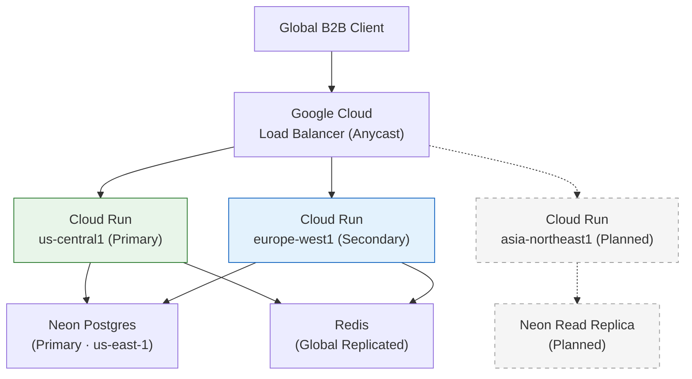

| Phase | Scope | Status |
| :--- | :--- | :--- |
| **Phase 1** | Single Region + CDN (GCS multi-region bucket) | ✅ Complete |
| **Phase 2** | Multi-Region Compute (US + EU Cloud Run) | 🔄 Q4 2026 |
| **Phase 3** | Neon Read Replicas + Region-aware pooling | 📋 Planned |

---

## Disaster Recovery

| Parameter | Target |
| :--- | :--- |
| **RTO** (Recovery Time Objective) | < 1 Hour |
| **RPO** (Recovery Point Objective) | < 1 Minute (Neon PITR) |

| Component | Recovery Method |
| :--- | :--- |
| **Database** | Neon Point-in-Time Recovery (30-day window) |
| **Media Assets** | GCS multi-region + object versioning |
| **Sessions** | DrizzleSessionStore auto-recovers with DB |
| **Infrastructure** | Re-deploy via Cloud Build from `main` branch |

---

## Contributing

<details>
<summary><strong>Pull Request checklist</strong></summary>

- [ ] `npm run verify:tech-integrity` exits 0
- [ ] `npm run typecheck` exits 0 (no TypeScript errors)
- [ ] `npm run check:apply` applied (Biome clean)
- [ ] `npm run test` passes
- [ ] `task_plan.md` updated before starting
- [ ] `findings.md` updated after finishing
- [ ] No new `any` types introduced
- [ ] No `@react-three/fiber` or `drei` imports
- [ ] No hardcoded ports other than 5002
- [ ] Tests added for any new service-layer logic
- [ ] Commit messages follow [Conventional Commits](https://www.conventionalcommits.org/)

</details>

### Commit Message Format

```
<type>(<scope>): <subject>

feat(products): add 3D configurator lazy loader
fix(auth): rotate session on Google OAuth callback
chore(deps): update Drizzle ORM to 0.45.2
```

---

## Support & Contact

| Channel | Purpose |
| :--- | :--- |
| **GitHub Issues** | Bug reports, feature requests (use templates) |
| **Slack `#run-remix-dev`** | Development questions |
| **Slack `#run-remix-incidents`** | Production incidents |
| **M. Hateem Jamshaid** | Architectural decisions, security disclosures |

For vulnerability reports: see [Security Policy](./Security-Model).
For troubleshooting: see [Troubleshooting Guide](./Troubleshooting).

---

*Copyright © 2026 RUN APPAREL (PVT) LTD / Durus Industries. All rights reserved.*
